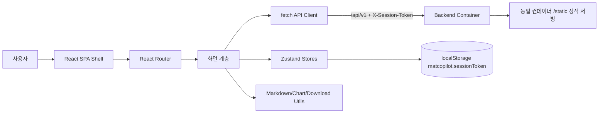
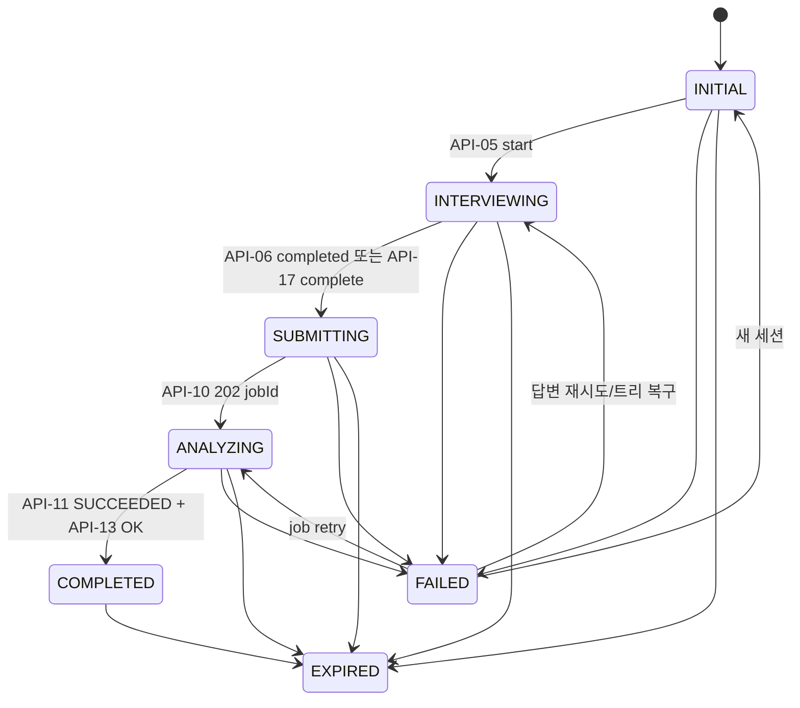

# Frontend Technical Requirements Document (TRD) — mat-copilot

| 항목 | 내용 |
| --- | --- |
| 문서 버전 | v0.2 (Draft) |
| 문서 상태 | Draft |
| 작성자 | @sw1029 |
| 검토자 | 프론트엔드 / 백엔드 / AI / QA / 보안 담당자 |
| 작성일 | 2026-08-22 |
| 최종 수정일 | 2026-08-22 |
| 대상 릴리스 | Hackathon MVP / M1 |
| 관련 PRD | [PRD/front.md](../PRD/front.md) |
| 관련 백엔드 TRD | [TRD/back.md](./back.md) |
| API 명세 | [SCHEMA/schema.md](../SCHEMA/schema.md) |
| 품질 근거 | [GAP_ANALYSIS.md](../GAP_ANALYSIS.md), [AGENTS.md](../AGENTS.md), [regulations.md](../regulations.md) |

> PRD/front.md v0.1의 “PRD 생성/TRD 생성/토큰 효율성” 서사는 백엔드 확정 계약과 충돌하므로 본 TRD에서는 **의도 기준선(IntentDoc) 생성 → 사용자 결과물 제출 → drift 분석 보고서** 흐름을 기준으로 한다. 프론트 정적 번들은 백엔드 컨테이너(Azure Container Apps)에서 동일 오리진으로 서빙한다.

---

## 1. 문서 목적 및 범위

### 1.1 목적

| 목적 | 내용 |
| --- | --- |
| 구현 기준 | React SPA가 SCHEMA v0.3 API와 안정적으로 통신하기 위한 화면, 상태, 오류, 접근성, 보안 설계를 확정한다. |
| 백엔드 정합 | TRD/back.md 부록 B의 통합안 C와 API-01~19를 프론트 구현 계약으로 흡수한다. |
| 심사 대응 | GAP_ANALYSIS.md §4.4~4.6의 오류 확인, 취소, 접근성, 자동화 테스트, AI 고지, 보안 헤더 감점 요인을 MVP 설계에 반영한다. |

### 1.2 구현 범위

| 구분 | 포함 범위 | 관련 PRD/근거 | 비고 |
| --- | --- | --- | --- |
| In Scope | 홈, 세션 생성, 기획안 업로드, 샘플 체험, 인터뷰 마인드맵/리스트, 결과물 제출, 분석 대기, 결과 보고서 | PRD US-1~9, SCHEMA API-01~19 | 웹앱·무로그인·Azure 배포 필수 |
| In Scope | fetch 래퍼, 오류 매핑, 멱등 재시도, 폴링, 취소, 복구 라우팅, localStorage 토큰 | GAP C4-b/C5 | silent catch 금지 |
| In Scope | AI 고지 배지, Markdown sanitize, 증거 링크, 클라이언트 md 다운로드 | GAP C6 | 모든 AI 표면 일관 표기 |
| In Scope | Vitest/Testing Library/Playwright 자동화 테스트 | GAP C4-c | 샘플 체험 E2E 1본 필수 |
| Out of Scope | 로그인, 사용자 계정, 이력 관리 | AGENTS.md | 무로그인 심사 경로 우선 |
| Out of Scope | 프론트 내 LLM 추론·drift 판정 | PRD NG1 | 백엔드/agent 책임 |
| Out of Scope | 답변 수정 후 subtree 재생성 | TRD/back.md OQ-11 | M2 보류 |
| Out of Scope | 모바일 마인드맵 캔버스 완전 지원 | GAP 모바일 대응 | 모바일은 결과 판독 및 리스트 폴백 보장 |

### 1.3 전제 조건 및 제약

| ID | 구분 | 내용 | 기술적 영향 | 확인 상태 |
| --- | --- | --- | --- | --- |
| CON-01 | 제품 | 반드시 웹앱이어야 한다. | SPA + 브라우저 표준 API 사용 | 확정 |
| CON-02 | 배포 | Azure Container Apps 백엔드 컨테이너가 정적 번들을 단일 URL로 제공한다. | 동일 오리진 `/api/v1`, CORS 미사용 | 확정 |
| CON-03 | 인증 | 로그인 없이 동작한다. | `X-Session-Token`만 사용, 계정 UI 없음 | 확정 |
| CON-04 | MVP | 해커톤 목적의 MVP다. | 빠른 구현, 단순 상태, 데모 샘플 포함 | 확정 |
| CON-05 | AI | 백엔드는 Copilot SDK와 Microsoft Agent Framework를 핵심 로직에 사용한다. | 프론트는 AI 산출 고지와 오류 표면화 담당 | 확정 |
| ASM-01 | API | SCHEMA v0.3 결정 패키지를 최종 계약으로 본다. | 기존 PRD/front v0.1 충돌 내용 무시 | 확정 |
| ASM-02 | 브라우저 | 최신 Chrome/Edge/Firefox 최근 2개 버전을 지원한다. | ES2022, Fetch, AbortController 사용 | 확정 |

| ASM-06 | 가정 | TRD 생성 여부는 결과물 제출 응답(`needsTrd`) 또는 보고서 응답의 TRD 포함 여부로 판별 가능 | TRD 패널·단계 UI의 조건부 렌더링 기준 | 확인 필요 (SCHEMA 반영 대기) |

### 1.4 용어 정의

| 용어 | 정의 | 데이터/코드 명칭 |
| --- | --- | --- |
| 세션 | 무로그인 사용자의 일회성 작업 단위 | `Session`, `sessionId`, `sessionToken` |
| IntentDoc | 인터뷰 결과로 만든 의도 기준선 Markdown 문서 | `IntentDoc` |
| 결과물 | 사용자가 분석 대상으로 제출한 파일/링크/GitHub | `Artifact` |
| Drift | 의도 기준선과 결과물의 누락·왜곡·확장 등 차이 | `Finding` |
| 증거 | drift 판단 근거 인용과 위치 | `EvidenceRef` |
| 상태 모델 | 프론트 화면 흐름 상태 | `AppStatus` |
| AI 표면 | AI가 생성·요약·판정한 질문, 문서, 리포트, 제안 | `AIGeneratedBadge` |

---

## 2. 요구사항 추적표

| PRD/근거 ID | 요구사항 요약 | 설계 섹션 | 구현 모듈 | 테스트 ID | 상태 |
| --- | --- | --- | --- | --- | --- |
| US-1~3 | 질문 시작·순차 답변·마인드맵 탐색 | §7.2~7.3 | `features/interview` | TC-INT-01~04 | 설계 |
| US-4 / GAP C5 | 분석 대기, 취소, 재시도 | §7.4, §12 | `features/analysis` | TC-POLL-01, TC-E2E-01 | 설계 |
| US-5~7 | IntentDoc·결과물·리포트 30:70 표시 | §7.5~7.8 | `features/report` | TC-RPT-01~05 | 설계 |
| FR-17 / GAP C4-b | 전 요청 오류 확인, silent catch 금지 | §6.5, §12 | `shared/api` | TC-API-01~02 | 설계 |
| GAP C4-c | 자동화 테스트 실재 | §14 | `tests` | TC-E2E-01 | 설계 |
| GAP P2 접근성 | 키보드, aria-live, 포커스 | §9 | `shared/a11y` | TC-A11Y-01~04 | 설계 |
| GAP C6 | AI 고지, sanitize, 토큰 비노출 | §11 | `shared/security` | TC-SEC-01~03 | 설계 |
| AGENTS/regulations | Azure, 무로그인, 단일 URL | §15 | `deploy` | TC-SMOKE-01 | 설계 |

---

## 3. 기술 스택

### 3.1 기술 선정 원칙

| 원칙 | 적용 기준 |
| --- | --- |
| MVP 속도 | 해커톤 내 구현 가능하고 팀이 빠르게 디버깅할 수 있어야 한다. |
| 접근성 | 마인드맵의 대체 리스트, 키보드 흐름, live region 구현이 가능해야 한다. |
| 보안 | Markdown/XSS 방어와 토큰 비노출을 라이브러리 레벨에서 통제한다. |
| 번들 크기 | 초기 경로는 300KB gzip 목표, 결과 화면은 lazy load한다. |
| 유지보수 | 타입 안정성, 테스트 생태계, 라이선스 확인이 쉬운 패키지를 우선한다. |

### 3.2 기술 스택 요약

| 영역 | 선정 기술 | 버전 | 상태 | 선정 근거 | 대안 및 제외 사유 |
| --- | --- | --- | --- | --- | --- |
| 런타임 | Browser ES2022 | 최신 2 major | 확정 | Fetch/AbortController/visibilitychange 기본 지원 | 레거시 브라우저는 MVP 범위 외 |
| UI 프레임워크 | React | 18.x | 확정 | 생태계·팀 생산성·React Flow/Recharts 호환 | Vue/Svelte는 팀·라이브러리 비용 증가 |
| 언어 | TypeScript | 5.x | 확정 | API 계약 타입화와 오류 매핑 누락 방지 | JS는 계약 안정성 부족 |
| 빌드 도구 | Vite | 5.x 이상 | 확정 | 빠른 dev/build, 정적 번들 산출 단순 | CRA는 유지보수/속도 열위 |
| 라우팅 | React Router | 6.x | 확정 | 상태별 화면 분기와 새로고침 복구 용이 | 직접 history 제어는 오류 가능성 큼 |
| 상태 관리 | Zustand | 4.x 이상 | 확정 | 세션/UI 상태 경량 관리, localStorage sync 쉬움 | Redux Toolkit은 MVP 대비 과함 |
| HTTP | 커스텀 fetch 래퍼 | 내부 | 확정 | 재시도·Abort·ETag·오류 표준화를 중앙화 | Axios는 Abort/ETag 직접 래핑 필요 |
| 마인드맵 캔버스 | React Flow `@xyflow/react` | 최신 안정 | 확정 | 노드/엣지/뷰포트 렌더·접근 가능한 커스텀 노드 | D3 직접 구현은 공수 큼 |
| Markdown | `react-markdown` + `rehype-sanitize` | 최신 안정 | 확정 | Markdown AST 기반 렌더와 allowlist sanitize | dangerouslySetInnerHTML 금지 |
| 차트 | Recharts | 최신 안정 | 확정 | React 친화, ChartSpec csv를 가변 차트로 렌더 | Chart.js는 커스텀 접근성 보강 더 필요 |
| CSV 파싱 | 경량 내부 파서 또는 PapaParse | 결정 대기 | 후보 | ChartSpec.csv 헤더 기반 표/차트 변환 | 대용량 CSV 아님, 내부 파서 가능 |
| 스타일 | CSS Modules + CSS Custom Properties | 내부 | 확정 | 번들 작고 CSP inline script 영향 없음 | 대형 UI 프레임워크는 번들 증가 |
| 테스트 | Vitest + Testing Library | 최신 안정 | 확정 | Vite와 통합, 컴포넌트 접근성 테스트 용이 | Jest는 설정 비용 증가 |
| E2E | Playwright | 최신 안정 | 확정 | 샘플 체험 3분 완주 검증, trace 수집 | Cypress는 별도 서버 설정 비용 |
| 관측 | 브라우저 console 래퍼 + backend telemetry endpoint(후속) | 내부 | MVP | traceId 노출·오류 누락 방지 | SaaS SDK는 개인정보·공수 부담 |
| 패키지 관리자 | npm | 10.x | 확정 | Node 표준, GitHub Actions 캐시 쉬움 | pnpm은 팀 환경 확인 필요 |

### 3.3 의존성 도입 기준

| 점검 항목 | 기준 | 확인 결과/정책 |
| --- | --- | --- |
| 라이선스 | MIT/Apache-2.0/BSD 우선, copyleft 회피 | React Flow 라이선스는 OQ-FE-01로 최종 확인 |
| 유지보수 | 최근 12개월 릴리스와 보안 이슈 대응 확인 | lockfile 갱신 시 `npm audit` 확인 |
| 보안 | Markdown·링크·CSV는 불신 데이터로 처리 | sanitize allowlist와 URL scheme 검사 필수 |
| 번들 크기 | 신규 대형 의존성은 초기 gzip +30KB 초과 시 검토 | 결과 화면 lazy chunk로 분리 |
| 접근성 | 키보드 대체 조작 또는 직접 보강 가능해야 함 | React Flow는 리스트 뷰 폴백 필수 |
| 대체 가능성 | API 클라이언트·차트·Markdown은 내부 adapter 뒤에 둠 | 라이브러리 교체 비용 제한 |

---

## 4. 프론트엔드 아키텍처

### 4.1 아키텍처 개요



| 설계 원칙 | 내용 |
| --- | --- |
| SPA | 정적 번들은 백엔드 컨테이너 `/static`에 포함되며 모든 API는 동일 오리진 `/api/v1`로 호출한다. |
| 서버 우선 | 로컬 store는 UI 캐시일 뿐이며 서버 응답 상태가 항상 우선한다. |
| 요청 중앙화 | 모든 fetch는 `apiClient`를 통과하고 HTTP 오류 body를 확인한다. |
| 사용자 통제 | 장시간 작업은 취소/재시도/새 세션 CTA를 제공한다. |

### 4.2 계층 및 책임

| 계층 | 책임 | 포함 요소 | 금지 사항 |
| --- | --- | --- | --- |
| Presentation | 화면 배치, 접근성 속성, 사용자 이벤트 | `pages/*`, `components/*` | API 직접 호출, business enum 하드코딩 남발 |
| Feature/Domain | 인터뷰·업로드·분석·리포트 도메인 로직 | `features/interview`, `features/report` | 다른 feature store 직접 변경 |
| State | 세션·UI·선택 상태 관리 | `stores/sessionStore.ts`, `stores/reportStore.ts` | 서버 truth를 덮어쓰기 |
| Data Access | API 타입, fetch 래퍼, 폴링 엔진 | `shared/api/*` | silent catch, 토큰 URL 포함 |
| Shared | 보안 렌더러, 차트, 다운로드, a11y 유틸 | `shared/*` | 제품 흐름 상태 보유 |

### 4.3 디렉터리 구조

```text
frontend/
├─ src/
│  ├─ app/                 # Router, providers, error boundary
│  ├─ pages/               # Home, Interview, SubmitArtifacts, AnalysisWaiting, Report
│  ├─ features/            # interview, artifacts, analysis, report
│  ├─ stores/              # Zustand stores + persistence helpers
│  ├─ shared/api/          # apiClient, endpoints, polling, error map
│  ├─ shared/a11y/         # live region, focus trap, keyboard utils
│  ├─ shared/security/     # markdown sanitize, safe link, escaping
│  ├─ shared/ui/           # 공통 컴포넌트, AI badge, buttons
│  ├─ shared/utils/        # chart csv, footnote, download blob
│  └─ tests/               # test fixtures, sample journey data
└─ e2e/                    # Playwright specs
```

### 4.4 모듈 의존성 규칙

| 규칙 | 내용 |
| --- | --- |
| 의존 방향 | `pages → features → stores/shared → api/utils` 단방향으로 유지한다. |
| Feature 격리 | feature 간 직접 import 금지, 공통 타입은 `shared/api/types.ts`로 이동한다. |
| API 래핑 | endpoint 함수는 raw `fetch`를 숨기고 `ApiResult<T>` 또는 throw `ApiErrorViewModel`만 노출한다. |
| 외부 라이브러리 | React Flow/Recharts/Markdown은 adapter 컴포넌트로 감싼다. |
| 순환 방지 | barrel export는 shared 내부에 한정하고 feature root barrel은 금지한다. |

### 4.5 라우팅 및 화면 진입

| 경로 | 화면/상태 | 진입 조건 | 필요한 식별자 | 직접 접근/새로고침 처리 |
| --- | --- | --- | --- | --- |
| `/` | 홈 | 세션 없음 또는 CREATED | 없음/토큰 | 토큰 있으면 API-02 복구 후 적합 화면으로 replace |
| `/interview` | 인터뷰 | INTERVIEWING | sessionId/token | API-07 tree 조회 후 active node 복원 |
| `/artifacts` | 결과물 제출 | INTERVIEW_DONE/SUBMITTING | sessionId/token | API-09 목록 조회 |
| `/analysis/:jobId` | 분석 대기 | ANALYZING | jobId | API-11 폴링 재개 |
| `/report` | 결과 | REPORT_READY/COMPLETED | sessionId/token | API-13/API-14 병렬 조회 |
| `/expired` | 만료/유실 | EXPIRED/404/410 | 없음 | 토큰 폐기 후 새 세션 CTA |

---

## 5. 핵심 상태 및 데이터 흐름

### 5.1 애플리케이션 상태 머신



| 백 SessionStatus | 프론트 상태 | 복구 화면 | 후속 호출 |
| --- | --- | --- | --- |
| CREATED | INITIAL | 홈 | 필요 시 API-05 |
| INTERVIEWING | INTERVIEWING | 인터뷰 | API-07 |
| INTERVIEW_DONE | SUBMITTING | 결과물 제출 | API-09 |
| ANALYZING | ANALYZING | 분석 대기 | API-11 `activeJobId` 폴링 |
| REPORT_READY | COMPLETED | 결과 | API-13/API-14 |
| FAILED | FAILED | 마지막 화면 오류 상태 | 오류 코드별 CTA |
| EXPIRED | EXPIRED | 만료 안내 | 토큰 폐기 |

| 현재 상태 | 이벤트 | 전이 조건 | 다음 상태 | 부수 효과 | 실패 처리 |
| --- | --- | --- | --- | --- | --- |
| INITIAL | 세션 생성 | API-01 201 | INITIAL | token 저장 | 생성 실패 배너, 샘플 CTA 유지 |
| INITIAL | 인터뷰 시작 | API-05 200 | INTERVIEWING | 질문 store 초기화 | 재시도 버튼 |
| INTERVIEWING | 답변 제출 | API-06 ACTIVE | INTERVIEWING | node merge, active 이동 | 입력값 보존 |
| INTERVIEWING | 인터뷰 종료 | API-06 COMPLETED/API-17 | SUBMITTING | route `/artifacts` | REQUIRED 409 목록 모달 |
| SUBMITTING | 분석 시작 | API-10 202 | ANALYZING | route `/analysis/:jobId` | precondition 오류 안내 |
| ANALYZING | job 성공 | API-11 SUCCEEDED | COMPLETED | report preload | 실패 시 retry/cancel CTA |
| ANY | 404/410 | SESSION_NOT_FOUND/EXPIRED | EXPIRED | localStorage 제거 | 새 세션 CTA |

### 5.2 상태 분류 및 저장 위치

| 상태 | 예시 | 소유 주체 | 저장 위치 | 영속화 | 초기화 조건 |
| --- | --- | --- | --- | --- | --- |
| 서버 상태 | session, tree, artifacts, job, report | 백엔드 | Zustand cache | 부분 | 서버 조회 성공 시 교체 |
| 세션 토큰 | `sessionToken` | 백엔드 발급/프론트 보관 | localStorage `matcopilot.sessionToken` | 예 | 만료/삭제/새 세션 |
| 전역 UI | current route, active modal, live message | 프론트 | memory store | 아니오 | 새로고침 |
| 선택 상태 | selectedFindingId, highlightedBlockIds | 프론트 | URL hash + memory | 부분 | report 이탈 |
| 폼 상태 | answer draft, artifact URL | 프론트 | component state | 아니오 | 제출 성공/화면 이탈 확인 |
| ETag 캐시 | job/report ETag | 프론트 | memory Map | 아니오 | 새 세션/304 무효화 |

### 5.3 스토어 스키마

```ts
type AppStatus = 'INITIAL' | 'INTERVIEWING' | 'SUBMITTING' | 'ANALYZING' | 'COMPLETED' | 'FAILED' | 'EXPIRED';

interface SessionStore {
  sessionId?: string;
  sessionToken?: string;
  appStatus: AppStatus;
  serverStatus?: 'CREATED' | 'INTERVIEWING' | 'INTERVIEW_DONE' | 'ANALYZING' | 'REPORT_READY' | 'FAILED' | 'EXPIRED';
  settings: { confuseThreshold: number; timeLimitSec: number };
  activeJobId?: string;
  lastError?: ApiErrorViewModel;
  setFromServer(session: Session): void; // 서버 우선 merge
  clearSession(reason: 'expired' | 'deleted' | 'new-session'): void;
}

interface InterviewStore {
  nodes: QuestionNode[];
  activeQuestionId?: string;
  pendingSkeletonParentId?: string;
  remainingQuestions?: number;
  submitSeq: number; // 오래된 응답 무시
}

interface ReportStore {
  intentDoc?: IntentDoc;
  artifacts: Artifact[];
  report?: Report;
  charts: ChartSpec[];
  footnoteByBlockId: Record<string, number>;
  selectedFindingId?: string;
}
```

### 5.4 동시성 및 경쟁 상태 방지

| 시나리오 | 위험 | 방지 전략 | 사용자 경험 |
| --- | --- | --- | --- |
| 답변 중복 제출 | 동일 답변 다중 전송 | 버튼 disabled + API-06 멱등 응답 신뢰 | 진행 표시 유지 |
| 오래된 응답 | 느린 응답이 최신 tree 덮음 | `submitSeq`와 서버 `QuestionStatus` 기준 merge | 최신 질문 유지 |
| 다중 탭 | 탭 간 상태 불일치 | 서버 반환 상태 우선, storage 이벤트는 복구 트리거만 | stale 탭도 최신 화면으로 이동 |
| 분석 중복 실행 | job 다중 생성 | API-10 멱등 + 프론트 버튼 lock | 기존 job으로 이동 |
| 화면 이탈 | 요청 leak, 상태 오염 | AbortController abort + unmounted guard | 이탈 확인/취소 가능 |
| 새로고침 | job/세션 유실 오인 | localStorage token → API-02 → 복구 라우팅 | 이어하기 |

### 5.5 복구 및 영속화 전략

| 항목 | 정책 |
| --- | --- |
| 저장 키 | `matcopilot.sessionToken`만 영속 저장한다. sessionId는 API-02 응답 또는 토큰 payload를 파싱하지 않고 서버 조회로 얻는다. |
| 최소화 | 질문/답변/보고서 전문은 localStorage에 저장하지 않는다. |
| 민감 정보 | 업로드 파일명·인용문·토큰은 URL, console, localStorage에 남기지 않는다. |
| 복구 순서 | 앱 부팅 → token 확인 → API-02 → 상태 매핑표로 route replace → 필요한 상세 API 호출 |
| 만료/유실 | 404/410 수신 즉시 token 제거, `/expired` 이동, “새 세션 시작” 제공 |
| 삭제 | API-19 성공 시 token 제거 및 메모리 store 초기화 |
| 스키마 변경 | `schemaVersion` 불일치 시 캐시 폐기 후 서버 재조회 |

---

## 6. API 및 데이터 계약

### 6.1 통신 원칙

| 항목 | 결정 |
| --- | --- |
| API 형식 | REST + JSON, 파일 업로드만 `multipart/form-data` |
| 기본 URL | 동일 오리진 `/api/v1` |
| 인증 방식 | API-01 제외 모든 요청에 `X-Session-Token` 헤더 |
| 상태 업데이트 | API-11 폴링 2초 + ETag/If-None-Match, SSE/WebSocket 미사용 |
| 타임아웃 | 조회 10s, 인터뷰 60s, 업로드 120s, 분석 시작 30s |
| 재시도 | 멱등 요청(GET, API-06 답변 제출)만 1s→2s→4s 최대 3회; 429는 Retry-After 우선 |
| 요청 취소 | 모든 요청에 AbortController; 화면 이탈·분석 취소·언마운트 시 abort |
| API 버전 | `/api/v1` 고정 |
| 날짜/ID | ISO 8601 UTC, UUID v4 |
| 오류 처리 | 모든 응답에서 `ok` 확인, 실패 body `{error}` 파싱, silent catch 금지 |

### 6.2 엔드포인트 목록

| ID | Method | Path | 목적 | 요청 타입 | 응답 타입 | 멱등성/프론트 처리 |
| --- | --- | --- | --- | --- | --- | --- |
| API-01 | POST | `/sessions` | 세션 생성/토큰 발급 | JSON settings? | SessionCreated | 비멱등, 자동 재시도 안 함 |
| API-02 | GET | `/sessions/{id}` | 세션 복구 | - | Session | 멱등, 자동 재시도 |
| API-03 | PATCH | `/sessions/{id}/settings` | 설정 저장 | JSON | SessionSettings | 멱등, 실패 시 값 보존 |
| API-04 | POST | `/sessions/{id}/plan` | 기획안 업로드 | multipart | PlanUploadResult | 비멱등, 진행률 표시 |
| API-05 | POST | `/sessions/{id}/interview/start` | 인터뷰 시작 | JSON? | QuestionNode[] | 멱등, 현재 질문 반환 |
| API-06 | POST | `/sessions/{id}/interview/answers` | 답변 제출 | JSON | AnswerResult | 멱등, 자동 재시도 가능 |
| API-07 | GET | `/sessions/{id}/interview/tree` | 질문 트리 | - | QuestionNode[] | 멱등, 복구용 |
| API-08 | POST | `/sessions/{id}/artifacts` | 결과물 제출 | multipart/JSON | Artifact | 비멱등, 사전 검증 |
| API-09 | GET | `/sessions/{id}/artifacts` | 결과물 목록 | - | Artifact[] | 멱등 |
| API-10 | POST | `/sessions/{id}/analysis` | 분석 job 생성 | JSON | 202 AnalysisJob | 세션 내 실행 job 반환 |
| API-11 | GET | `/sessions/{id}/jobs/{jobId}` | job 폴링 | If-None-Match | AnalysisJob/304 | 멱등, 폴링 엔진 |
| API-12 | POST | `/sessions/{id}/jobs/{jobId}/retry` | 실패 job 재시도 | JSON | AnalysisJob | 실패 상태만 |
| API-13 | GET | `/sessions/{id}/report` | 보고서 | - | Report | 멱등 |
| API-14 | GET | `/sessions/{id}/report/charts` | 차트 | - | ChartSpec[] | 멱등 |
| API-15 | GET | `/health` | 헬스 | - | status | smoke |
| API-16 | GET | `/ready` | 준비 | - | status | smoke |
| API-17 | POST | `/sessions/{id}/interview/complete` | 조기 종료 | `{confirm}` | result/409 | REQUIRED 미답 시 confirm 필요 |
| API-18 | POST | `/sessions/{id}/jobs/{jobId}/cancel` | 분석 취소 | - | AnalysisJob | 취소 버튼과 연결 |
| API-19 | DELETE | `/sessions/{id}` | 즉시 파기 | - | 204 | 성공 시 로컬 삭제 |

### 6.3 핵심 데이터 모델

| 모델 | 필수 필드/제약 | 프론트 사용 |
| --- | --- | --- |
| `QuestionNode` | `questionId,parentId,depth,prompt,kind,status,intentPhase,inputType:'text',aiGenerated:boolean`; `helperText?,confused?` | 노드 렌더, `aiGenerated=true`면 AI 고지 배지(규칙 기반 폴백 질문은 false), REQUIRED/REVISED 표시 |
| `Artifact` | `type(FILE|LINK|GITHUB)`, `ingestStatus`, `ingestNote?` | 제출 목록, 분석 제외 사유 |
| `AnalysisJob` | `status(QUEUED|RUNNING|SUCCEEDED|FAILED|CANCELLED)`, `stage`, `completedStages`, `progress?`, `error?` | 대기 단계, 취소/재시도 |
| `IntentDoc` | `markdown`, `blocks[{blockId:'ib-<seq>',intentIds[]}]` | 좌측 상단 문서, 앵커, 각주 파생 |
| `Report` | `metrics[]`, `quantStats`, `qualitative(md)`, `suggestions[]`, `findings[]`, `intentDoc`, `normalizationSchema`, `aiGeneratedNotice`, `earlyCompleted?` | 결과 화면 전체 |
| `Finding` | `theme,summary,detail,evidence[],severity,confidence,suggestion?,intentBlockIds[]` | 리포트 카드, 교차 강조 |
| `EvidenceRef` | `artifactId`, `location{kind,path?,startLine?,endLine?,url?,note?}`, `quote` | 발췌 이동/외부 링크 |
| `Metric` | `metricId,label,value,unit,thresholds?,status,description,computable,reason?` | 지표 카드와 산정 불가 |

### 6.4 검증 상수

| 항목 | 프론트 사전 검증 | 실패 안내 |
| --- | --- | --- |
| 기획안 | `.docx/.txt/.md`, 10MB 이하 | “기획안은 docx/txt/md, 10MB 이하만 업로드할 수 있어요.” |
| 결과물 파일 | 개당 20MB 이하, 세션당 20건 | “결과물은 파일당 20MB, 최대 20건까지 제출할 수 있어요.” |
| 답변 | 1~2,000자 | “답변은 2,000자 이내로 입력해 주세요.” |
| URL | `https://`만 허용 | “https 링크만 분석할 수 있어요.” |
| GITHUB | host `github.com`만 허용 | “GitHub 결과물은 github.com 주소만 지원해요.” |
| confuseThreshold | 0~1, step 0.05 | 슬라이더 값 보정 |
| timeLimitSec | 60~3600 | 범위 밖 입력 차단 |

### 6.5 문서 위치 식별 계약

| 결정 항목 | 선택/정의 | 근거 |
| --- | --- | --- |
| IntentDoc 위치 | `blockId = ib-<seq>` | 재렌더링·Markdown 변환 후에도 안정 앵커 필요 |
| 각주 번호 | 프론트가 `blockId` 오름차순 정렬 후 1부터 파생 | 백 번호 의존 제거, 일관성 보장 |
| Finding 연결 | `Finding.intentBlockIds[]` | 카드 hover/선택 시 문서 블록 강조 |
| Evidence 위치 | `EvidenceRef.location.kind`별 처리 | file/web/github 이동 분기 가능 |
| 누락 항목 | `REQUIREMENT_OMISSION`은 evidence 비어도 정상 | 결과물에 근거 없음이 누락의 의미 |
| 매핑 실패 | 각주는 유지, “위치 이동 불가” 뱃지 | 끊긴 링크/오류 오인 방지 |
| Markdown 렌더 | block wrapper에 `data-block-id` 삽입 | 스크롤·강조 target 확보 |

### 6.6 오류 모델 및 코드별 UI 매핑

```ts
interface ApiError {
  code: 'INVALID_INPUT' | 'SESSION_NOT_FOUND' | 'SESSION_EXPIRED' | 'UNSUPPORTED_FORMAT' | 'PAYLOAD_TOO_LARGE' | 'INTERVIEW_NOT_ACTIVE' | 'REQUIRED_QUESTIONS_PENDING' | 'ANALYSIS_PRECONDITION_FAILED' | 'JOB_NOT_FOUND' | 'JOB_NOT_RETRYABLE' | 'JOB_NOT_CANCELLABLE' | 'PIPELINE_STAGE_FAILED' | 'LLM_UPSTREAM_ERROR' | 'RATE_LIMITED' | 'INTERNAL';
  message: string; // 한국어
  retryable: boolean;
  details?: Record<string, unknown>;
  traceId: string;
}
```

| 코드 | 화면 문구 | 재시도 버튼 | 자동 재시도 | CTA/상태 보존 |
| --- | --- | --- | --- | --- |
| INVALID_INPUT | 입력값을 확인해 주세요. `{message}` | 아니오 | 아니오 | 필드 포커스, 입력 보존 |
| SESSION_NOT_FOUND | 진행 중인 세션을 찾을 수 없어요. | 아니오 | 아니오 | 토큰 폐기, 새 세션 시작 |
| SESSION_EXPIRED | 세션이 만료되었어요. 새로 시작해 주세요. | 아니오 | 아니오 | 토큰 폐기, 새 세션 CTA |
| UNSUPPORTED_FORMAT | 지원하지 않는 형식이에요. docx/txt/md 또는 지원 파일을 사용해 주세요. | 아니오 | 아니오 | 업로드 목록 보존 |
| PAYLOAD_TOO_LARGE | 파일이 너무 커요. 허용 크기 이하로 줄여 주세요. | 아니오 | 아니오 | 파일 선택 재시도 |
| INTERVIEW_NOT_ACTIVE | 현재 답변할 수 있는 인터뷰가 아니에요. 최신 상태를 불러올게요. | 예(상태 새로고침) | 아니오 | API-07/API-02 재동기화 |
| REQUIRED_QUESTIONS_PENDING | 아직 필수 질문 `{n}`개가 남아 있어요. 그래도 마칠까요? | 아니오 | 아니오 | 미답 목록 모달 → `confirm=true` 강행 선택 (§7.3) |
| ANALYSIS_PRECONDITION_FAILED | 분석을 시작하려면 의도와 결과물이 필요해요. | 아니오 | 아니오 | 결과물 제출 화면 이동 |
| JOB_NOT_FOUND | 분석 작업을 찾을 수 없어요. | 예(세션 복구) | 아니오 | API-02 후 라우팅 |
| JOB_NOT_RETRYABLE | 이 작업은 재시도할 수 없어요. 최신 상태를 확인해 주세요. | 예(상태 새로고침) | 아니오 | API-11/02 |
| JOB_NOT_CANCELLABLE | 이미 끝난 작업은 취소할 수 없어요. 최신 상태를 불러올게요. | 예(상태 새로고침) | 아니오 | API-11 재동기화 |
| PIPELINE_STAGE_FAILED | 분석이 중단됐어요. 완료된 단계는 보존되어 이어서 재시도할 수 있어요. | 예(API-12) | 아니오 | 실패 단계 표시, 재시도 CTA |
| LLM_UPSTREAM_ERROR | AI 처리 중 일시 오류가 발생했어요. | 예 | 예(멱등 요청만) | traceId 표시, 실패 단계 보존 |
| RATE_LIMITED | 요청이 많아요. `{Retry-After}`초 후 다시 시도해 주세요. | 카운트다운 후 예 | Retry-After 후 1회 | 남은 시간 표시 |
| INTERNAL | 알 수 없는 오류가 발생했어요. 잠시 후 다시 시도해 주세요. | 예 | 예(멱등 요청만) | traceId 표시, 입력/완료 상태 보존 |

### 6.7 백엔드 합의 항목 체크리스트

| 합의 항목 | 상태 | 프론트 반영 | 근거 |
| --- | --- | --- | --- |
| 질문 입력 유형·검증 | 합의됨 | `inputType:'text'`, 2,000자 | TRD/back.md B.8/B.5 |
| 분기·병합 표현 | 합의됨 | 단일 부모 tree, 병합 없음 | SCHEMA `QuestionNode` |
| 질의 종료 신호 | 합의됨 | API-06 `interviewStatus=COMPLETED` | TRD/back.md B.8 |
| 답변 수정·분기 무효화 | 합의됨(보류) | MVP 미제공, M2 경고 모달 설계만 | OQ-11 |
| 비동기 상태 전달 | 합의됨 | API-11 폴링 2s | B.8, SCHEMA API-11 |
| 실패 재시도·멱등성 | 합의됨 | API-12, 완료 단계 보존 | TRD/back.md §7.8/B.8 |
| 문서 블록 식별 | 합의됨 | IntentDoc `ib-<seq>` | B.3/OQ-22 결정 패키지 |
| 지표 메타 | 합의됨 | `Report.metrics[]` | B.4/OQ-21 결정 패키지 |
| 부분 결과·산정 불가 | 합의됨 | `computable=false + reason` | B.4 |
| 세션 만료·보존 | 합의됨 | localStorage token, 만료 시 폐기 | B.6, API-19 |

---

## 7. 화면 및 기능별 기술 설계

### 7.1 전역 애플리케이션 셸

| 설계 항목 | 내용 |
| --- | --- |
| 뷰포트 | 데스크톱은 `height:100dvh`, 내부 패널 스크롤만 허용 |
| 모바일 | 768px 미만은 결과 판독 우선 단일 컬럼, 마인드맵 대신 리스트 뷰 기본 |
| 홈 이동 | 미제출 답변/업로드/분석 중이면 확인 모달, 분석 중은 API-18 취소 선택 제공 |
| 전역 오류 | ErrorBoundary가 “새로고침/새 세션/traceId 복사” 제공 |
| AI 고지 | 질문 카드, IntentDoc, 리포트, 제안에 `AIGeneratedBadge` 공통 표시 |
| 데모 경로 | “샘플로 체험” 버튼이 번들 샘플을 자동 제출하고 E2E와 동일 플로우 실행 |

### 7.2 홈 및 첫 질문

| 설계 항목 | 내용 |
| --- | --- |
| 세션 생성 | 홈 진입 시 API-01 호출, 실패 시 샘플 체험은 mock bundle 기반으로 계속 가능하게 안내 |
| 첫 질문 | API-05 결과의 ACTIVE REQUIRED 질문 1개 표시 |
| 기획안 업로드 | 선택형 영역에서 API-04 multipart, 진행률과 413/415 사전 차단 |
| 설정 | 질문 강도(confuseThreshold)와 제한 시간(timeLimitSec)을 API-03 PATCH |
| 제출 | Ctrl/Cmd+Enter 제출, Enter 줄바꿈은 textarea 기본 유지 |
| AI 고지 | 질문 본문 옆 “AI 생성 질문” 배지와 tooltip |

### 7.3 인터뷰 화면 상세

| 노드 상태 | 렌더링 | 상호작용 |
| --- | --- | --- |
| PENDING | 흐름 끝 스켈레톤 노드, 30초 후 “질문을 구성 중이에요. 잠시만 기다려 주세요.” | 입력 불가 |
| ACTIVE | 질문, helperText, textarea, 제출/구체화 요청(requestFlag) | 입력 포커스, 제출 가능 |
| ANSWERED | 질문/답변 요약, 완료 아이콘 | 선택 시 전체 답변 popover |
| SKIPPED | 흐린 스타일 + “건너뜀” 라벨 | 조기 종료 사유 표시 |

| 항목 | 설계 |
| --- | --- |
| REQUIRED/OPTIONAL | REQUIRED는 필수 배지와 두꺼운 border, OPTIONAL은 보조 배지; 색상 외 텍스트 필수 |
| confused | 값이 있으면 “모호도 높음/보통/낮음” 라벨로 표시하되 점수 숫자는 tooltip에만 |
| requestFlag | “더 구체적으로 물어봐 주세요” 체크박스/버튼, 제출 payload에 `requestFlag:true` |
| remainingQuestions | API-06 값이 있으면 “예상 남은 질문 N개” 힌트, 없으면 숨김 |
| 조기 종료 | “인터뷰 마치기” → API-17. 409이면 REQUIRED 미답 목록 표시 후 `confirm=true` 강행 가능 |
| completedReason | THRESHOLD: “의도가 충분히 구체화됐어요.” / USER_EARLY: “사용자 요청으로 인터뷰를 마쳤어요.” / WATCHDOG: “질문 한도에 도달했어요.” / TIME_LIMIT: “시간 제한에 도달했어요.” |
| REVISED | `intentPhase=REVISED` 질문은 “변경된 의도 확인” 배지와 점선 테두리 |
| 리스트 폴백 | 모바일/스크린리더 토글 시 depth별 nested list로 동일 노드 제공 |

### 7.4 질문 마인드맵/캔버스

| 설계 항목 | 내용 |
| --- | --- |
| 그래프 구조 | `nodes`와 `edges`는 `QuestionNode.parentId`로 파생, store에는 원본 tree만 저장 |
| 레이아웃 | depth 기반 좌→우 dagre-lite 계산 또는 React Flow position 캐시 |
| 현재 질문 이동 | ACTIVE 변경 시 `fitView({ nodes:[active] })`; reduced-motion이면 즉시 이동 |
| 드래그 충돌 | textarea 내부 pointerdown은 `nodrag` class로 캔버스 드래그 차단 |
| 확대/축소 | 데스크톱만 제공, 리스트 뷰에는 해당 없음 |
| 대규모 그래프 | 100+ 노드에서 React.memo 노드 컴포넌트, React Flow viewport 렌더 사용 |

### 7.5 결과물 제출 화면

| 설계 항목 | 내용 |
| --- | --- |
| 제출 방식 | 파일 드롭존, HTTPS 링크 입력, GitHub URL 입력 탭 |
| 사전 검증 | §6.4 상수로 확장자/크기/개수/host 검증 |
| 업로드 진행률 | `XMLHttpRequest` adapter 또는 fetch stream 한계 시 진행률은 파일별 “전송 중” 단계형 표시 |
| 목록 | `Artifact.ingestStatus`와 `ingestNote` 표시; unsupported/too large/unsafe는 분석 제외 배지 |
| 분석 시작 | 제출 결과물 1건 이상이면 API-10, 아니면 precondition 안내 |
| 삭제 | MVP에서 개별 artifact 삭제 API가 없으면 “세션 파기 후 새로 시작”만 제공 |

### 7.6 분석 대기 화면

| 프론트 단계 라벨 | 매핑 JobStage | 표시 규칙 |
| --- | --- | --- |
| ① 의도·결과물 정리 | INGEST, NORMALIZE, EVALUATE | 하나라도 RUNNING이면 진행 중, 모두 completed면 완료 |
| ② 차이 분석 | DRIFT | drift stage 기준 |
| ③ 보고서 생성 | AGGREGATE, REPORT | 완료 후 결과 route |

| 설계 항목 | 내용 |
| --- | --- |
| 폴링 | 기본 2s, `If-None-Match`, 304면 기존 UI 유지 |
| progress null | 임의 퍼센트 금지, 단계형 로더만 표시 |
| 탭 비가시 | `visibilitychange` hidden이면 폴링 정지, visible이면 즉시 1회 재조회 |
| 오류 백오프 | 네트워크/5xx는 1s→2s→4s 최대 3회 후 오류 상태 |
| 취소 | “분석 취소” → API-18 + 현재 API-11 Abort; 성공 시 SUBMITTING으로 복귀 |
| 장시간 안내 | 30초마다 “결과물을 정리하고 있어요/차이를 분석하고 있어요” polite live 안내 |
| 실패 재시도 | retryable 또는 API-12 가능한 경우 실패 단계부터 재시도 버튼 |

### 7.7 분석 결과 레이아웃

| 영역 | 크기/동작 | 데이터 | 로딩/빈 상태 | 오류 상태 |
| --- | --- | --- | --- | --- |
| 좌상 IntentDoc | 데스크톱 좌측 30% 상단 50%, 독립 스크롤 | `report.intentDoc` | 문서 skeleton | 다운로드 비활성 + 재조회 |
| 좌하 결과물 | 좌측 하단 50%, 발췌/목록 탭 | `artifacts`, `EvidenceRef` | “분석된 발췌 없음” | 위치 이동 불가 뱃지 |
| 우측 리포트 | 데스크톱 우측 70%, 상단 지표/차트, 하단 finding | `metrics`, `charts`, `findings` | summary placeholder | 오류 카드 + traceId |
| 모바일 | 단일 컬럼: 요약→findings→IntentDoc→artifacts | 동일 | accordion | 동일 |

### 7.8 결과 화면 상세 규칙

| 기능 | 설계 |
| --- | --- |
| blockId 앵커 | Markdown block wrapper에 `id=ib-<seq>`와 `data-intent-ids` 부여 |
| 각주 번호 | `IntentDoc.blocks`를 `blockId` 숫자 순 정렬하여 `footnoteByBlockId` 생성 |
| 교차 강조 | finding card hover/focus → `intentBlockIds` 문서 블록 강조, 선택 시 고정 |
| Evidence file | 좌하 발췌 패널에서 `path:startLine-endLine` 항목으로 스크롤 |
| Evidence web/github | `https` URL만 새 탭, `rel="noopener noreferrer"`; GitHub도 동일 |
| 위치 해석 불가 | quote는 표시, 이동 버튼 대신 “위치 이동 불가” 뱃지 |
| 누락 테마 | `REQUIREMENT_OMISSION` + evidence empty는 “결과물에서 대응 근거를 찾지 못함(정상 누락 판정)” 표시 |
| Metric status | good/warn/bad/na 4종 배지; 색상+아이콘+텍스트 병행 |
| computable=false | 값 영역에 “산정 불가”, `reason`을 설명 텍스트로 표시 |
| ChartSpec | csv 헤더 파싱 후 행 1개=metric card, 범주+값=bar, time/order= line, theme counts=pie/bar; 확신 불가 시 표 fallback |
| 다운로드 | IntentDoc.md, report.md를 클라이언트에서 Blob 생성 후 object URL 즉시 revoke |

---

## 8. 컴포넌트 설계

### 8.1 컴포넌트 목록

| 컴포넌트 | 책임 | 주요 Props | 상태 소유 | 접근성 역할 | 재사용 |
| --- | --- | --- | --- | --- | --- |
| `AppShell` | 헤더/라우트/전역 오류 | `children` | app | landmark `banner/main` | 전역 |
| `AIGeneratedBadge` | AI 표면 고지 | `label, description` | 없음 | `aria-label` | 전역 |
| `QuestionCard` | 질문/답변 입력 | `node,onSubmit` | interview | `article`, labelled textarea | 인터뷰 |
| `MindMapCanvas` | React Flow 렌더 | `nodes,edges,activeId` | 없음 | canvas + 대체 안내 | 인터뷰 |
| `QuestionListFallback` | 스크린리더/모바일 대체 | `nodes` | 없음 | `tree`/`treeitem` 또는 nested list | 인터뷰 |
| `ArtifactUploader` | 파일/링크 제출 | validation constants | artifacts | labelled form | 제출 |
| `AnalysisStepper` | job 단계 표시 | `job` | analysis | `status`, live text | 대기 |
| `IntentDocPanel` | sanitize Markdown + anchors | `intentDoc,highlightIds` | report | `document` | 결과 |
| `EvidencePanel` | 발췌/목록 이동 | `artifacts,evidence` | report | list | 결과 |
| `MetricCard` | 지표 표시 | `metric` | 없음 | labelled region | 결과 |
| `ChartRenderer` | CSV→차트/표 | `chartSpec` | 없음 | table fallback | 결과 |
| `FindingCard` | 상세 리포트 | `finding,footnotes` | report | button/article | 결과 |
| `ErrorCallout` | 오류/CTA | `error,actions` | 없음 | assertive option | 전역 |
| `ConfirmModal` | 종료/삭제/취소 확인 | `title,onConfirm` | app | `dialog` | 전역 |

### 8.2 컴포넌트 상태 규격

| 컴포넌트 | Default | Loading/Skeleton | Empty | Error | Disabled | Focus/Selected | Partial data |
| --- | --- | --- | --- | --- | --- | --- | --- |
| QuestionCard | ACTIVE 입력 | PENDING skeleton | 질문 없음 CTA | 제출 실패 | 제출 중 | ACTIVE ring | helperText 없음 허용 |
| ArtifactUploader | 입력 가능 | 업로드 중 | 결과물 0건 | 413/415 | 20건 도달 | dropzone focus | 일부 skipped 표시 |
| AnalysisStepper | 단계형 | progress/spinner | job 없음 | 실패 단계 | 취소 중 | 현재 단계 | progress null |
| IntentDocPanel | 문서 | block skeleton | 문서 없음 | 재조회 실패 | 다운로드 불가 | block highlight | 일부 block 미매핑 |
| ChartRenderer | 차트 | skeleton | 데이터 없음 | 파싱 실패 | - | active datum | 표 fallback |
| FindingCard | 요약 | - | finding 없음 | evidence 이동 실패 | - | selected/hover | evidence empty 정상 |

### 8.3 디자인 토큰

| 토큰 영역 | 정의 위치 | 명명 규칙 | 주의 사항 |
| --- | --- | --- | --- |
| Color | `src/shared/ui/tokens.css` | `--color-status-good-bg` | 색상 단독 의미 금지 |
| Typography | tokens.css | `--font-size-body` | 긴 한국어 줄바꿈 고려 |
| Spacing | tokens.css | 4px base scale | 터치 타깃 44px 이상 |
| Z-index | tokens.css | modal/toast/header/canvas | 모달 focus trap 우선 |
| Motion | tokens.css | `--motion-duration-*` | reduced-motion 시 0ms |

---

## 9. 접근성

### 9.1 목표 및 기준

| 항목 | 기준 |
| --- | --- |
| 준수 목표 | WCAG 2.1 AA 핵심 흐름 충족 |
| 자동 검증 | Testing Library role query, Playwright axe(도입 시), 브라우저 수동 SR 점검 |
| 키보드 완료 흐름 | 홈 → 샘플/인터뷰 → 2문답 → 조기 종료 → 결과물 제출 → 분석 → 결과 finding 탐색 |
| 대체 UI | React Flow 마인드맵은 리스트 뷰를 동등 기능 대체로 제공 |

### 9.2 키보드 인터랙션 모델

| 영역 | 키 조작 | 동작 |
| --- | --- | --- |
| 전역 | Tab/Shift+Tab | 논리 순서대로 header → main → active controls 이동 |
| 마인드맵 | 방향키 | 같은 depth/부모 기준 이전·다음 노드로 roving tabindex 이동 |
| 마인드맵 | Enter | 선택 노드가 ACTIVE면 답변 입력 textarea로 진입 |
| 마인드맵 | Home/End | 첫 노드/ACTIVE 노드로 이동 |
| 입력 | Ctrl/Cmd+Enter | 답변 제출 |
| 모달 | Esc | 닫기 가능 모달 닫고 호출 버튼으로 포커스 복귀 |
| 결과 | Enter/Space | finding 선택, 관련 block 스크롤 및 강조 |

### 9.3 스크린리더 대체 구조

| 기능 | role/구조 | 설명 |
| --- | --- | --- |
| 질문 리스트 | `<ol aria-label="인터뷰 질문 흐름">` + depth 텍스트 | 캔버스 대신 선형/계층 맥락 제공 |
| 활성 질문 | `aria-current="step"` | 현재 답변 위치 명시 |
| 노드 상태 | 접근성 이름에 “필수/선택, 답변 완료/활성/건너뜀” 포함 | 색상 의존 제거 |
| 결과 문서 | `article` + block heading/anchor | 각주 버튼이 block으로 이동 |
| 차트 | 차트 옆 동일 데이터 table | 시각 정보 대체 |

### 9.4 aria-live 사용처

| live 종류 | 사용처 | 메시지 예 |
| --- | --- | --- |
| polite | 새 질문 도착 | “새 필수 질문이 도착했어요.” |
| polite | 단계 전환 | “차이 분석 단계가 시작됐어요.” |
| polite | 폴링 상태 변화 | “보고서 생성이 완료됐어요.” |
| polite | 429 카운트다운 | “20초 후 다시 시도할 수 있어요.” |
| assertive | 제출/업로드/분석 오류 | “답변 제출에 실패했어요. 입력은 보존됐습니다.” |
| assertive | 세션 만료 | “세션이 만료되어 새로 시작해야 합니다.” |

### 9.5 포커스·모션·대비

| 항목 | 규칙 |
| --- | --- |
| 새 질문 | ACTIVE 질문 도착 시 textarea로 포커스 이동, 사용자가 이전 노드를 탐색 중이면 toast + “현재 질문으로 이동” 제공 |
| 모달 | focus trap, `aria-modal=true`, 닫힘 후 호출 요소로 복귀 |
| 오류 | assertive callout 렌더 후 callout heading에 programmatic focus |
| reduced motion | React Flow fitView animation, skeleton shimmer, chart animation 비활성 |
| 대비 | 텍스트 4.5:1, 큰 텍스트 3:1, focus ring 3:1 이상 |
| 타깃 크기 | 주요 버튼/링크 최소 44×44px, 인접 타깃 8px 간격 |

---

## 10. 성능 설계

### 10.1 성능 예산

| 지표 | 목표 | 측정 환경 | 측정 도구 | 실패 기준 |
| --- | --- | --- | --- | --- |
| LCP | 2.5s 이하 | 일반 데스크톱/4G Fast | Playwright trace/Lighthouse 선택 | 3.0s 초과 |
| INP | 200ms 이하 | 질문 입력/드래그 | Web Vitals | 300ms 초과 |
| CLS | 0.1 이하 | 모든 화면 | Lighthouse | 0.15 초과 |
| 초기 JS | <300KB gzip 목표 | 홈+인터뷰 초기 chunk | Vite bundle report | 350KB 초과 |
| 노드 렌더 | 100 nodes/120 edges 조작 가능 | dev fixture | React Profiler | 드래그 체감 끊김 |
| 긴 문서 | 1MB markdown 결과 열람 가능 | sample report | 수동/Profiler | 2s 이상 freeze |

### 10.2 최적화 전략

| 전략 | 적용 기준 |
| --- | --- |
| 코드 스플릿 | `ReportPage`, Recharts, Markdown renderer는 lazy load |
| React Flow | 기본 viewport 렌더 + custom node `React.memo`; position 계산 캐시 |
| 리스트 가상화 | 질문 150개 이상 또는 결과 finding 200개 이상이면 virtual list 도입 |
| Markdown | block 단위 key, highlight class만 변경; 전체 markdown 재파싱 최소화 |
| 폴링 | 304 활용, hidden 탭 정지, 완료/실패/취소 시 즉시 중단 |
| 차트 | ChartSpec 파싱 결과 memo, 차트 애니메이션 reduced-motion 연동 |
| 대용량 응답 | report/charts 병렬 조회, 화면별 skeleton, JSON 파싱 오류 별도 처리 |

---

## 11. 보안 및 개인정보 보호

### 11.1 위협 및 대응

| 위협 | 공격/오류 경로 | 영향 | 대응 | 검증 |
| --- | --- | --- | --- | --- |
| XSS | Report markdown, evidence quote, 파일명 | 스크립트 실행 | `react-markdown` + `rehype-sanitize` allowlist, 파일명 escape | TC-SEC-01 |
| 악성 HTML | iframe/script/object 삽입 | 피싱/실행 | allowlist에서 금지 | TC-SEC-01 |
| 토큰 노출 | URL, console, error log | 세션 탈취 | token은 header/localStorage만, 로그 마스킹 | TC-SEC-02 |
| Reverse tabnabbing | 외부 evidence 링크 | opener 탈취 | `target=_blank rel=noopener noreferrer` | 컴포넌트 테스트 |
| CSP 위반 | inline script/style | XSS 완화 약화 | 백 CSP와 정합, inline script 금지 | smoke |
| 업로드 표시 | 파일명에 HTML 포함 | UI 주입 | textContent 렌더, escape | TC-SEC-03 |
| CSRF | 무쿠키 header token API | 낮음 | 쿠키 인증 미사용, Same Origin | 설계 검토 |

### 11.2 Markdown sanitize allowlist

| 허용 | 금지 |
| --- | --- |
| `p, br, strong, em, code, pre, ul, ol, li, blockquote, h1~h4, table, thead, tbody, tr, th, td, a` | `script, iframe, object, embed, style, form, input, button`, inline event handler |
| 링크 속성 `href,title`(https/mailto 제한), `rel,target`은 SafeLink에서 재작성 | `javascript:`, `data:`, `vbscript:` URL |

### 11.3 데이터 취급 기준

| 데이터 | 민감도 | 브라우저 저장 | 전송 보호 | 로그 허용 | 보존/삭제 |
| --- | --- | --- | --- | --- | --- |
| sessionToken | 높음 | localStorage 단일 키 | HTTPS header | 금지 | 만료/삭제 시 즉시 제거 |
| 질문/답변 | 중간 | memory only | HTTPS JSON | 길이/ID만 가능 | 세션 TTL/API-19 |
| 파일명/URL | 중간 | memory only | HTTPS | host/확장자만 가능 | 세션 TTL/API-19 |
| report/evidence | 중간 | memory only | HTTPS | findingId/traceId만 | 세션 TTL/API-19 |
| traceId | 낮음 | memory | HTTPS | 허용 | 오류 추적 |

### 11.4 보안 헤더 및 브라우저 정책

| 헤더/정책 | 프론트 요구 |
| --- | --- |
| CSP | `default-src 'self'; script-src 'self'; style-src 'self'; img-src 'self' data:; connect-src 'self'; frame-src 'none'; object-src 'none'; base-uri 'self'` 권고 |
| HTTPS/HSTS | Azure 배포는 HTTPS only, HSTS는 백에서 설정 |
| X-Content-Type-Options | `nosniff` |
| Referrer-Policy | `strict-origin-when-cross-origin` 또는 더 엄격 |
| Permissions-Policy | camera/microphone/geolocation 미허용 |
| Source map | production 공개 여부는 trace 대응과 코드 노출 균형 검토, 기본 비공개 권고 |

### 11.5 책임 있는 AI 고지

| 표면 | 고지 문구 |
| --- | --- |
| 질문 카드 | “AI가 생성한 질문입니다. 중요한 내용은 사용자가 검토해 주세요.” |
| IntentDoc | “인터뷰 답변을 바탕으로 AI가 정리한 의도 기준선입니다.” |
| 리포트/제안 | “AI 분석 결과이며, 근거와 함께 검토용으로 제공됩니다.” |
| 산정 불가 | “데이터 부족으로 AI가 해당 지표를 산정하지 않았습니다.” |

---

## 12. 오류 처리 및 사용자 피드백

### 12.1 오류 처리 원칙

| 원칙 | 내용 |
| --- | --- |
| 전 요청 확인 | `response.ok`가 아니면 반드시 body를 파싱하고 표준 오류로 변환한다. |
| silent catch 금지 | catch는 사용자 안내, telemetry, 재throw/상태 저장 중 하나를 반드시 수행한다. |
| 입력 보존 | 답변/URL/파일 선택은 실패 시 가능한 한 유지한다. |
| 완료 단계 보존 | job 실패 시 completedStages는 유지하고 실패 단계부터 재시도한다. |
| traceId | 사용자에게 “오류 추적 ID”로 표시하되 토큰/본문은 노출하지 않는다. |
| 429 | Retry-After 카운트다운 후 버튼 활성화, 자동 반복 폭주 금지 |

### 12.2 화면별 오류 처리표

| 화면/기능 | 오류 | 보존할 상태 | 사용자 안내 | 액션 | 복구 성공 조건 |
| --- | --- | --- | --- | --- | --- |
| 홈 세션 생성 | INTERNAL/네트워크 | 설정값 | “세션을 만들지 못했어요.” | 다시 시도/샘플 체험 | API-01 201 |
| 답변 제출 | INVALID_INPUT/LLM | 입력값 | 오류 문구 + traceId | 다시 제출 | API-06 200 |
| 질문 트리 복구 | SESSION_NOT_FOUND | 없음 | 세션 유실 안내 | 새 세션 | API-01 201 |
| 업로드 | 413/415 | 목록/입력 | 한도/형식 안내 | 파일 교체 | API-08 201 |
| 분석 시작 | PRECONDITION | 제출 목록 | 결과물 필요 안내 | 제출 화면 이동 | API-10 202 |
| 폴링 | 304 | 기존 job | 변화 없음 | 지속 | SUCCEEDED/FAILED/CANCELLED |
| 폴링 | LLM/INTERNAL | completedStages | 실패 단계 안내 | retry/cancel | API-12 후 RUNNING |
| 결과 조회 | report 오류 | route/session | 보고서 재조회 실패 | 다시 불러오기 | API-13 OK |

---

## 13. 관측성 및 분석 이벤트

### 13.1 로깅 및 오류 수집

| 구분 | 수집 대상 | 필수 속성 | 제외/마스킹 | 보존 정책 |
| --- | --- | --- | --- | --- |
| Error | API 오류, render boundary | `traceId, code, route, appStatus` | token, 답변, quote, URL full path | 백 telemetry 정책 따름 |
| Warning | 304 반복, 위치 이동 실패, chart fallback | `route, reason` | 본문 데이터 | 세션 단위 집계 |
| Performance | route load, poll duration, render duration | `screen, durationMs` | 사용자 입력 | 집계만 |

### 13.2 제품 분석 이벤트

| 이벤트명 | 발생 시점 | 속성 | 연결 성공 지표 | 개인정보 주의 |
| --- | --- | --- | --- | --- |
| `session_created` | API-01 성공 | route, hasSample | 시작률 | token 제외 |
| `answer_submitted` | API-06 성공 | questionKind, depth | 완료율/오류율 | 답변 본문 제외 |
| `early_complete_clicked` | 조기 종료 | unansweredRequiredCount | 사용자 통제 | 질문 본문 제외 |
| `artifact_submitted` | API-08 성공 | type, ingestStatus | 분석 시작률 | URL path 제외 |
| `analysis_cancelled` | API-18 성공 | stage | 취소 UX | 본문 제외 |
| `report_viewed` | 결과 진입 | findingCount, metricCount | 결과 도달률 | 인용 제외 |
| `finding_selected` | 카드 선택 | theme,severity | 탐색률 | detail 제외 |

### 13.3 모니터링 및 알림

| 지표 | 정상 기준 | 경고/장애 임계값 | 대시보드 | 알림 대상 |
| --- | --- | --- | --- | --- |
| 프론트 치명 오류율 | <0.5% 세션 | 1% 초과 | App Insights | FE/BE |
| 답변 제출 오류율 | <1% 요청 | 3% 초과 | App Insights | FE/AI |
| 분석 완료율 | >95% | 90% 미만 | App Insights | BE/AI |
| E2E smoke | 통과 | 실패 | GitHub Actions | 전체 |

---

## 14. 테스트 전략

### 14.1 테스트 계층

| 테스트 종류 | 대상 | 도구 | 실행 명령 | 통과 기준 |
| --- | --- | --- | --- | --- |
| 타입 검사 | TS 타입/API 모델 | TypeScript | `npm run typecheck` | 오류 0 |
| 단위 | 폴링 엔진, 오류 매핑, 각주 파생, CSV 파싱 | Vitest | `npm run test:unit` | 전체 통과 |
| 컴포넌트 | QuestionCard, ErrorCallout, MetricCard, IntentDocPanel | Testing Library | `npm run test:component` | role 기반 검증 통과 |
| E2E | 샘플 체험 완주 | Playwright | `npm run test:e2e` | 3분 내 결과 확인 |
| 접근성 | 키보드/aria-live/focus | Testing Library + Playwright | `npm run test:a11y` | 핵심 위반 0 |
| 빌드 | production bundle | Vite | `npm run build` | 성공 + 예산 확인 |

### 14.2 필수 테스트 시나리오

| TC ID | 우선순위 | 시나리오 | 사전 조건 | 기대 결과 | 관련 요구사항 |
| --- | --- | --- | --- | --- | --- |
| TC-API-01 | P0 | 모든 API 오류가 ErrorCallout으로 표면화 | mock 500/400 | silent catch 없음, traceId 표시 | GAP C4-b |
| TC-API-02 | P0 | 오류 코드 12종 매핑 | fixture | 문구/CTA/자동재시도 정책 일치 | §6.6 |
| TC-POLL-01 | P0 | 2s 폴링, 304, hidden pause, 실패 백오프 | fake timers | 중단 조건 준수 | §7.6 |
| TC-INT-01 | P0 | ACTIVE 질문 제출 후 다음 질문 focus | mock API-06 | 입력 보존/전환 | §7.3/§9 |
| TC-INT-02 | P0 | 조기 종료 409 REQUIRED 목록 → confirm | mock API-17 | 목록 표시 후 SUBMITTING | §7.3 |
| TC-RPT-01 | P0 | blockId 정렬 각주 파생 | IntentDoc fixture | 안정 번호 생성 | §7.8 |
| TC-RPT-02 | P0 | finding hover로 문서 block 강조 | report fixture | 교차 강조 | §7.8 |
| TC-RPT-03 | P1 | REQUIREMENT_OMISSION evidence empty | finding fixture | 정상 누락 표시 | §7.8 |
| TC-SEC-01 | P0 | 악성 Markdown sanitize | script fixture | script/iframe 미렌더 | §11 |
| TC-A11Y-01 | P0 | 키보드만으로 인터뷰/결과 탐색 | Playwright | mouse 없이 완료 | §9 |
| TC-E2E-01 | P0 | 샘플 체험 3분 완주 | bundled sample | 홈→샘플→2문답→조기 종료→제출→대기→결과 | 심사 경로 |

### 14.3 테스트 데이터

| 데이터 세트 | 목적 | 규모/특징 | 생성/보관 방식 |
| --- | --- | --- | --- |
| `sample-basic` | E2E 샘플 체험 | 질문 2개, 결과물 1개, finding 3개 | `src/tests/fixtures` |
| `sample-large-tree` | 마인드맵 성능 | 노드 120개, depth 4 | fixture generator |
| `sample-malicious-md` | XSS 검증 | script/iframe/javascript URL | fixture |
| `sample-report-na` | 산정 불가/누락 테마 | metrics na, evidence empty | fixture |

---

## 15. 개발 및 배포

### 15.1 환경 구성

| 환경 | 목적 | API 대상 | 설정 주입 방식 | 접근 통제 |
| --- | --- | --- | --- | --- |
| Local | 개발 | Vite proxy 또는 백엔드 localhost `/api/v1` | 동일 오리진 가정, env 최소화 | 개발자 PC |
| CI | 테스트/빌드 | mock + build | GitHub Actions | 저장소 권한 |
| Production | 심사 배포 | Azure Container Apps 동일 컨테이너 | 정적 번들 `/static` 포함 | 무로그인 공개 |

### 15.2 환경 변수

| 변수명 | 목적 | 필수 | 공개 가능 | 기본값 | 관리 위치 |
| --- | --- | --- | --- | --- | --- |
| 없음 | 동일 오리진 `/api/v1` 사용 | 아니오 | - | - | - |

> 프론트 번들에는 비밀값, API 키, Copilot 설정, 세션 토큰 기본값을 포함하지 않는다.

### 15.3 CI/CD 파이프라인

```mermaid
flowchart LR
    Commit --> Install[npm ci]
    Install --> Typecheck
    Typecheck --> Unit[Vitest]
    Unit --> E2E[Playwright sample]
    E2E --> Build[Vite build]
    Build --> Copy[Copy dist to backend static]
    Copy --> Image[Build backend container]
    Image --> Deploy[Azure Container Apps]
    Deploy --> Smoke[/health /ready sample]
```

| 단계 | 명령/도구 | 실패 조건 | 산출물 |
| --- | --- | --- | --- |
| Install | `npm ci` | lockfile 불일치 | node_modules cache |
| Typecheck | `npm run typecheck` | TS 오류 | - |
| Test | `npm run test:unit && npm run test:component` | 테스트 실패 | coverage(optional) |
| E2E | `npm run test:e2e` | 샘플 완주 실패 | Playwright report |
| Build | `npm run build` | Vite 실패/예산 초과 | `dist/` |
| Package | backend Docker build가 `dist`를 `/static`에 복사 | 정적 파일 누락 | container image |
| Smoke | `curl /health`, `curl /ready`, 샘플 URL | 비정상 응답 | 배포 검증 로그 |

### 15.4 배포 및 롤백

| 항목 | 정책 |
| --- | --- |
| 배포 전략 | main push 또는 수동 workflow로 이미지 빌드 후 Azure Container Apps revision 배포 |
| 캐시 무효화 | Vite hashed assets 사용, `index.html`은 no-cache 권고 |
| API 호환성 | SCHEMA v0.3 하위호환 필드 추가만 허용, enum 추가 시 fallback 표시 |
| Feature Flag | MVP는 최소화; 샘플 체험은 항상 노출 |
| 롤백 조건 | E2E smoke 실패, `/ready` 실패, 치명 오류율 급증 |
| 롤백 절차 | 이전 Container Apps revision으로 traffic 전환 |
| 배포 후 검증 | 시크릿 브라우저에서 무로그인 샘플 체험 완주 |

---

## 16. 코딩 규칙 및 협업 기준

| 항목 | 기준 |
| --- | --- |
| 명명 | 컴포넌트 PascalCase, hooks `use*`, API 함수 `verbNoun` |
| 타입 | API 응답 타입은 `shared/api/types.ts`; `any` 금지, unknown은 guard 후 사용 |
| 상태 | 서버 상태 merge 함수는 `setFromServer` 단일 경로 사용 |
| API | raw fetch 직접 사용 금지, `apiClient` 필수 |
| 오류 | catch 블록은 사용자 상태 업데이트 또는 throw를 포함 |
| 스타일 | CSS Modules + tokens, 색상 의미 하드코딩 금지 |
| UI 문자열 | 한국어 기본, 오류 message는 백 한국어 우선 + 프론트 fallback |
| 테스트 | 신규 오류/상태 분기는 단위 또는 컴포넌트 테스트 추가 |
| 접근성 | interactive 요소는 접근성 이름 필수, div button 금지 |

### 16.1 Definition of Done

| 체크 | 기준 |
| --- | --- |
| 요구사항 | 관련 PRD/TRD 항목과 테스트 ID가 연결됨 |
| 품질 | typecheck, unit/component, build 통과 |
| 오류 | 로딩/빈/오류/재시도/취소 상태 구현 |
| 접근성 | 키보드, focus, aria-live, 접근성 이름 검증 |
| 보안 | Markdown sanitize, 토큰 비노출, 외부 링크 rel 적용 |
| 성능 | 초기 번들/노드 100+ 기준 확인 |
| 배포 | 백 컨테이너 정적 서빙에서 smoke 확인 |

---

## 17. 릴리스 단계별 기술 범위

| 단계 | 기술 구현 범위 | 선행 조건 | 완료 조건 | 제외/후속 |
| --- | --- | --- | --- | --- |
| M1 | 세션, 샘플 체험, 인터뷰 2문답, 결과물 제출, 분석 대기, 결과 MVP | SCHEMA v0.3 | E2E 샘플 완주 | 답변 수정 |
| M2 | 대규모 tree 최적화, 상세 차트, 접근성 보강 | M1 피드백 | 키보드/SR 핵심 통과 | SSE 검토 |
| M3 | 모바일 결과 판독 개선, 관측성 대시보드 | 실제 데모 로그 | 결과 탐색률 개선 | 계정/이력 |
| M4 | 성능 튜닝, PDF 등 포맷 확장 UI | 백 지원 | 추가 포맷 안정 | 네이티브 앱 |

---

## 18. 기술 리스크 및 대응

| ID | 리스크 | 가능성 | 영향도 | 조기 징후 | 완화 방안 | 비상 계획 | 담당자 |
| --- | --- | --- | --- | --- | --- | --- | --- |
| RISK-FE-01 | React Flow 라이선스/번들 이슈 | 중 | 중 | 의존성 검토 실패 | 라이선스 확인, lazy load | 리스트 뷰만 MVP 제공 | FE |
| RISK-FE-02 | API 계약 병렬 개정 불일치 | 중 | 상 | enum/field mismatch | adapter와 fallback, 계약 테스트 | mock schema로 샘플 경로 유지 | FE/BE |
| RISK-FE-03 | 장시간 분석 UX 이탈 | 중 | 상 | cancel 클릭 증가 | 단계 문구, 취소/재시도 | 샘플 결과 즉시 경로 제공 | FE |
| RISK-FE-04 | Markdown XSS | 중 | 상 | sanitize 테스트 실패 | allowlist 엄격화 | HTML 렌더 전면 비활성 | FE/Sec |
| RISK-FE-05 | 모바일 캔버스 사용성 | 상 | 중 | 작은 화면 노드 조작 실패 | 리스트 폴백 기본 | 모바일은 결과 판독 전용 안내 | FE |
| RISK-FE-06 | AI 결과 오해 | 중 | 중 | 사용자가 점수를 절대 평가로 해석 | AI 고지, 근거/신뢰도/산정 불가 표시 | 점수형 표현 제거 | PM/FE |

---

## 19. 기술 의사결정 기록 (ADR)

| ADR ID | 의사결정 | 상태 | 선택안 | 주요 근거 | 대안 | 결정일 | 담당자 |
| --- | --- | --- | --- | --- | --- | --- | --- |
| ADR-001 | 상태 업데이트 방식 | 승인 | API-11 폴링 2s + ETag | MVP 단순성, SCHEMA 계약 | SSE | 2026-08-22 | FE/BE |
| ADR-002 | 마인드맵 구현 | 승인 | React Flow + 리스트 폴백 | 생산성/성능/접근성 보완 | 직접 SVG | 2026-08-22 | FE |
| ADR-003 | Markdown 렌더링 | 승인 | react-markdown + rehype-sanitize | XSS 방어와 AST 제어 | raw HTML | 2026-08-22 | FE/Sec |
| ADR-004 | 상태 관리 | 승인 | Zustand | 경량, localStorage sync | Redux | 2026-08-22 | FE |
| ADR-005 | 배포 | 승인 | 백 컨테이너 정적 서빙 | 단일 URL, CORS 제거 | 별도 Static Web Apps | 2026-08-22 | FE/BE |

### ADR-001 — 분석 상태 전달 방식

| 항목 | 내용 |
| --- | --- |
| 맥락 | 장시간 분석 job 상태를 사용자에게 보여야 하며 SCHEMA는 API-11 폴링을 확정했다. |
| 결정 | 2초 폴링 + ETag/If-None-Match + hidden 탭 일시정지 + 실패 백오프를 사용한다. |
| 트레이드오프 | SSE보다 실시간성은 낮지만 구현·배포 리스크가 작고 해커톤 MVP에 적합하다. |
| 재검토 | 인터뷰/분석 상태 p50 지연이 5초 초과하거나 서버 부하가 문제되면 SSE 검토. |

---

## 20. 미결 사항

| ID | 질문/결정 사항 | 선택지 | 영향 범위 | 결정권자 | 기한 | 상태 |
| --- | --- | --- | --- | --- | --- | --- |
| OQ-FE-01 | React Flow `@xyflow/react` 라이선스 최종 확인 | 현행 사용 / 리스트 뷰 fallback | 법무/배포 | FE/PM | 구현 착수 전 | Open |
| OQ-FE-02 | ChartSpec 자동 선택 세부 규칙 | 내부 규칙 / 백 chartType 추가 | 차트 정확성 | FE/BE | M1 중 | Open |
| OQ-FE-03 | CSV 파서 의존성 | 내부 파서 / PapaParse | 번들/정확성 | FE | M1 중 | Open |
| OQ-FE-04 | production sourcemap 공개 여부 | 비공개 / 제한 공개 | 디버깅/소스 노출 | FE/Sec | 배포 전 | Open |

---

## 21. 검토 및 승인

### 21.1 검토 체크리스트

| 항목 | 상태 |
| --- | --- |
| 모든 P0 요구사항이 설계와 테스트에 매핑되었다. | 작성됨 |
| 프론트엔드와 백엔드 데이터 계약이 합의되었다. | SCHEMA v0.3 결정 패키지 기준 작성됨 |
| 상태 전이, 실패 및 복구 경로가 정의되었다. | 작성됨 |
| 기술 스택의 버전, 근거 및 대안이 기록되었다. | 작성됨 |
| 성능 목표가 측정 가능한 수치로 정의되었다. | 작성됨 |
| 접근성, 보안 및 개인정보 요구사항이 포함되었다. | 작성됨 |
| 배포, 관측성 및 롤백 방법이 정의되었다. | 작성됨 |
| 미결 사항마다 결정권자와 기한이 지정되었다. | 작성됨 |

### 21.2 승인 이력

| 역할 | 이름 | 승인 여부 | 일자 | 의견 |
| --- | --- | --- | --- | --- |
| Product/PM | @sw1029 | 대기 | 2026-08-22 | Draft 검토 필요 |
| Frontend | TBD | 대기 | 2026-08-22 | - |
| Backend/AI | TBD | 대기 | 2026-08-22 | SCHEMA v0.3 정합 확인 필요 |
| QA | TBD | 대기 | 2026-08-22 | E2E 샘플 fixture 확인 필요 |
| Security/Operations | TBD | 대기 | 2026-08-22 | CSP/토큰 정책 확인 필요 |

---

## 부록 A. PRD 수용 기준 매핑

| PRD 수용 기준 | 구현 설계 | 검증 방법 | 결과 |
| --- | --- | --- | --- |
| AC-1 첫 질문 표시 | §7.2 | TC-INT-01 | 미검증 |
| AC-2 다음 질문 연결 | §7.3~7.4 | TC-INT-01 | 미검증 |
| AC-3 가변 질문 렌더 | §7.4/§10 | sample-large-tree | 미검증 |
| AC-4 캔버스만 드래그 | §7.4 | 컴포넌트/E2E | 미검증 |
| AC-5 입력/드래그 충돌 방지 | §7.4 | 컴포넌트 | 미검증 |
| AC-6 대기 단계 표시 | §7.6 | TC-POLL-01 | 미검증 |
| AC-7 새로고침 복구 | §5.1~5.5 | E2E | 미검증 |
| AC-8 30:70 결과 | §7.7 | 컴포넌트 | 미검증 |
| AC-9 좌측 패널 분할 | §7.7 | 컴포넌트 | 미검증 |
| AC-10 각주 번호 | §7.8 | TC-RPT-01 | 미검증 |
| AC-11 교차 강조 | §7.8 | TC-RPT-02 | 미검증 |
| AC-12 색상 외 표현 | §8.3/§9 | TC-A11Y-01 | 미검증 |
| AC-13 입력값 보존 | §12 | TC-API-01 | 미검증 |
| AC-14 실패 단계 재시도 | §7.6/§12 | TC-POLL-01 | 미검증 |
| AC-15 키보드 핵심 흐름 | §9 | TC-A11Y-01/TC-E2E-01 | 미검증 |

## 부록 B. 변경 이력

| 버전 | 일자 | 작성자 | 변경 내용 | 검토자 |
| --- | --- | --- | --- | --- |
| v0.1 | 2026-08-22 | @sw1029 | TRD/front.md 신규 상세 작성. SCHEMA v0.3 결정 패키지, TRD/back.md 부록 B, GAP_ANALYSIS 반영 | 대기 |

## 부록 C. 템플릿 커버리지

| 템플릿 섹션 | 작성 섹션 | 커버리지 |
| --- | --- | --- |
| 1. 문서 목적 및 범위 | §1 | 완료 |
| 2. 요구사항 추적표 | §2 | 완료 |
| 3. 기술 스택 | §3 | 완료 |
| 4. 프론트엔드 아키텍처 | §4 | 완료 |
| 5. 핵심 상태 및 데이터 흐름 | §5 | 완료 |
| 6. API 및 데이터 계약 | §6 | 완료 |
| 7. 화면 및 기능별 기술 설계 | §7 | 완료 |
| 8. 컴포넌트 설계 | §8 | 완료 |
| 9. 접근성 | §9 | 완료 |
| 10. 성능 설계 | §10 | 완료 |
| 11. 보안 및 개인정보 보호 | §11 | 완료 |
| 12. 오류 처리 및 사용자 피드백 | §12 | 완료 |
| 13. 관측성 및 분석 이벤트 | §13 | 완료 |
| 14. 테스트 전략 | §14 | 완료 |
| 15. 개발 및 배포 | §15 | 완료 |
| 16. 코딩 규칙 및 협업 기준 | §16 | 완료 |
| 17. 릴리스 단계별 기술 범위 | §17 | 완료 |
| 18. 기술 리스크 및 대응 | §18 | 완료 |
| 19. ADR | §19 | 완료 |
| 20. 미결 사항 | §20 | 완료 |
| 21. 검토 및 승인 | §21 | 완료 |
| 부록 A/B | 부록 A/B/C | 완료 |
