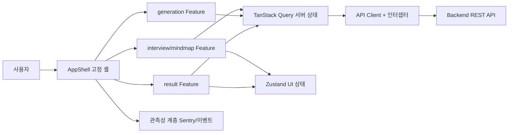
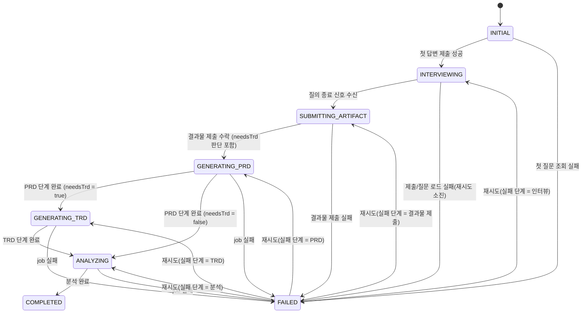
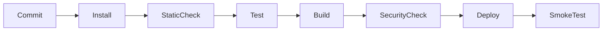

# Frontend Technical Requirements Document (TRD) — mat-copilot

> 이 문서는 [PRD/front.md](../PRD/front.md)의 제품 요구사항을 구현 가능한 기술 설계로 구체화한다.
> 통신 규약의 단일 진실 공급원은 [SCHEMA/schema.md](../SCHEMA/schema.md)이며, 본 문서는 이를 준수한다.

| 항목 | 내용 |
| --- | --- |
| 문서 버전 | v0.2 (Draft) |
| 문서 상태 | Draft |
| 작성자 | @sw1029 |
| 검토자 | 프론트엔드 / 백엔드 / AI / QA 담당자 (지정 예정) |
| 작성일 | 2026-08-22 |
| 최종 수정일 | 2026-08-22 |
| 대상 릴리스 | M1 ~ M4 |
| 관련 PRD | [PRD/front.md](../PRD/front.md) |
| 관련 백엔드 TRD | [TRD/back.md](./back.md) |
| 디자인 문서 | 미정 (Figma 링크 추후 추가) |
| API 명세 | [SCHEMA/schema.md](../SCHEMA/schema.md) |

---

## 1. 문서 목적 및 범위

### 1.1 목적

이 TRD는 PRD/front.md에 정의된 5단계 화면 흐름(홈/첫 질문(+선택 문서 업로드) → 연속 질의 마인드맵 → 최종 결과물 제출 → 문서 생성 대기 → 분석 결과)을 구현하기 위한 기술 스택, 아키텍처, 상태 모델, API 계약, 컴포넌트 설계, 품질 기준을 확정하여 프론트엔드 개발팀에 단일 구현 기준을 제공한다. 특히 다음 기술적 의사결정을 문서화한다.

- 가변 길이 질문 그래프를 렌더링하는 캔버스 구현 방식
- 비동기 생성/분석 작업의 상태 수신·복구 전략 (TRD 생성 단계는 백엔드 판단에 따라 조건부 포함)
- PRD와 비교 대상(TRD 또는 최종 결과물) 각주와 시각화·리포트의 교차 강조(선택 동기화) 설계
- 전체 화면 고정 셸에서의 독립 스크롤·드래그 이벤트 분리
- 선택형 계획 문서 업로드·전처리 상태 표시와 최종 결과물 제출 흐름

### 1.2 구현 범위

| 구분 | 포함 범위 | 관련 PRD ID | 비고 |
| --- | --- | --- | --- |
| In Scope | 전체 화면 셸, 홈 버튼, 이탈 확인 모달 | FR-1, FR-20 | M1 |
| In Scope | 첫 질문 표시, 답변 검증·제출, 중복 제출 방지 | FR-2, FR-3, US-1, US-2 | M1 |
| In Scope | 동적 질문 노드/연결선 렌더링, 활성 질문 제어 | FR-4, FR-5, US-2 | M1 |
| In Scope | 챗봇 캔버스 드래그, 현재 질문 복귀 | FR-6, FR-7, US-3 | M1 |
| In Scope | 질의 종료 전환, 생성 단계 상태 표시·복구 | FR-8, FR-9, FR-10, US-4 | M2 |
| In Scope | 30:70 결과 레이아웃, 문서 렌더링, 각주, 교차 강조 | FR-11 ~ FR-14, US-5 | M3 |
| In Scope | 분석 지표 시각화, 상세 리포트 | FR-15, FR-16, US-6, US-7 | M3 |
| In Scope | 오류·재시도, 문서 다운로드, 빈 상태 | FR-17 ~ FR-19, US-8 | M2~M4 |
| In Scope | 계획 문서 업로드·전처리 상태 표시 | FR-21, US-10 | M1 |
| In Scope | 최종 결과물 제출 화면·TRD 조건부 표시 | FR-22, US-11 | M2 |
| In Scope | 접근성(키보드 전 흐름), 관측성, 성능 최적화 | US-9, NFR 전반 | M4 |
| Out of Scope | LLM 추론, 문서 비교, 토큰 산정 로직 | NG-1 | 백엔드 책임 |
| Out of Scope | PRD·TRD 편집기, 공동 편집, 버전 관리 | NG-2 | 후속 검토 |
| Out of Scope | 노드 임의 생성·삭제, 연결선 수정 | NG-3 | 후속 검토 |
| Out of Scope | 분석 결과 자체 검증·보정 | NG-4 | 백엔드 책임 |
| Out of Scope | 모바일 전용 레이아웃, 네이티브 앱 | NG-5 | MVP 제외 |

### 1.3 전제 조건 및 제약

| ID | 구분 | 내용 | 기술적 영향 | 확인 상태 |
| --- | --- | --- | --- | --- |
| CON-01 | PRD 제약 | React 기반 웹 애플리케이션으로 구현 | 스택 선정의 기준점 | 확정 |
| CON-02 | PRD 제약 | 화면 전체 고정, 챗봇 캔버스만 드래그 | 뷰포트 고정 셸 + 내부 스크롤/드래그 분리 설계 필요 | 확정 |
| CON-03 | PRD 제약 | 질문 개수·깊이를 프론트에서 제한·가정하지 않음 | 그래프 가상화 및 동적 레이아웃 필요 | 확정 |
| CON-04 | PRD 제약 | 결과 화면 좌 30% / 우 70%, 우측 상 40%(지표, 스크롤 없음) / 하 60%(리포트) | 레이아웃 상수화, 최소 해상도 1280×720 검증 | 확정 |
| CON-05 | SCHEMA 제약 | REST + JSON, `X-Session-Token` 헤더, 폴링 2초 권장 | API 클라이언트 공통 인터셉터 설계 | 확정 |
| ASM-01 | 가정 | 백엔드가 질문의 고유 ID·부모 관계·종료 신호를 일관 제공 | 어긋나면 그래프 렌더링 불가 → 계약 테스트로 방지 | 확정 (SCHEMA §2) |
| ASM-02 | 가정 | 비교 결과에 양쪽 문서의 안정적 위치 식별자 포함 | 미제공 시 각주 매핑 실패 상태 표시로 강등 | 확인 필요 (SCHEMA 보류) |
| ASM-03 | 가정 | 분석 지표에 값·상태 기준·단위·설명 메타데이터 포함 | 프론트 임계값 하드코딩 금지 | 확인 필요 |
| ASM-04 | 가정 | 생성 작업은 비동기이며 jobId로 상태 재조회 가능 | 새로고침 복구 설계의 전제 | 확정 (SCHEMA API-11) |
| ASM-05 | 가정 | 분석 완료 후 동일 sessionId로 재접근 가능 | 결과 화면 직접 진입/복구 지원 | 확정 (SCHEMA API-02) |

| ASM-06 | 가정 | TRD 생성 여부는 결과물 제출 응답(`needsTrd`) 또는 보고서 응답의 TRD 포함 여부로 판별 가능 | TRD 패널·단계 UI의 조건부 렌더링 기준 | 확인 필요 (SCHEMA 반영 대기) |

### 1.4 용어 정의

| 용어 | 정의 | 데이터/코드상의 명칭 |
| --- | --- | --- |
| 세션 | 인터뷰 시작부터 결과 조회까지의 단일 사용자 작업 단위 | `InterviewSession`, `sessionId` |
| 계획 문서 | 사용자가 선택 업로드하는 기존 기획 문서(docx/txt/md). 전처리 후 분석 기준으로 저장 | `PlanDocument`, `preprocessStatus` |
| 질문 노드 | 마인드맵의 개별 질문. 부모 관계로 트리 구성 | `QuestionNode`, `questionId`, `parentId` |
| 활성 질문 | 현재 답변 입력이 가능한 유일한 질문 | `QuestionStatus.ACTIVE` |
| 최종 결과물 | 질의 종료 후 제출하는 링크(웹/GitHub) 또는 파일(zip/docx/문서/코드) | `Artifact`, `artifactId` |
| 생성 작업 | PRD 생성 → (조건부) TRD 생성 → 분석의 비동기 job. 단계 구성은 가변 | `GenerationJob`, `jobId`, `stages` |
| 비교 대상 | 각주가 연결되는 PRD의 상대 문서. TRD 생성 시 TRD, 미생성 시 최종 결과물 | `AnalysisResult.target` |
| 각주 | PRD와 비교 대상의 대응 구간에 부여되는 동일 식별 번호 | `Comparison.footnoteNumber` |
| 비교 구간 | 각주로 연결되는 양쪽의 위치 범위와 상태 | `Comparison`, `prdRange`, `targetRange` |
| 교차 강조 | 각주/지표/리포트 선택 시 4개 영역 동기 강조 | `selectedComparisonId` (전역 UI 상태) |
| 산정 불가 | 값이 없거나 계산 불가한 지표의 명시적 상태 | `MetricStatus.NOT_COMPUTABLE` |

---

## 2. 요구사항 추적표

> 모든 P0 기능 요구사항과 비기능 요구사항은 하나 이상의 설계 항목 및 테스트에 연결된다.

| PRD ID | 요구사항 요약 | 설계 섹션 | 구현 모듈 | 테스트 ID | 상태 |
| --- | --- | --- | --- | --- | --- |
| FR-1 | 전체 화면 셸 + 홈 버튼 | §7.1 | `app/AppShell` | TC-01 | 설계 |
| FR-2 | 첫 질문만 표시 | §7.2 | `features/interview` | TC-02 | 설계 |
| FR-3 | 순차 답변 제출·중복 방지 | §7.2, §5.3 | `features/interview` | TC-03, TC-04 | 설계 |
| FR-4 | 동적 질문 노드·연결선 | §7.3 | `features/mindmap` | TC-05 | 설계 |
| FR-5 | 단일 활성 질문 제어 | §5.1, §7.3 | `features/interview` | TC-06 | 설계 |
| FR-6 | 캔버스 드래그 | §7.3 | `features/mindmap` | TC-07 | 설계 |
| FR-7 | 현재 질문 복귀 | §7.3 | `features/mindmap` | TC-08 | 설계 |
| FR-8 | 질의 종료 → 결과물 제출 전환 | §5.1, §7.4a | `app/router`, `features/artifact` | TC-09 | 설계 |
| FR-9 | 작업 단계 상태 표시(가변 단계) | §7.4 | `features/generation` | TC-10 | 설계 |
| FR-10 | 새로고침 후 상태 복구 | §5.4, §7.4 | `features/generation`, `shared/persistence` | TC-11 | 설계 |
| FR-11 | 30:70 결과 레이아웃 | §7.5 | `features/result` | TC-12 | 설계 |
| FR-12 | 문서 렌더링 (PRD 필수, TRD 조건부) | §7.5, §7.6 | `features/result/document` | TC-13 | 설계 |
| FR-13 | 대응 각주 표시 | §7.6, §6.4 | `features/result/document` | TC-14 | 설계 |
| FR-14 | 교차 강조 동기화 | §7.8 | `features/result/selection` | TC-15 | 설계 |
| FR-15 | 분석 지표 시각화 | §7.7 | `features/result/metrics` | TC-16 | 설계 |
| FR-16 | 상세 리포트 | §7.5, §7.8 | `features/result/report` | TC-17 | 설계 |
| FR-17 | 오류·재시도 | §12 | `shared/error`, 각 feature | TC-18 | 설계 |
| FR-18 | 문서 다운로드 | §7.6 | `features/result/document` | TC-19 | 설계 |
| FR-19 | 결과 빈 상태 | §12.2 | `features/result` | TC-20 | 설계 |
| FR-20 | 이탈 방지 확인 | §7.1 | `app/AppShell` | TC-21 | 설계 |
| FR-21 | 계획 문서 업로드·전처리 상태 | §7.2a | `features/plan-doc` | TC-25 | 설계 |
| FR-22 | 최종 결과물 제출 | §7.4a | `features/artifact` | TC-26 | 설계 |
| NFR-반응성 | 입력·드래그 100ms 이내 반영 | §10 | `features/mindmap` | TC-22 | 설계 |
| NFR-접근성 | WCAG 2.1 AA, 키보드 전 흐름 | §9 | 전 모듈 | TC-23 | 설계 |
| NFR-보안 | XSS 방지, 민감 데이터 미보관 | §11 | `shared/markdown`, `shared/persistence` | TC-24 | 설계 |
| NFR-안정성 | 중복 제출·응답 역전·작업 유실 방지 | §5.3 | `shared/api`, `features/interview` | TC-04, TC-11 | 설계 |

---

## 3. 기술 스택

### 3.1 기술 선정 원칙

- PRD 제약(React 기반, 전체 화면 고정, 캔버스 드래그)과의 적합성
- 해커톤 일정 내 구현 가능한 학습 곡선과 팀 숙련도
- 가변 그래프·긴 Markdown 렌더링 성능과 WCAG 2.1 AA 접근성 지원
- MIT/Apache 등 허용 라이선스와 공급망 보안
- 활발한 유지보수와 생태계 안정성
- 번들 크기 최소화와 최신 Chrome/Edge/Firefox 최근 2개 주요 버전 호환

### 3.2 기술 스택 요약

| 영역 | 후보/선정 기술 | 버전 | 선정 상태 | 선정 근거 | 대안 및 제외 사유 |
| --- | --- | --- | --- | --- | --- |
| 런타임 | Node.js (개발), 브라우저 (실행) | 20 LTS | 확정 | LTS 안정성, 도구 생태계 | Bun — 도구 호환성 리스크 |
| UI 프레임워크 | React | 18.x | 확정 | PRD 제약(CON-01), 팀 숙련도 | Vue/Svelte — PRD 제약 위배 |
| 언어 | TypeScript (strict) | 5.x | 확정 | API 계약 타입 안전성, 상태 머신 모델링 | JS — 계약 검증 취약 |
| 빌드 도구 | Vite | 5.x | 확정 | 빠른 HMR, 코드 분할 기본 지원 | CRA — 유지보수 중단 |
| 라우팅 | React Router | 6.x | 확정 | 표준 SPA 라우팅, 세션/작업 ID 경로 파라미터 | TanStack Router — 팀 숙련도 |
| 서버 상태 관리 | TanStack Query | 5.x | 확정 | 폴링·캐시·재시도·중복 요청 제거 내장 | SWR — 폴링/뮤테이션 기능 상대적 부족 |
| 클라이언트 상태 관리 | Zustand | 4.x | 확정 | 경량, 선택 동기화 전역 상태에 적합 | Redux — 보일러플레이트 과다 |
| 폼/검증 | React Hook Form + Zod | 7.x / 3.x | 확정 | 답변 검증 스키마와 API 응답 검증 공유 | Formik — 성능/유지보수 열세 |
| 그래프/캔버스 | React Flow (@xyflow/react) | 12.x | 확정 | 노드·엣지·팬(드래그)·뷰포트 제어 내장, 커스텀 노드 지원 | D3 직접 구현 — 일정 대비 과다, konva — 접근성 취약 |
| 차트 | Recharts | 2.x | 확정 | React 선언형, 접근성 보완 용이 | Chart.js — React 통합 간접적 |
| Markdown 렌더링 | react-markdown + remark-gfm | 9.x | 확정 | 안전한 기본 정책(HTML 미실행), 커스텀 렌더러로 블록 ID 주입 가능 | marked + DOMPurify — 커스텀 렌더러 작성 비용 |
| 스타일링/UI 시스템 | Tailwind CSS + CSS 변수 디자인 토큰 | 3.x | 확정 | 빠른 구현, [PRD/color-system.md](../PRD/color-system.md) 토큰화 | CSS-in-JS — 런타임 비용 |
| 국제화 | UI 문자열 상수 모듈 분리 (ko 기본) | - | 확정 | PRD NFR: 코드-문자열 분리만 요구, i18n 라이브러리는 후속 | react-i18next — MVP 과설계 |
| 단위/통합 테스트 | Vitest + React Testing Library | 1.x / 14.x | 확정 | Vite 통합, 컴포넌트 상태 테스트 | Jest — Vite 설정 비용 |
| E2E 테스트 | Playwright | 1.x | 확정 | 키보드·드래그 시나리오, 멀티 브라우저 | Cypress — 멀티탭/브라우저 제약 |
| 오류/성능 관측 | Sentry (browser SDK) | 최신 | 후보 | 오류·성능·traceId 상관관계 | 자체 로깅 — 대시보드 구축 비용. 해커톤 중 콘솔+수집 엔드포인트 대체 가능 |
| 패키지 관리자 | pnpm | 9.x | 확정 | 설치 속도, 엄격한 의존성 격리 | npm — 유령 의존성 |

### 3.3 의존성 도입 기준

| 점검 항목 | 기준 | 확인 결과 |
| --- | --- | --- |
| 라이선스 | MIT/Apache-2.0/BSD 허용, GPL 계열 금지 | 상기 선정 스택 전부 MIT/Apache |
| 유지보수 | 최근 6개월 내 릴리스, 주요 이슈 응답 존재 | 전 항목 충족 |
| 보안 | `pnpm audit` high 이상 0건, CI에서 검사 | CI 파이프라인에 포함 (§15.3) |
| 번들 크기 | 신규 의존성 1건당 gzip 50KB 초과 시 검토 승인 필요 | React Flow·Recharts는 결과/맵 라우트로 코드 분할 |
| 접근성 | 키보드 조작 불가 컴포넌트 도입 금지 | React Flow는 키보드 대체 탐색 자체 구현 (§9.2) |
| 대체 가능성 | 외부 라이브러리는 래퍼 모듈 통해서만 사용 (§4.4) | 그래프·차트·Markdown 렌더러에 적용 |

---

## 4. 프론트엔드 아키텍처

### 4.1 아키텍처 개요

- **렌더링 방식**: CSR 단일 페이지 애플리케이션(SPA). 로그인 없는 세션 토큰 기반 단일 사용자 흐름으로 SSR 불필요.
- **애플리케이션 경계**: 프론트엔드는 표시·입력·상태 복구만 담당하고 모든 추론·비교·산정은 백엔드 API에 위임한다(NG-1, NG-4).
- **백엔드 통신**: REST + JSON, `X-Session-Token` 헤더, 비동기 작업은 2초 간격 폴링(SCHEMA §1). 인터뷰 턴은 동기 요청/응답.
- **설계 원칙**: 기능(feature) 단위 수직 분할, 서버 상태(TanStack Query)와 클라이언트 상태(Zustand)의 엄격한 분리, 외부 라이브러리 래핑.



### 4.2 계층 및 책임

| 계층 | 책임 | 포함 요소 | 금지 사항 |
| --- | --- | --- | --- |
| Presentation | 렌더링, 사용자 입력 수집, 접근성 속성 | 페이지·컴포넌트·디자인 토큰 | API 직접 호출, 비즈니스 판단 |
| Feature/Domain | 화면 흐름 제어, 상태 머신, 선택 동기화 규칙 | feature별 hooks, 상태 머신, 셀렉터 | 타 feature 내부 직접 참조 |
| Data Access | API 호출, 응답 Zod 검증, 폴링, 캐시, 재시도 | `shared/api` 클라이언트, query/mutation 정의 | UI 상태 보유, 컴포넌트 의존 |
| Shared | 공통 유틸, Markdown 래퍼, 오류 모델, 영속화, 관측성 | `shared/*` 모듈 | feature 도메인 지식 포함 |

### 4.3 디렉터리 구조

```text
src/
├─ app/                  # AppShell, 라우터, 전역 Provider, 오류 경계
├─ features/
│  ├─ interview/         # 첫 질문·답변 제출·활성 질문 제어
│  ├─ mindmap/           # 질문 그래프 캔버스 (React Flow 래핑)
│  ├─ generation/        # 생성·분석 대기 화면, job 폴링·재시도
│  └─ result/
│     ├─ document/       # PRD·TRD Markdown 패널, 각주, 다운로드
│     ├─ metrics/        # 분석 지표 시각화
│     ├─ report/         # 차이 상세 리포트
│     └─ selection/      # 교차 강조 선택 상태(단일 진실 공급원)
├─ shared/
│  ├─ api/               # API 클라이언트, 엔드포인트, Zod 스키마
│  ├─ markdown/          # react-markdown 래퍼, sanitize, 블록 ID 주입
│  ├─ error/             # ApiError 매핑, 사용자 메시지 변환
│  ├─ persistence/       # sessionStorage 래퍼, 스키마 버전 관리
│  ├─ telemetry/         # 오류·이벤트 수집 래퍼
│  └─ ui/                # 공통 컴포넌트(버튼, 모달, 스켈레톤, 토스트)
└─ styles/               # 디자인 토큰(CSS 변수), Tailwind 설정
```

### 4.4 모듈 의존성 규칙

- 의존 방향: `app → features → shared` 단방향만 허용. 역방향 금지.
- Feature 간 직접 참조 금지. 공유가 필요하면 `shared`로 추출하거나 전역 상태(selection store)를 경유한다.
- 두 개 이상의 feature가 사용하는 코드만 `shared`로 추출한다(선제적 추상화 금지).
- 순환 의존성은 `eslint-plugin-import`(`import/no-cycle`)로 CI에서 차단한다.
- React Flow, Recharts, react-markdown은 각각 `features/mindmap/canvas`, `features/result/metrics/chart`, `shared/markdown` 래퍼를 통해서만 import 한다(교체 가능성 확보).

### 4.5 라우팅 및 화면 진입

| 경로 | 화면/상태 | 진입 조건 | 필요한 식별자 | 직접 접근/새로고침 처리 |
| --- | --- | --- | --- | --- |
| `/` | 홈·첫 질문 (INITIAL) | 없음 | 없음 (진입 시 세션 생성) | 저장된 세션이 있으면 이어하기 안내 후 해당 단계로 이동 |
| `/interview/:sessionId` | 연속 질의 마인드맵 (INTERVIEWING) | 세션 존재, 인터뷰 진행 중 | `sessionId` | 질문 트리 전체 재조회(API-07) 후 활성 질문 복원. 세션 무효 시 `/`로 안내 |
| `/submit/:sessionId` | 최종 결과물 제출 (SUBMITTING_ARTIFACT) | 질의 종료됨, job 미생성 | `sessionId` | 세션 상태 조회로 복원. 이미 제출됐으면 `/generating`으로 이동 |
| `/generating/:sessionId` | 생성·분석 대기 (GENERATING_*, ANALYZING) | 결과물 제출됨, job 존재 | `sessionId`, `jobId` | job 상태 조회(API-11)로 단계 복원. 완료 시 `/result`로 자동 이동 |
| `/result/:sessionId` | 분석 결과 (COMPLETED) | 분석 완료 | `sessionId` | 결과 재조회로 복원. 미완료 시 `/generating`으로 리다이렉트 |
| `*` | 404 안내 | - | - | 홈 이동 액션 제공 |

---

## 5. 핵심 상태 및 데이터 흐름

### 5.1 애플리케이션 상태 머신



- `FAILED` 상태는 `failedFrom`(원래 단계)과 `error`(ApiError)를 함께 보존한다.
- 재시도는 항상 `failedFrom` 단계로 복귀하며, 완료된 단계(`completedStages`)는 재실행하지 않는다(FR-17, SCHEMA API-12).
- `GENERATING_TRD` 단계는 결과물 제출 응답의 `needsTrd`가 true인 경우에만 존재한다. 프론트는 단계 목록을 하드코딩하지 않고 job 응답의 `stages`를 기준으로 렌더링한다.

| 현재 상태 | 이벤트 | 전이 조건 | 다음 상태 | 부수 효과 | 실패 처리 |
| --- | --- | --- | --- | --- | --- |
| INITIAL | (선택) 계획 문서 업로드 | 파일 형식 docx/txt/md | INITIAL | 전처리 API 호출, 진행/완료 상태 표시 | 업로드 실패 안내 + 재시도, 인터뷰 진행은 차단하지 않음 |
| INITIAL | 답변 제출 | 유효성 통과, 제출 중 아님 | INTERVIEWING | 세션 생성 + 답변 제출 API, sessionId 영속화 | 입력값 보존, 인라인 오류 + 재시도 |
| INTERVIEWING | 답변 제출 | 활성 질문 존재, 제출 중 아님 | INTERVIEWING | 답변 제출, 다음 질문 노드 추가, 캔버스 자동 이동 | 노드 오류 상태, 입력값 보존 |
| INTERVIEWING | 종료 신호 (`interviewStatus=COMPLETED`) | 마지막 응답에 포함 | SUBMITTING_ARTIFACT | `/submit` 이동, 결과물 입력 UI 표시 | - |
| SUBMITTING_ARTIFACT | 결과물 제출 | 링크 또는 파일 존재, 제출 중 아님 | GENERATING_PRD | 제출 API 호출, `needsTrd` 수신·영속화, job 폴링 시작 | 입력값 보존, 인라인 오류 + 재시도 |
| GENERATING_PRD | 폴링 응답: PRD 단계 완료 | `completedStages`에 PRD 포함 | GENERATING_TRD 또는 ANALYZING (`needsTrd` 기준) | 단계 UI 갱신 | job 실패 시 FAILED(failedFrom 보존) |
| GENERATING_TRD | 폴링 응답: TRD 단계 완료 | `completedStages`에 TRD 포함 | ANALYZING | 단계 UI 갱신 | 동일 |
| ANALYZING | 폴링 응답: `SUCCEEDED` | 결과 조회 가능 | COMPLETED | `/result` 이동, 폴링 중단 | 동일 |
| FAILED | 재시도 클릭 | retry API 202 수락 | failedFrom 단계 | 폴링 재개 | 재실패 시 FAILED 유지, 오류 갱신 |
| 임의 상태 | 홈 버튼 | 진행 중 작업/미제출 답변 존재 | (모달 확인 후) INITIAL | 이탈 확인 모달(FR-20), 확정 시 상태 초기화 | 취소 시 상태 유지 |

### 5.2 상태 분류 및 저장 위치

| 상태 | 예시 | 소유 주체 | 저장 위치 | 영속화 여부 | 초기화 조건 |
| --- | --- | --- | --- | --- | --- |
| 서버 상태 | 질문 트리, job 상태, 문서, 비교, 지표 | 백엔드 | TanStack Query 캐시 | 아니요 (재조회로 복구) | 세션 종료, 홈 이동 확정 |
| 전역 UI 상태 | 앱 단계(state machine), 선택된 comparisonId, 캔버스 뷰포트 | 프론트 | Zustand store | 아니요 | 라우트 이탈·세션 초기화 |
| 로컬 UI 상태 | 모달 열림, 노드 펼침, 패널 스크롤 | 컴포넌트 | useState | 아니요 | 언마운트 |
| 폼 상태 | 답변 입력값, 검증 오류 | 프론트 | React Hook Form | 아니요 (제출 실패 시 메모리 보존) | 제출 성공 |
| 복구 식별자 | `sessionId`, `sessionToken`, `jobId`, 앱 단계 스냅샷 | 프론트 | `sessionStorage` | 예 | 세션 만료(410)·홈 이동 확정 |

### 5.3 동시성 및 경쟁 상태 방지

| 시나리오 | 위험 | 방지 전략 | 사용자 경험 |
| --- | --- | --- | --- |
| 답변 중복 제출 | 동일 답변 다중 처리 | 제출 중 버튼 disabled + mutation `isPending` 가드. 백엔드 멱등성(동일 questionId 재제출 시 기존 결과 반환) 병행 | 버튼이 스피너로 전환, 이중 클릭 무시 |
| 오래된 다음 질문 응답 | 활성 질문 역전 | 제출마다 단조 증가 시퀀스 부여, 최신 시퀀스보다 오래된 응답 폐기. 활성 질문은 항상 마지막 성공 응답 기준 | 항상 최신 질문만 활성화 |
| 빠른 세션 전환 | 이전 세션 데이터 잔존 | Query 캐시 key에 `sessionId` 포함, 세션 초기화 시 `queryClient.removeQueries` + store reset | 새 세션에 이전 데이터 미노출 |
| 작업 재시도 중 중복 실행 | job 이중 생성 | 재시도 버튼 pending 가드 + retry API 멱등성(실패 job만 수락, `JOB_NOT_RETRYABLE` 409 처리) | 재시도 1회만 반영, 중복 클릭 무시 |
| 새로고침/재접속 | 진행 상태 유실 | `sessionStorage`의 식별자로 세션·트리·job 재조회 후 단계 복원 (§5.4) | 진행하던 단계 화면으로 자동 복귀 |
| 폴링과 재시도 경합 | 상태 플리커 | 재시도 mutation 완료까지 폴링 일시 중지 후 재개 | 단계 표시가 일관되게 갱신 |

### 5.4 복구 및 영속화 전략

- 세션/작업 식별자 저장 위치: `sessionStorage` key `matcopilot.v1.session` (JSON: `{ schemaVersion, sessionId, sessionToken, jobId?, phase }`).
- 저장 데이터 최소화 기준: 식별자와 단계 스냅샷만 저장한다. 질문·답변·문서·분석 본문은 저장하지 않고 API 재조회로 복구한다.
- 민감 정보 저장 금지 기준: 사용자 답변 원문, 문서 본문, 분석 결과를 브라우저 저장소에 두지 않는다(NFR-보안).
- 재접속 시 복구 순서: ① sessionStorage 로드 → ② 세션 상태 조회(API-02) → ③ 서버 상태 기준으로 라우트 결정(§4.5) → ④ 화면별 데이터 재조회(질문 트리 API-07 / job API-11 / 결과 API-13) → ⑤ 로컬 스냅샷과 서버 상태 불일치 시 **서버 상태 우선**.
- 만료/삭제 정책: `SESSION_EXPIRED`(410) 수신 시 저장 데이터 즉시 삭제 후 만료 안내와 새 인터뷰 시작 액션 표시.
- 스키마 버전 변경 시 처리: `schemaVersion` 불일치 데이터는 마이그레이션 없이 폐기하고 새 세션으로 안내한다.

---

## 6. API 및 데이터 계약

> 계약의 원본은 [SCHEMA/schema.md](../SCHEMA/schema.md)이다. 본 절은 프론트엔드 사용 관점의 요약과 프론트 전용 정책을 기술한다.

### 6.1 통신 원칙

| 항목 | 결정 |
| --- | --- |
| API 형식 | REST + JSON (Base Path `/api/v1`) |
| 기본 URL/환경 분리 | `VITE_API_BASE_URL` 환경 변수로 주입 (§15.2) |
| 인증 방식 | 로그인 없음. 세션 발급 후 모든 요청에 `X-Session-Token` 헤더 자동 첨부(인터셉터) |
| 상태 업데이트 | Polling (TanStack Query `refetchInterval` 2000ms). SSE는 M2 이후 검토(SCHEMA 보류) |
| 타임아웃 | 일반 조회 10s, 인터뷰 턴(답변 제출) 60s |
| 재시도 | 5xx·네트워크 오류에 한해 멱등 요청(GET, 답변 제출)만 자동 재시도. 최대 2회, 지수 백오프(1s → 2s) + 지터. `retryable=false` 오류는 자동 재시도 금지 |
| 요청 취소 | 라우트 이탈·세션 초기화 시 `AbortController`로 미완료 요청 취소 |
| API 버전 관리 | URL prefix `/v1` 고정 |
| 날짜/시간 기준 | ISO 8601 UTC 수신, 표시 시 로컬 타임존 변환 |
| ID 형식 | UUID v4 문자열 |

### 6.2 엔드포인트 목록 (프론트 사용 관점)

| ID | Method | Path | 목적 | 요청 타입 | 응답 타입 | 오류 | 멱등성 |
| --- | --- | --- | --- | --- | --- | --- | --- |
| API-01 | POST | `/sessions` | 세션 생성 + 토큰 발급 | `{ settings? }` | `InterviewSession` + `sessionToken` | 500/502 | 아니오 |
| API-02 | GET | `/sessions/{sessionId}` | 세션 상태 조회(복구) | - | `InterviewSession` | 404/410 | 예 |
| API-05 | POST | `/sessions/{sessionId}/interview/start` | 인터뷰 시작, 첫 질문 | - | `QuestionNode` | 404/410 | 예 |
| API-06 | POST | `/sessions/{sessionId}/interview/answers` | 답변 제출 → 다음 질문 0..n개 | `Answer` | `{ nextQuestions, interviewStatus }` | 400/409/410/502 | 예 (동일 questionId) |
| API-07 | GET | `/sessions/{sessionId}/interview/tree` | 질문 트리 전체(복구/마인드맵) | - | `QuestionNode[]` + `Answer[]` | 404/410 | 예 |
| API-08 | POST | `/sessions/{sessionId}/plan-doc` | (선택) 계획 문서 업로드·전처리 | multipart(docx/txt/md) | `PlanDocument` | 400/413/415 | 아니오 |
| API-09 | POST | `/sessions/{sessionId}/artifacts` | 최종 결과물 제출(링크/파일) → TRD 필요 판단 | `{ link? }` 또는 multipart | `{ artifactId, needsTrd }` | 400/409/410 | 예 (동일 내용 재제출) |
| API-10 | POST | `/sessions/{sessionId}/analysis` | 생성·분석 job 생성 | - | `GenerationJob` (202) | 409 | 예 (실행 중 job 반환) |
| API-11 | GET | `/sessions/{sessionId}/jobs/{jobId}` | job 상태 폴링 | - | `GenerationJob` | 404 | 예 |
| API-12 | POST | `/sessions/{sessionId}/jobs/{jobId}/retry` | 실패 단계부터 재시도 | - | `GenerationJob` (202) | 409 | 예 |
| API-13 | GET | `/sessions/{sessionId}/report` | 문서·비교·지표·리포트 조회 | - | `AnalysisResult` | 404/409 | 예 |
| API-14 | GET | `/sessions/{sessionId}/report/charts` | 도표 구성 데이터 | - | `ChartSpec[]` | 404 | 예 |

### 6.3 핵심 데이터 모델 (프론트 타입, Zod로 런타임 검증)

#### 인터뷰 세션

```ts
interface InterviewSession {
  sessionId: string;                 // UUID v4
  status: SessionStatus;             // CREATED | INTERVIEWING | INTERVIEW_DONE | ANALYZING | REPORT_READY | FAILED | EXPIRED
  activeJobId?: string | null;
  createdAt: string;                 // ISO 8601 UTC
  expiresAt?: string | null;         // TTL 정책 보류 — null 허용
}
```

#### 질문 노드 및 답변

```ts
interface QuestionNode {
  questionId: string;
  parentId: string | null;           // null = 루트. 트리(분기) 구조
  depth: number;
  prompt: string;                    // 질문 본문
  helperText?: string;               // 목적/답변 예시 보조 설명 (없으면 미표시)
  inputType: "text";                 // MVP: 자유 텍스트만 (선택형·첨부는 OQ-01)
  validation?: { minLength?: number; maxLength?: number; required: boolean };
  status: QuestionStatus;            // PENDING | ACTIVE | ANSWERED | SKIPPED
  createdAt: string;
}

interface Answer {
  questionId: string;
  value: string;
  submittedAt: string;
}
```

#### 계획 문서(선택 업로드) 및 최종 결과물

```ts
interface PlanDocument {
  documentId: string;
  fileName: string;
  preprocessStatus: "PROCESSING" | "DONE" | "FAILED";
  extractedSummary?: string;         // 전처리 완료 시 추출 요약 (예: "초기 기획 항목 12건 추출")
}

interface Artifact {
  artifactId: string;
  type: "LINK" | "FILE";
  value: string;                     // URL 또는 파일명
  needsTrd: boolean;                 // 백엔드 판단: TRD(기술 개요) 생성 필요 여부
}
```

#### 생성 작업

```ts
interface GenerationJob {
  jobId: string;
  status: JobStatus;                 // QUEUED | RUNNING | SUCCEEDED | FAILED
  stages: GenerationStage[];         // 이 job의 단계 구성 (TRD_GENERATION은 needsTrd=true일 때만 포함)
  stage: GenerationStage;            // PRD_GENERATION | TRD_GENERATION | ANALYSIS
  completedStages: GenerationStage[];
  progress?: number | null;          // 0~100. null이면 단계형 로더 사용 (FR-9)
  error?: ApiError | null;           // FAILED 시 failedFrom = stage
}
```

#### 생성 문서

```ts
interface GeneratedDocument {
  documentId: string;
  type: "PRD" | "TRD";               // PRD는 항상 존재. TRD는 needsTrd=true인 경우에만 응답에 포함
  title: string;
  markdown: string;                  // 블록 ID 주석 포함 (§6.4)
  downloadUrl?: string;              // 미제공 시 프론트에서 Blob 생성 (§7.6)
}
```

#### 비교 구간 및 상세 분석

```ts
interface DocumentRange {
  blockIds: string[];                // 안정적 블록 ID 목록 (§6.4)
  startOffset?: number;              // 블록 내 문자 오프셋 (부분 강조용, 선택)
  endOffset?: number;
}

interface Comparison {
  comparisonId: string;
  footnoteNumber: number;            // PRD·비교 대상 공통 각주 번호
  title: string;
  status: "MATCH" | "PARTIAL" | "DISTORTED" | "MISSING" | "ADDED";
  severity: "LOW" | "MEDIUM" | "HIGH";
  prdRange: DocumentRange | null;    // null = 비교 대상에만 존재 (ADDED)
  targetRange: DocumentRange | null; // 비교 대상(TRD 또는 결과물) 측 범위. null = PRD에만 존재 (MISSING)
  detail: ComparisonDetail;
}

interface ComparisonDetail {
  summary: string;                   // 차이 요약
  reason: string;                    // 차이 판단 근거
  impact: string;                    // 원래 의도에 미치는 영향
  prdQuote?: string;
  targetQuote?: string;              // 비교 대상(TRD 또는 결과물) 인용
  recommendation: string;            // 개선 제안
  confidence?: "LOW" | "MEDIUM" | "HIGH";  // 미제공 시 미표시
}
```

#### 분석 지표

```ts
interface AnalysisMetric {
  metricId: string;                  // intent_alignment | intent_distortion | requirement_coverage |
                                     // item_match_rate (TRD 생성 시에만) | hallucination_index
  label: string;
  value: number | null;              // null = 산정 불가
  unit: string;                      // %, 점 등
  status: "GOOD" | "WARN" | "BAD" | "NOT_COMPUTABLE";  // 백엔드 임계값 기준 (프론트 하드코딩 금지)
  threshold?: { good: number; warn: number };           // 표시·툴팁용 메타데이터
  description: string;               // 산식/의미 설명 (툴팁·정보 패널)
  notComputableReason?: string;      // NOT_COMPUTABLE 시 필수 (FR-19)
  relatedComparisonIds?: string[];   // 교차 강조 연동 (§7.8)
}

interface AnalysisResult {
  documents: GeneratedDocument[];    // PRD 필수 + TRD(needsTrd=true 시에만 포함)
  target: "TRD" | "ARTIFACT";        // 비교 대상 종류. TRD 미생성 시 결과물과 비교
  comparisons: Comparison[];
  metrics: AnalysisMetric[];         // 백엔드가 넘겨주는 목록 그대로 렌더링 (개수 가변)
  summaryText: string;               // 리포트 기본 상태에 표시할 분석 요약
  aiGeneratedNotice: true;           // AI 생성 결과 고지 표기
}
```

### 6.4 문서 위치 식별 계약

| 결정 항목 | 선택/정의 | 근거 |
| --- | --- | --- |
| 위치 식별 방식 | Block ID (Markdown 블록 단위 안정 ID) + 선택적 블록 내 오프셋 | 텍스트 매칭보다 재렌더링에 안전. PRD §12 리스크 대응 |
| ID 안정성 보장 | 백엔드가 문서 생성 시 블록 ID를 확정·동봉하며 이후 불변 | 프론트 재계산 없이 매핑 유지 |
| 한쪽 문서에만 존재하는 항목 | `prdRange`/`targetRange` 중 하나가 null → `한쪽 문서에만 존재` 배지로 표시 | PRD §6.4 누락 항목 요구 |
| 범위가 겹치는 비교 항목 | 하나의 블록에 복수 각주 허용. 각주 마커를 나란히 표시하고 강조는 선택된 항목만 적용 | 중첩 강조 충돌 방지 |
| Markdown 변환 후 매핑 | `shared/markdown` 렌더러가 블록 ID를 DOM `data-block-id`로 주입해 스크롤·강조 대상 특정 | §7.6 |
| 매핑 실패 표시 | 대상 블록 미존재 시 강조 생략, 리포트에 `문서 내 위치를 찾을 수 없음` 표시 + 관측 이벤트 전송 | 조용한 실패 방지 |

### 6.5 오류 모델

```ts
interface ApiError {
  code: string;          // SCHEMA §5 코드 표
  message: string;       // 사용자 표시 가능 한국어 메시지
  retryable: boolean;
  details?: Record<string, unknown>;
  traceId: string;       // 관측성 상관관계 ID
}
// HTTP body: { "error": ApiError }
```

| 오류 코드/종류 | 발생 조건 | 사용자 메시지 | 재시도 가능 | 입력/상태 보존 | 로깅 수준 |
| --- | --- | --- | --- | --- | --- |
| `INVALID_INPUT` (400) | 답변 형식·필드 오류 | 필드 인라인 안내 | 아니오 | 입력값 보존 | warning |
| `SESSION_NOT_FOUND` (404) | 잘못된 세션 | 세션을 찾을 수 없음 + 새 인터뷰 시작 | 아니오 | 저장 식별자 삭제 | warning |
| `SESSION_EXPIRED` (410) | 세션 만료 | 만료 안내 + 새 인터뷰 시작 | 아니오 | 저장 식별자 삭제 | info |
| `INTERVIEW_NOT_ACTIVE` (409) | 종료된 인터뷰에 제출 | 상태 재조회 후 올바른 화면으로 이동 | 아니오 | 서버 상태 우선 복구 | warning |
| `JOB_NOT_RETRYABLE` (409) | 실패 아닌 job 재시도 | 최신 상태 재조회로 해소 | 아니오 | 폴링 상태 갱신 | warning |
| `LLM_UPSTREAM_ERROR` (502) | 모델 호출 실패 | 일시 오류 안내 + 재시도 버튼 | 예 | 입력·완료 단계 보존 | error |
| `RATE_LIMITED` (429) | 요청 한도 초과 | `Retry-After` 기준 대기 안내 | 예 (대기 후) | 입력값 보존 | warning |
| `INTERNAL` (500) | 미분류 서버 오류 | 일반 오류 + traceId 노출 | 예 | 입력·완료 단계 보존 | error |
| 네트워크 단절 | fetch 실패/오프라인 | 오프라인 배너, 복구 시 자동 재조회 | 예 | 전체 상태 보존 | warning |

### 6.6 백엔드 합의 필요 항목

- [x] 질문 입력 유형과 validation 스키마 — MVP 자유 텍스트 확정, 기타 유형 보류(SCHEMA)
- [x] 질문의 분기·병합 표현 방식 — `parentId` 트리(분기만, 병합 없음) 확정
- [x] 질의 종료 신호 — `interviewStatus: COMPLETED` 확정
- [ ] 이전 답변 수정 및 이후 분기 무효화 계약 — 보류 (SCHEMA 보류 엔드포인트)
- [x] 비동기 작업의 상태 전달 방식 — 202 + 폴링 2초 확정, SSE 보류
- [x] 실패 단계 재시도 API와 멱등성 — API-12 확정
- [ ] 문서의 안정적인 블록/구간 식별 방식 — 본 문서 §6.4 제안, 백엔드 합의 필요
- [ ] 분석 지표의 단위, 임계값, 상태 및 설명 — §6.3 `AnalysisMetric` 제안, 산식은 백엔드 확정 필요
- [x] 부분 결과와 `산정 불가` 표현 방식 — `value: null` + `notComputableReason` 제안 (합의 중)
- [ ] 인증, 세션 만료 및 결과 보존 기간 — TTL 보류 (SCHEMA §6)

---

## 7. 화면 및 기능별 기술 설계

### 7.1 전역 애플리케이션 셸

| 설계 항목 | 내용 |
| --- | --- |
| 뷰포트 고정 방식 | 루트에 `height: 100dvh; overflow: hidden`. 문서 본문 스크롤 미사용(CON-02) |
| 내부 스크롤 영역 | 각 패널이 `overflow-y: auto` 독립 스크롤. 캔버스는 스크롤 대신 팬(드래그) |
| 홈 이동/이탈 방지 | 좌측 상단 고정 홈 버튼. 미제출 답변 또는 진행 중 job 존재 시 확인 모달(FR-20). `beforeunload`는 인터뷰 중에만 등록 |
| 최소 해상도 미만 처리 | 1280×720 미만에서 안내 배너 표시, 핵심 기능은 유지(축소 레이아웃 여부는 OQ-10) |
| 전역 오류 경계 | 라우트 단위 React ErrorBoundary. 렌더링 오류 시 traceId와 함께 복구(새로고침/홈) 액션 제공, 관측 이벤트 전송 |
| 포커스 이동 원칙 | 라우트 전환 시 페이지 제목(h1)으로 포커스 이동. 모달 열림 시 포커스 트랩, 닫힘 시 트리거로 복귀 |

### 7.2 인터뷰 및 첫 질문

| 설계 항목 | 내용 |
| --- | --- |
| 첫 질문 로딩 | 진입 시 세션 생성(API-01) → 인터뷰 시작(API-05). 로딩 스켈레톤 카드 표시, 실패 시 `다시 불러오기` |
| 입력 타입 렌더링 | MVP는 자동 높이 조절 `textarea` 단일. `inputType` 스위치 구조로 확장 대비 |
| 클라이언트 검증 | `validation` 필드 기반 Zod 스키마 동적 생성. 공백만 입력 시 무효. 위반 사유를 버튼 하단에 즉시 안내(FR-3) |
| 제출 단축키 | `Ctrl/Cmd+Enter` 제출, `Enter` 줄바꿈(PRD §6.1). 입력 필드에 단축키 힌트 표기 |
| 중복 제출 차단 | mutation pending 동안 버튼 disabled + 시퀀스 가드(§5.3) |
| 제출 실패 시 값 보존 | RHF 상태 유지(리셋은 성공 시에만). 오류 메시지 + 동일 값 재시도 버튼 |

### 7.2a 계획 문서 업로드 (선택)

| 설계 항목 | 내용 |
| --- | --- |
| 배치 | 홈 화면 첫 질문 카드 상단에 점선 카드로 표시. `(선택)` 라벨 명시 |
| 허용 형식 | docx/txt/md. `<input type="file" accept=".docx,.txt,.md">` + MIME 검증. 그 외 형식은 업로드 전 거부 안내 |
| 업로드·전처리 상태 | `PROCESSING`(스피너 + "전처리 중 — 초기 기획 추출…") → `DONE`(체크 + `extractedSummary` 표시) → `FAILED`(오류 + 재시도) |
| 인터뷰와의 관계 | 업로드는 인터뷰 진행을 차단하지 않음(비동기). 전처리 결과는 백엔드가 분석 기준으로 저장 |
| 크기 제한 | 413 응답 시 제한 안내. 구체 상한은 SCHEMA에서 확정(OQ) |

### 7.3 질문 마인드맵/캔버스

| 설계 항목 | 내용 |
| --- | --- |
| 그래프 데이터 구조 | `Map<questionId, QuestionNode>` + `parentId` 기반 인접 리스트. React Flow nodes/edges로 파생(메모이즈) |
| 자동 레이아웃 알고리즘 | 좌→우 계층 레이아웃(d3-hierarchy `tree` 또는 dagre LR). 노드 추가 시 증분 재계산, 기존 노드 위치 유지 우선 |
| 노드/엣지 렌더링 | React Flow 커스텀 노드(상태별 스타일: 완료/활성/전송 중/오류 — 색+아이콘+라벨 병행). 엣지는 방향 화살표 있는 베지어 |
| 드래그 좌표계 및 경계 | React Flow 뷰포트 팬 사용. `translateExtent`로 그래프 바운딩 박스 + 여백으로 이동 범위 제한(노드 유실 방지) |
| 현재 질문 자동 이동 | 새 활성 노드가 뷰포트 밖이면 `setCenter` 애니메이션 이동. `현재 질문으로 이동` 고정 버튼 제공(FR-7). `prefers-reduced-motion` 시 즉시 이동 |
| 입력 조작과 드래그 충돌 방지 | 입력 필드·버튼에 React Flow `nopan nodrag wheel` 클래스 적용, 포인터 이벤트 전파 차단. 텍스트 선택·내부 스크롤 정상 동작 검증(TC-07) |
| 키보드 대체 탐색 | 화살표 키로 노드 간 포커스 이동(부모/자식/형제), `Enter`로 노드 상세 열기, `Home`으로 활성 질문 복귀. roving tabindex 적용 |
| 대규모 그래프 최적화 | React Flow `onlyRenderVisibleElements`(뷰포트 렌더링) 활성화, 레이아웃 결과 캐시, 노드 컴포넌트 memo |
| 축소·확대/미니맵 범위 | MVP 제외(PRD §6.2 후속). React Flow 내장 `MiniMap`/줌으로 M4에서 도입 가능 |

#### 성능 한계 및 검증 데이터

| 항목 | 목표/상한 | 측정 방법 | 초과 시 대응 |
| --- | --- | --- | --- |
| 노드 수 | 200개까지 체감 저하 없음 | 합성 트리 fixture + Playwright 성능 측정 | 가상화 강화, 완료 노드 요약 렌더링 |
| 엣지 수 | 노드 수 - 1 (트리) | 동일 | 엣지 단순 직선 렌더링 강등 |
| 드래그 FPS/응답 시간 | 55fps 이상 / 입력 반영 100ms 이내 | Chrome DevTools Performance 트레이스 | 노드 memo 재점검, 뷰포트 렌더링 범위 축소 |
| 레이아웃 계산 시간 | 노드 200개 기준 50ms 이내 | `performance.mark` 계측 | 증분 레이아웃, Web Worker 이전 |

### 7.4 문서 생성 및 분석 대기

| 설계 항목 | 내용 |
| --- | --- |
| 단계 상태 모델 | 가변 단계(PRD 생성 / 조건부 TRD 생성 / 비교 분석) × 4상태(대기/진행 중/완료/실패). `GenerationJob.stages`+`stage`+`completedStages`에서 파생. 단계 목록 하드코딩 금지 |
| 상태 수신 방식 | TanStack Query 폴링 2000ms. `SUCCEEDED`/`FAILED` 도달 시 폴링 중단 |
| 폴링/재연결 정책 | 네트워크 오류 시 지수 백오프(최대 10s)로 폴링 유지, 오프라인 배너 표시. `online` 이벤트에 즉시 재조회 |
| 실제 진행률 유무 처리 | `progress`가 숫자면 백분율 바, null이면 단계형 로더만 표시(FR-9, 임의 백분율 금지) |
| 장시간 대기 안내 | 30초 경과 시 현재 수행 작업 설명 + 경과 시간 표시. live region으로 단계 변화 알림 |
| 완료 단계 보존 | `completedStages` 기준으로 완료 체크 아이콘 유지, 실패해도 완료 단계 UI 불변 |
| 실패 단계 재시도 | 실패 단계명 + `ApiError.message` + 재시도 버튼. retry API 호출 후 폴링 재개(완료 단계 재실행 없음) |
| 새로고침 복구 | `sessionStorage`의 jobId로 API-11 재조회 후 단계 복원(§5.4). 이미 완료면 `/result` 즉시 이동 |

### 7.4a 최종 결과물 제출

| 설계 항목 | 내용 |
| --- | --- |
| 진입 조건 | `interviewStatus=COMPLETED` 수신 시 `/submit` 라우트로 전환(FR-8) |
| 입력 수단 | 링크 입력(`textarea`/`input`) + 파일 첨부(zip/docx/문서/코드) 병행. 최소 하나 있어야 제출 활성화(FR-22) |
| 제출 처리 | API-09 호출. pending 동안 중복 제출 차단. 응답의 `needsTrd`를 전역 상태·`sessionStorage`에 영속화 |
| TRD 판단 반영 | `needsTrd` 값으로 대기 화면 단계 구성(§7.4)과 결과 화면 TRD 패널 표시(§7.5)를 결정 |
| 실패 처리 | 입력값 보존 + 인라인 오류 + 재시도. 400(형식 오류)/413(크기 초과) 구분 안내 |

### 7.5 분석 결과 레이아웃

| 영역 | 크기/동작 | 데이터 | 로딩/빈 상태 | 오류 상태 |
| --- | --- | --- | --- | --- |
| PRD 패널 | 좌 30%. TRD 존재 시 상단 50%, 미존재 시 좌측 대부분. 독립 스크롤 | `GeneratedDocument(type=PRD)` + PRD측 각주 | 문서 스켈레톤 / `문서 없음` 원인 안내 | 부분 실패 시 해당 패널만 오류 + 재조회 |
| TRD 패널 (조건부) | 좌 30%의 하단 50%, 독립 스크롤. **백엔드 응답에 TRD 포함 시에만 렌더링**, 미포함 시 `TRD 미생성 — 기술 개요가 필요하지 않음` 안내 배너 | `GeneratedDocument(type=TRD)` + 비교 대상측 각주 | 동일 | 동일 |
| 분석 시각화 | 우 70%의 상부 40%. 지표 카드는 단일 행 그리드로 **스크롤 없이 전부 표시** | `AnalysisMetric[]`(개수 가변) + `ChartSpec[]` | 지표 카드 스켈레톤 / 지표 없음 사유 안내(FR-19) | 오류 카드 + 재조회. 문서 패널은 유지 |
| 상세 리포트 | 우 70%의 하부 60%, 독립 스크롤. 백엔드 데이터 그대로 렌더링 | 선택된 `Comparison.detail` + `summaryText` | 기본 상태: 각주 선택 안내 + 분석 요약 | 선택 항목 로드 실패 안내 |

- 좌/우, 상/하 경계에 1px 구분선 + 충분한 명도 대비. 비율은 CSS Grid/Flex 상수(`30fr 70fr`, `40fr 60fr`)로 관리.
- 지표 카드 그리드는 `grid-template-columns: repeat(N, minmax(0,1fr))`(N = 지표 수)로 카드 수에 맞춰 자동 분할한다.

### 7.6 Markdown 렌더링 및 교차 강조

| 설계 항목 | 내용 |
| --- | --- |
| Markdown 파서/렌더러 | `shared/markdown` 래퍼: react-markdown + remark-gfm. 제목 계층·원문 구조 보존 |
| 허용 HTML 정책 | raw HTML 렌더링 비활성(기본값). 필요한 서식은 Markdown 문법으로 한정 |
| Sanitization | react-markdown은 HTML을 실행하지 않음. 만약 raw HTML 허용이 필요해지면 rehype-sanitize 필수 도입 |
| Block ID 주입 방식 | 백엔드 블록 ID를 커스텀 컴포넌트 렌더러에서 `data-block-id`·`id` 속성으로 주입 |
| 각주 표시 방식 | 블록 끝에 `[n]` 형태 각주 버튼(`<button>`) 렌더링. 상태별 스타일: 색상 + 테두리 + 아이콘(일치 ✓ / 부분 ◐ / 왜곡 ⚠ / 누락 ∅ / 추가 +) 병행(PRD §6.4) |
| 복수/중첩 강조 처리 | 한 블록에 복수 각주 나란히 표시. 강조 스타일은 선택된 comparisonId 1건에만 적용 |
| 양쪽 문서 스크롤 동기화 | 각주 선택 시 양 패널에서 `scrollIntoView({ block: "center" })` 실행. 상시 스크롤 동기화(비율 연동)는 하지 않음 |
| 선택 상태의 단일 진실 공급원 | `features/result/selection`의 Zustand store: `{ selectedComparisonId, origin }`. 모든 영역은 이 store만 구독(§7.8) |
| 긴 문서 최적화 | 블록 단위 컴포넌트 memo + `content-visibility: auto`. 초과 저하 시 블록 가상화(virtuoso) 도입 |
| 다운로드 파일 생성/URL 처리 | `downloadUrl` 있으면 앵커 다운로드, 없으면 `Blob(text/markdown)` + `URL.createObjectURL` 생성 후 즉시 revoke. 파일명 `{title}.md` |

### 7.7 분석 시각화

| 지표 | 시각화 후보 | 값/단위 | 상태 기준 출처 | 접근 가능한 대체 표현 |
| --- | --- | --- | --- | --- |
| 의도 정합성 점수 | 게이지/점수 카드 | 0~100 점 | 백엔드 `status`/`threshold` 메타데이터 | 점수 텍스트 + 상태 라벨 |
| 의도 왜곡도 | 점수 카드 + 심각도 배지 | 0~100 점 | 동일 | 텍스트 + 아이콘 |
| 요구사항 충족률/누락률 | 누적 막대 | % | 동일 | 수치 표 병행 |
| PRD·TRD 항목 일치율 (TRD 생성 시에만) | 도넛(일치/부분/왜곡/누락/추가 분포) | %·건수 | 동일 | 상태별 건수 표 |
| 할루시네이션 지수 | 점수 카드 | 0~100 점 (낮을수록 양호) | 동일 | 텍스트 + 설명 툴팁 |

- 지표 목록·개수는 백엔드 응답(`AnalysisResult.metrics`)을 그대로 렌더링하며 프론트에서 목록을 하드코딩하지 않는다.
- 모든 지표 카드는 상부 40% 영역 안에서 스크롤 없이 단일 행으로 표시한다(CON-04).

- 상태 색상: 양호=초록, 주의/나쁨=빨강, 중간=주황/중립. 항상 라벨·아이콘·패턴 병행(색상 단독 의미 금지).
- 지표 산식·의미는 `description`을 정보 아이콘 툴팁/패널로 노출.
- `NOT_COMPUTABLE`은 0으로 그리지 않고 `산정 불가` 배지 + `notComputableReason` 표시.
- `ChartSpec.csv`는 프론트에서 파싱해 차트 유형을 자율 선택(SCHEMA: 렌더링은 프론트 책임). 모든 차트에 대체 데이터 표 제공.

### 7.8 선택 연동 규칙

| 사용자 액션 | PRD 패널 | TRD 패널(존재 시) | 시각화 | 상세 리포트 | URL/복구 상태 |
| --- | --- | --- | --- | --- | --- |
| 각주 선택 | 대응 블록 강조 + 스크롤 | 대응 블록 강조 + 스크롤 | 관련 지표/세그먼트 강조 | 해당 `ComparisonDetail` 표시 | `?c={comparisonId}` 쿼리 반영 (새로고침 복원) |
| 지표/항목 선택 | `relatedComparisonIds` 첫 항목 블록 강조 + 스크롤 | 동일 | 선택 지표 강조 | 첫 관련 항목 표시 + 관련 목록 | 동일 |
| 선택 해제 (Esc/재클릭/바깥 클릭) | 강조 제거 | 강조 제거 | 강조 제거 | 기본 안내 상태 복귀 | 쿼리 제거 |

- 무한 루프 방지: store 업데이트는 사용자 액션에서만 발생하고, 각 영역은 구독-반영만 수행한다(영역 간 직접 호출 금지).
- `prdRange`/`targetRange`가 null인 항목은 해당 패널 강조를 생략하고 `한쪽 문서에만 존재` 배지를 리포트에 표시.
- TRD 미생성 세션에서는 TRD 패널 강조가 생략되고 리포트의 비교 대상 인용(`targetQuote`)이 결과물 인용으로 표시된다.

---

## 8. 컴포넌트 설계

### 8.1 컴포넌트 목록

| 컴포넌트 | 책임 | 타입 | 위치 | 접근성 | 상태 범위 |
| --- | --- | --- | --- | --- | --- |
| `AppShell` | 고정 셸, 홈 버튼, 라우트 아웃렛, 오류 경계 | 레이아웃 | `app/` | banner/main 랜드마크, skip link | 전역 phase 구독 |
| `HomeButton` + `LeaveConfirmModal` | 홈 이동, 이탈 확인(FR-20) | 공통 | `app/` | `role="dialog"`, 포커스 트랩 | 로컬 |
| `QuestionCard` | 질문·보조 설명·입력·제출 | Feature | `features/interview` | label 연결, 오류 `aria-describedby` | RHF 폼 |
| `PlanDocUpload` | (선택) 계획 문서 업로드·전처리 상태(FR-21) | Feature | `features/plan-doc` | 파일 input label, 상태 live region | 업로드 mutation |
| `ArtifactSubmitForm` | 최종 결과물 링크/파일 제출(FR-22) | Feature | `features/artifact` | label 연결, 오류 안내 | RHF + mutation |
| `AnswerForm` | 검증·제출·단축키·pending 가드 | Feature | `features/interview` | `aria-busy`, 단축키 힌트 | RHF + mutation |
| `MindmapCanvas` | React Flow 래퍼, 팬·뷰포트·경계 | Feature | `features/mindmap` | `role="application"` + 키보드 탐색(§9.2) | 뷰포트 store |
| `QuestionFlowNode` | 상태별 노드 렌더링, 요약/펼침 | Feature | `features/mindmap` | 상태 텍스트 라벨 포함 | 로컬 |
| `SkeletonNode` | 다음 질문 로딩 표시 | Feature | `features/mindmap` | `aria-hidden` + live region 별도 알림 | - |
| `GoToActiveButton` | 현재 질문 복귀(FR-7) | Feature | `features/mindmap` | 버튼, 단축키 `Home` | - |
| `GenerationProgress` | 가변 단계 상태 표시·재시도 | Feature | `features/generation` | `aria-live="polite"` 단계 알림 | Query 파생 |
| `ResultLayout` | 좌 30 / 우 70 (우측 상 40 / 하 60) 그리드 | 레이아웃 | `features/result` | 영역별 `region` + 라벨 | - |
| `DocumentPanel` | Markdown 렌더링·각주·다운로드. TRD 미생성 시 안내 배너 | Feature | `features/result/document` | 제목 계층 유지, 각주는 버튼 | selection 구독 |
| `FootnoteMarker` | 각주 번호·상태 아이콘 | 공통 | `features/result/document` | `aria-label="각주 n, 상태"` | selection 구독 |
| `MetricsBoard` | 지표 카드·차트 그리드 | Feature | `features/result/metrics` | 차트 대체 표 제공 | selection 구독 |
| `MetricCard` | 지표 값·상태·툴팁·산정 불가 | Feature | `features/result/metrics` | 상태 텍스트 병행 | - |
| `ComparisonReport` | 차이 상세 리포트 | Feature | `features/result/report` | 문서 위치 이동 버튼 | selection 구독 |
| `ErrorState` / `EmptyState` / `OfflineBanner` | 오류·빈·오프라인 공통 표시 | 공통 | `shared/ui` | `role="alert"` / `status` | - |

### 8.2 컴포넌트 상태 규격

각 주요 컴포넌트에 다음 상태를 정의하고 Storybook 없이도 fixture로 테스트한다.

- [x] Default
- [x] Loading/Skeleton — QuestionCard, DocumentPanel, MetricsBoard, GenerationProgress
- [x] Empty — MetricsBoard(지표 없음), ComparisonReport(기본 안내), DocumentPanel(문서 없음)
- [x] Error — 전 데이터 컴포넌트 (재시도 액션 포함)
- [x] Disabled — 제출 버튼(검증 실패/pending), 재시도 버튼(pending)
- [x] Focus — 모든 인터랙티브 요소에 시각적 포커스 링(토큰화)
- [x] Selected/Active — 각주, 노드, 지표 카드
- [x] Partial data — 결과 일부 누락 시 사용 가능 영역만 렌더링 + 누락 안내(FR-19)

### 8.3 디자인 토큰

| 토큰 영역 | 정의 위치 | 명명 규칙 | 주의 사항 |
| --- | --- | --- | --- |
| Color | `styles/tokens.css` CSS 변수 (원천: [PRD/color-system.md](../PRD/color-system.md)) | `--color-{role}-{variant}` (예: `--color-status-good`) | 색상에만 의미를 의존하지 않음. 상태는 라벨·아이콘 병행 |
| Typography | `styles/tokens.css` + Tailwind 확장 | `--font-{size|weight}-{scale}` | 최소 본문 14px, 문서 패널 가독성 우선 |
| Spacing | Tailwind scale (4px 기반) | Tailwind 표준 | 패널 내부 여백 토큰 통일 |
| Z-index | `styles/tokens.css` | `--z-{layer}` (base/canvas/header/modal/toast) | 임의 z-index 금지 |
| Motion | `styles/tokens.css` | `--motion-{duration|easing}-{scale}` | `prefers-reduced-motion` 시 애니메이션 제거 |

---

## 9. 접근성

### 9.1 목표 및 기준

- 준수 목표: WCAG 2.1 AA (PRD NFR)
- 검증 도구: axe-core 자동 검사(Playwright 통합) + NVDA/VoiceOver 수동 검사 + 키보드 전용 수동 시나리오
- 키보드만으로 완료해야 하는 핵심 흐름: 첫 질문 답변 → 연속 질의 전체 → 대기 화면 확인 → 각주 선택 → 상세 리포트 탐색 → 문서 다운로드 (PRD 수용 기준 15)

### 9.2 기능별 접근성 설계

| 기능 | 키보드 조작 | 포커스 정책 | 스크린 리더 | 색상 외 표현 | 검증 방법 |
| --- | --- | --- | --- | --- | --- |
| 질문 입력/제출 | `Tab` 이동, `Ctrl/Cmd+Enter` 제출, `Enter` 줄바꿈 | 새 질문 도착 시 입력 필드로 포커스 이동 | 질문·보조 설명을 label/description으로 연결, 제출 결과 live region | 검증 오류는 텍스트+아이콘 | TC-23, axe |
| 마인드맵 탐색 | 화살표 키 노드 이동, `Enter` 상세, `Home` 활성 질문 복귀 | roving tabindex, 포커스 노드 시각 링 | 노드에 `aria-label`: "질문 n, 상태, 요약" | 노드 상태를 색+아이콘+텍스트 | 수동 NVDA + TC-23 |
| 생성 단계 | `Tab`으로 재시도 버튼 접근 | 실패 시 재시도 버튼으로 포커스 | `aria-live="polite"`로 단계 전환 알림 | 단계 상태 아이콘+텍스트 | axe + 수동 |
| 각주/교차 강조 | 각주는 버튼으로 `Tab`/`Enter` 선택, `Esc` 해제 | 선택 시 리포트 제목으로 포커스 이동 옵션 제공 | `aria-pressed` 선택 상태, 강조 구간 `aria-current` | 강조는 배경+테두리+아이콘 | TC-15, TC-23 |
| 차트 | 카드 단위 포커스, 툴팁 키보드 접근 | 카드 포커스 링 | 각 차트에 대체 표(`table`)와 요약 텍스트 | 상태 라벨·패턴 병행 | axe + 수동 |
| 오류/모달 | `Esc` 닫기, `Tab` 순환 | 포커스 트랩, 닫힘 시 트리거 복귀 | `role="alertdialog"`/`alert` | 오류 아이콘+텍스트 | axe + 수동 |

---

## 10. 성능 설계

### 10.1 성능 예산

| 지표 | 목표 | 측정 환경 | 측정 도구 | 실패 기준 |
| --- | --- | --- | --- | --- |
| LCP | 2.5s 이내 | 데스크톱, 정상 네트워크(Fast 3G 아님) | Lighthouse CI | 3.0s 초과 |
| INP | 200ms 이내 | 동일 | Lighthouse CI / web-vitals | 500ms 초과 |
| CLS | 0.1 이하 | 동일 | Lighthouse CI | 0.25 초과 |
| 초기 JS 번들 | gzip 250KB 이하 (홈 라우트) | 빌드 산출물 | `vite build` + size 리포트 | 300KB 초과 |
| 드래그 응답성 | 입력 반영 100ms 이내, 55fps 이상 | 노드 200개 fixture | DevTools Performance | 45fps 미만 |
| 긴 문서 렌더링 | 문서당 500블록 기준 최초 렌더 1s 이내 | 합성 문서 fixture | `performance.mark` | 2s 초과 |

### 10.2 최적화 전략

- 코드 분할 기준: 라우트 단위 `lazy()` 분할. React Flow는 `/interview`, Recharts·Markdown 렌더러는 `/result` 청크로 격리.
- 그래프 가상화/뷰포트 렌더링: React Flow `onlyRenderVisibleElements` 활성화, 노드 컴포넌트 memo.
- 문서 블록 지연 렌더링: 블록 memo + `content-visibility: auto`, 저하 시 react-virtuoso 도입.
- 레이아웃 계산 캐시: 트리 해시 기준 레이아웃 결과 캐시, 노드 추가 시 증분 계산.
- 메모이제이션 적용/금지 기준: 리스트 항목·노드·블록에는 적용, 측정 없는 선제적 `useMemo` 남용 금지.
- 대용량 응답 처리: 결과 API는 문서/비교/지표를 단일 조회 후 Query 캐시 공유. CSV 파싱은 idle callback에서 수행.
- 성능 회귀 탐지: CI에서 Lighthouse CI + 번들 사이즈 diff 리포트, 예산 초과 시 빌드 실패.

---

## 11. 보안 및 개인정보 보호

### 11.1 위협 및 대응

| 위협 | 공격/오류 경로 | 영향 | 대응 | 검증 |
| --- | --- | --- | --- | --- |
| XSS | LLM 생성 Markdown, 사용자 답변 재표시 | 세션 토큰 탈취, UI 변조 | raw HTML 미실행(react-markdown 기본), `dangerouslySetInnerHTML` 전면 금지(lint 규칙), URL 스킴 화이트리스트(http/https) | TC-24: 악성 Markdown fixture |
| 민감 정보 노출 | 브라우저 저장소, 로그, URL | 답변·문서 유출 | 저장소에는 식별자만(§5.4), 로그에 답변·문서 본문 금지(§13.1), URL에는 UUID만 | 코드 리뷰 + 로그 검사 |
| 세션 탈취 | 토큰 노출 | 타인 세션 접근 | 토큰은 sessionStorage 한정(탭 종료 시 소멸), URL·로그에 토큰 금지, HTTPS 전제 | 리뷰 체크리스트 |
| CSRF | 상태 변경 요청 위조 | 세션 오염 | 쿠키 미사용 + 커스텀 헤더(`X-Session-Token`) 요구로 실질 위험 낮음 | 계약 테스트 |
| 악성 다운로드 | downloadUrl 변조 | 악성 파일 유도 | 동일 오리진/허용 도메인만 앵커 사용, 그 외는 프론트 Blob 생성 경로 사용 | 단위 테스트 |
| 공급망 취약점 | npm 의존성 | 번들 오염 | `pnpm audit` CI 게이트, lockfile 고정, 의존성 도입 기준(§3.3) | CI |

### 11.2 데이터 취급 기준

| 데이터 | 민감도 | 브라우저 저장 | 전송 보호 | 로그 허용 | 보존/삭제 |
| --- | --- | --- | --- | --- | --- |
| sessionId / jobId | 낮음 | sessionStorage 허용 | HTTPS | 허용 | 세션 만료 시 삭제 |
| sessionToken | 중간 | sessionStorage 한정 | HTTPS 헤더 | 금지 | 세션 만료·홈 확정 시 삭제 |
| 사용자 답변 원문 | 높음 | 금지 (메모리만) | HTTPS | 금지 (길이만 허용) | 서버 정책 따름 |
| 생성 문서·분석 결과 | 높음 | 금지 (Query 캐시 메모리만) | HTTPS | 금지 | 페이지 종료 시 소멸 |
| traceId | 낮음 | 불필요 | - | 허용 (오류 상관관계) | 로그 보존 정책 따름 |

### 11.3 보안 헤더 및 브라우저 정책

- CSP: `default-src 'self'; connect-src 'self' {API origin}; img-src 'self' data:; style-src 'self' 'unsafe-inline'`(Tailwind 인라인 제거 가능 시 강화). 호스팅 계층에서 설정.
- HTTPS/HSTS: 전 환경 HTTPS 강제, HSTS는 호스팅 설정.
- 쿠키 속성: 쿠키 미사용(토큰 헤더 방식).
- iframe 정책: `frame-ancestors 'none'` (임베딩 불필요).
- Referrer/Permissions 정책: `strict-origin-when-cross-origin`, 불필요 권한(camera 등) 전면 차단.
- 소스맵 공개 정책: 프로덕션은 hidden source map(관측 도구 업로드 전용), 공개 배포 금지.

---

## 12. 오류 처리 및 사용자 피드백

### 12.1 오류 처리 원칙

- `ApiError.message`(한국어)를 우선 표시하되, 없으면 `shared/error`의 코드→메시지 매핑으로 변환한다. 기술 용어(HTTP 코드, 스택)는 노출하지 않는다.
- `retryable` 필드로 재시도 가능/불가를 구분한다. 재시도 불가 오류에는 재시도 버튼 대신 대체 행동(새 인터뷰, 상태 재조회)을 제공한다.
- 사용자 입력값과 완료된 단계는 어떤 오류에서도 유실하지 않는다(PRD 수용 기준 13, 14).
- 부분 성공은 사용 가능한 영역을 정상 표시하고 누락 영역에만 원인과 다음 행동을 안내한다(FR-19).
- 서버 오류(5xx)에는 `traceId`를 접을 수 있는 상세 영역으로 노출해 문의를 지원한다.

### 12.2 화면별 오류 처리표

| 화면/기능 | 오류 | 보존할 상태 | 사용자 안내 | 액션 | 복구 성공 조건 |
| --- | --- | --- | --- | --- | --- |
| 홈/첫 질문 | 첫 질문 조회 실패 | - | 원인 메시지 | `다시 불러오기` | 질문 카드 표시 |
| 인터뷰 | 답변 제출 실패 | 입력값, 노드 그래프 | 노드 오류 상태 + 인라인 메시지 | 동일 값 재시도 | 다음 질문 수신 |
| 인터뷰 | 다음 질문 생성 지연 | 전송 중 상태 | 스켈레톤 노드 + 처리 중 안내 | (중복 제출 차단) | 응답 수신 |
| 인터뷰 | 세션 만료(410) | - | 만료 안내 | 새 인터뷰 시작 | 새 세션 생성 |
| 대기 | 생성/분석 실패 | 완료 단계 표시 | 실패 단계명 + 원인 | 실패 단계 재시도 | job SUCCEEDED |
| 대기 | 새로고침 | jobId (sessionStorage) | 복구 중 로더 | 자동 | 단계 복원 |
| 결과 | 결과 일부 누락 | 정상 영역 표시 | 누락 영역 + 원인 명시 | 부분 재조회 | 전체 표시 |
| 결과 | 각주 매핑 실패 | 선택 상태 | `위치를 찾을 수 없음` 표시 | 리포트 텍스트로 확인 | - (관측 이벤트 전송) |
| 공통 | 연결 끊김 | 전체 상태 | 오프라인 배너 | 자동 재조회(online 이벤트) | 최신 상태 동기화 |
| 공통 | 렌더링 예외 | 라우트 외 영역 | ErrorBoundary 화면 + traceId | 새로고침 / 홈 | 정상 렌더 |

---

## 13. 관측성 및 분석 이벤트

### 13.1 로깅 및 오류 수집

| 구분 | 수집 대상 | 필수 속성 | 제외/마스킹 | 보존 정책 |
| --- | --- | --- | --- | --- |
| Error | 미처리 예외, ErrorBoundary, API 4xx/5xx, 매핑 실패 | `traceId`, `sessionId`, route, phase, 오류 코드 | 답변·문서 본문, sessionToken | 도구 기본(30일) |
| Warning | 자동 재시도 발생, 오래된 응답 폐기, 스키마 검증 실패 | 위와 동일 + 재시도 횟수 | 동일 | 동일 |
| Performance | web-vitals(LCP/INP/CLS), 드래그 프레임, 문서 렌더 시간 | route, 노드 수/문서 블록 수 | - | 동일 |

### 13.2 제품 분석 이벤트

| 이벤트명 | 발생 시점 | 속성 | 연결 성공 지표 | 개인정보 주의 |
| --- | --- | --- | --- | --- |
| `interview_first_answer_submitted` | 첫 답변 제출 성공 | sessionId | 첫 질문 답변 시작률 ≥80% | 답변 내용 미포함 |
| `interview_completed` | 종료 신호 수신 | 질문 수, 소요 시간 | 인터뷰 완료율 ≥70% | 동일 |
| `answer_submit_failed` | 제출 실패 | 오류 코드 | 제출 오류율 <1% | 동일 |
| `generation_completed` / `generation_failed` | job 종료 | 단계, 재시도 횟수 | 생성·분석 완료율 ≥95% | - |
| `job_recovered_after_refresh` | 새로고침 복구 성공/실패 | 성공 여부 | 복구 성공률 ≥99% | - |
| `comparison_selected` | 각주/지표 선택 | comparisonId, origin(각주/지표/리포트) | 차이 항목 확인율 ≥60% | - |
| `report_viewed` | 상세 리포트 표시 | 선택→표시 경과 시간 | 리포트 탐색 중앙값 ≤10초 | - |
| `document_downloaded` | 다운로드 실행 | 문서 type | US-8 사용률 | - |
| `frontend_fatal_error` | ErrorBoundary 발화 | traceId | 치명적 오류율 <0.5% | - |

### 13.3 모니터링 및 알림

| 지표 | 정상 기준 | 경고/장애 임계값 | 대시보드 | 알림 대상 |
| --- | --- | --- | --- | --- |
| 프론트 치명적 오류율 | <0.5% 세션 | 1% / 3% | Sentry 대시보드 (구축 예정) | 프론트 담당 |
| 답변 제출 오류율 | <1% | 2% / 5% | 동일 | 프론트+백엔드 |
| job 복구 실패율 | <1% | 2% / 5% | 동일 | 프론트+백엔드 |
| LCP p75 | ≤2.5s | 3s / 4s | Lighthouse CI 리포트 | 프론트 담당 |

---

## 14. 테스트 전략

### 14.1 테스트 계층

| 테스트 종류 | 대상 | 도구 | 실행 시점 | 통과 기준 |
| --- | --- | --- | --- | --- |
| 정적 검사 | TypeScript strict, ESLint(import 규칙 포함) | tsc, eslint | 커밋 훅 + CI | 오류 0건 |
| 단위 테스트 | 상태 머신, 시퀀스 가드, 레이아웃 계산, 오류 매핑, CSV 파싱 | Vitest | CI | 전건 통과 |
| 컴포넌트 테스트 | QuestionCard, GenerationProgress, FootnoteMarker, MetricCard 상태 규격(§8.2) | Vitest + RTL | CI | 전건 통과 |
| API 계약 테스트 | Zod 스키마 vs SCHEMA fixture(정상·오류·경계) | Vitest + fixture | CI | 스키마 위반 0건 |
| 통합 테스트 | 답변 제출→노드 추가, 폴링→단계 전환, 선택 동기화 | Vitest + RTL + MSW | CI | 전건 통과 |
| E2E 테스트 | 5단계 핵심 흐름 전체(결과물 제출 포함), 새로고침 복구, 키보드 흐름 | Playwright | CI (main 병합 전) | 전건 통과 |
| 접근성 테스트 | 전 라우트 axe 검사 + 키보드 시나리오 | axe-core + Playwright | CI | serious 이상 위반 0건 |
| 성능 테스트 | 성능 예산(§10.1) | Lighthouse CI, fixture 계측 | CI (main) | 예산 내 |
| 브라우저 테스트 | Chrome/Edge/Firefox 최근 2개 주요 버전 | Playwright 프로젝트 매트릭스 | CI (main) | 전건 통과 |

### 14.2 필수 테스트 시나리오

| TC ID | 우선순위 | 시나리오 | 사전 조건 | 기대 결과 | 관련 요구사항 |
| --- | --- | --- | --- | --- | --- |
| TC-01 | P0 | 전체 화면 고정, 본문 스크롤 없음, 홈 버튼 상시 표시 | - | 뷰포트 고정, 패널만 스크롤 | FR-1, AC-1 |
| TC-02 | P0 | 첫 진입 시 질문 카드 1개와 입력 요소만 표시 | 세션 생성 성공 | 다른 노드 미표시 | FR-2, AC-1 |
| TC-03 | P0 | 빈/무효 답변 시 제출 비활성 + 사유 안내 | 활성 질문 존재 | 제출 차단, 안내 표시 | FR-3 |
| TC-04 | P0 | 이중 클릭·연타 제출 시 1회만 전송, 오래된 응답 폐기 | mutation pending | 중복 요청 없음, 최신 질문만 활성 | FR-3, FR-5, NFR-안정성 |
| TC-05 | P0 | 0개/1개/n개 분기 질문 응답 렌더링 | fixture 트리 | 모든 노드·엣지 정상 표시 | FR-4, AC-2, AC-3 |
| TC-06 | P0 | 항상 하나의 노드만 활성 | 다중 질문 수신 | 활성 1개, 미도착 질문 미표시 | FR-5 |
| TC-07 | P0 | 캔버스만 드래그, 입력 필드 텍스트 선택과 충돌 없음 | 노드 다수 | 페이지 고정, 입력 정상 | FR-6, AC-4, AC-5 |
| TC-08 | P0 | `현재 질문으로 이동` 및 `Home` 키 복귀 | 뷰포트 밖 활성 노드 | 활성 노드 중앙 표시 | FR-7 |
| TC-09 | P0 | 종료 신호 수신 시 결과물 제출 화면 전환, 제출 후 대기 화면 이동 | `COMPLETED` 응답 | `/submit` 이동 → 제출 → `/generating` 이동, job 생성 | FR-8, FR-22, AC-6 |
| TC-10 | P0 | 가변 단계(needsTrd에 따라 2~3단계) 상태 표시, progress null 시 단계형 로더 | job 폴링 | 단계 구성 응답 기준 렌더, 임의 백분율 미표시 | FR-9 |
| TC-11 | P0 | 새로고침 후 인터뷰/대기/결과 각 단계 복구 | sessionStorage 식별자 | 진행 단계 화면 복원 | FR-10, AC-7 |
| TC-12 | P0 | 30:70, 좌측 50:50(TRD 존재 시), 우측 40:60 레이아웃 및 독립 스크롤 | 결과 데이터 | 비율·스크롤 유지, 지표 행 무스크롤 | FR-11, AC-8, AC-9, AC-16 |
| TC-13 | P0 | 긴 PRD·TRD(500블록) 렌더링 성능·구조 보존 | 합성 문서 | 1s 내 렌더, 제목 계층 유지 | FR-12 |
| TC-14 | P0 | 동일 comparisonId가 양 문서에 동일 각주 번호로 표시 | 비교 fixture | 번호·상태 일치 | FR-13, AC-10 |
| TC-15 | P0 | 각주/지표/리포트 선택 시 4개 영역 동기화, Esc 해제 | 결과 데이터 | 강조·스크롤·리포트 일치 | FR-14, AC-11 |
| TC-16 | P0 | 지표 상태 표시, `산정 불가` 사유 표시, 0점 오인 없음 | metric fixture (null 포함) | 배지+사유 표시 | FR-15 |
| TC-17 | P0 | 리포트에 근거·영향·인용·제안·신뢰도 표시, 문서 이동 액션 | 항목 선택 | 전 필드 렌더 | FR-16 |
| TC-18 | P0 | 실패 단계 재시도 시 완료 단계 미재실행 | FAILED job | failedFrom부터 재개 | FR-17, AC-14 |
| TC-19 | P1 | PRD·TRD `.md` 다운로드 (URL/Blob 양 경로) | 결과 데이터 | 올바른 파일명·내용 | FR-18 |
| TC-20 | P1 | 비교/지표 없음 시 원인과 다음 행동 안내 | 빈 결과 fixture | 빈 상태 UI | FR-19 |
| TC-21 | P1 | 미제출 답변 존재 시 홈 이동 확인 모달 | 입력 중 | 취소 시 상태 유지 | FR-20 |
| TC-22 | P0 | 노드 200개에서 드래그 55fps, 입력 100ms | 성능 fixture | 예산 내 | NFR-반응성 |
| TC-23 | P0 | 키보드만으로 첫 답변→리포트 탐색 전 흐름 완료 | - | 전 단계 수행 가능 | US-9, AC-15 |
| TC-24 | P0 | script/iframe/javascript: URL 포함 Markdown 무해화 | 악성 fixture | 실행·주입 없음 | NFR-보안 |
| TC-25 | P1 | 계획 문서 업로드: 형식 검증, 전처리 진행/완료/실패 상태 표시, 인터뷰 비차단 | docx/txt/md fixture | 상태 전환 표시, 인터뷰 정상 진행 | FR-21 |
| TC-26 | P0 | 결과물 제출: 링크/파일 최소 1개 검증, needsTrd 수신 후 단계·패널 반영 | 제출 fixture (needsTrd true/false) | TRD 단계·패널 조건부 표시 | FR-22, FR-12 |

검토 시 최소 포함 범주 체크:

- [x] 첫 질문 조회, 입력 검증 및 답변 제출 (TC-02, TC-03)
- [x] 중복 제출 방지와 오래된 응답 무시 (TC-04)
- [x] 가변 길이 및 분기 질문 그래프 (TC-05)
- [x] 캔버스 드래그와 입력 필드 이벤트 충돌 (TC-07)
- [x] 현재 질문으로 이동 및 키보드 대체 탐색 (TC-08, TC-23)
- [x] 생성 단계 진행, 실패 단계 재시도 및 완료 단계 보존 (TC-10, TC-18)
- [x] 새로고침/재접속 후 상태 복구 (TC-11)
- [x] 긴 PRD·TRD 렌더링 (TC-13)
- [x] 각주, 문서, 차트 및 상세 리포트 교차 강조 (TC-15)
- [x] 누락, 부분 결과 및 산정 불가 상태 (TC-16, TC-20)
- [x] 안전하지 않은 Markdown 및 사용자 입력 (TC-24)
- [x] 최소 지원 해상도와 지원 브라우저 (브라우저 매트릭스, 1280×720 뷰포트 E2E)
- [x] 키보드 및 스크린 리더 핵심 흐름 (TC-23 + 수동)
- [x] 네트워크 지연, 오프라인 및 연결 복구 (MSW 지연/차단 fixture)
- [x] 계획 문서 업로드·전처리 상태 (TC-25)
- [x] 결과물 제출과 TRD 조건부 생성 분기 (TC-26)

### 14.3 테스트 데이터

| 데이터 세트 | 목적 | 규모/특징 | 생성/보관 방식 |
| --- | --- | --- | --- |
| 소형 인터뷰 트리 | 기본 흐름 | 노드 5개, 단일 경로 | JSON fixture, 저장소 내 `fixtures/` |
| 분기 트리 | 분기 렌더링 | 노드 30개, 분기 3개 | 동일 |
| 대형 트리 | 성능 검증 | 노드 200개 | 생성 스크립트 |
| 긴 문서 쌍 | 문서 렌더 성능·각주 | 문서당 500블록, 각주 50개 | 생성 스크립트 |
| 결함 데이터 | 강건성 | 필드 누락, null 지표, 매핑 실패 블록 ID | 수기 fixture |
| 악성 Markdown | XSS 검증 | script/iframe/javascript URL 포함 | 수기 fixture |
| 오류 응답 세트 | 오류 처리 | SCHEMA §5 전체 코드 | MSW 핸들러 |

---

## 15. 개발 및 배포

### 15.1 환경 구성

| 환경 | 목적 | API 대상 | 설정 주입 방식 | 접근 통제 |
| --- | --- | --- | --- | --- |
| Local | 개발 | MSW 목 서버 또는 로컬 백엔드 | `.env.local` | 로컬 한정 |
| Development | 통합 확인 | dev 백엔드 | 빌드 시 `VITE_*` 주입 | 팀 내부 |
| Staging | 릴리스 검증 | staging 백엔드 | 동일 | 팀 내부 |
| Production | 서비스 | prod 백엔드 | 동일 | 공개 (해커톤 데모) |

### 15.2 환경 변수

| 변수명 | 목적 | 필수 | 공개 가능 | 기본값 | 관리 위치 |
| --- | --- | --- | --- | --- | --- |
| `VITE_API_BASE_URL` | API 오리진 | 예 | 예 | `http://localhost:8000` | 환경별 `.env` / CI 변수 |
| `VITE_SENTRY_DSN` | 오류 수집 | 아니오 | 예 (DSN은 공개 가능 값) | 없음 (미설정 시 수집 비활성) | CI 변수 |
| `VITE_APP_ENV` | 환경 라벨 | 예 | 예 | `local` | 환경별 `.env` |

> 비밀값은 프론트엔드 번들 또는 저장소에 포함하지 않는다. `VITE_` 접두사 변수는 번들에 노출됨을 전제로 공개 가능한 값만 사용한다.

### 15.3 CI/CD 파이프라인



| 단계 | 명령/도구 | 실패 조건 | 산출물 |
| --- | --- | --- | --- |
| Install | `pnpm install --frozen-lockfile` | lockfile 불일치 | node_modules 캐시 |
| Static Check | `tsc --noEmit`, `eslint .` | 오류 1건 이상 | 리포트 |
| Test | `vitest run`, `playwright test` (main) | 실패 1건 이상 | 커버리지·트레이스 |
| Build | `vite build` | 빌드 실패, 번들 예산 초과 | `dist/` |
| Security Check | `pnpm audit --audit-level=high` | high 이상 취약점 | 리포트 |
| Deploy | 정적 호스팅 업로드 (CDN) | 업로드 실패 | 배포 URL |
| Smoke Test | Playwright 최소 시나리오(홈 진입→첫 질문 표시) | 실패 | 트레이스 |

### 15.4 배포 및 롤백

- 배포 전략: 정적 자산 불변 파일명(콘텐츠 해시) + `index.html`만 짧은 캐시. 원자적 업로드 후 전환.
- 캐시 무효화: 해시 파일명으로 자동 무효화, `index.html`은 `no-cache`.
- API 호환성 확인: 배포 전 계약 테스트(§14.1) 통과 + `/api/v1` 버전 고정 확인.
- Feature Flag 사용 기준: MVP는 미도입. M4의 미니맵/줌 등 점진 기능에 환경 변수 기반 플래그 검토.
- 롤백 조건: 스모크 테스트 실패, 배포 후 30분 내 치명적 오류율 3% 초과.
- 롤백 절차: 직전 빌드 산출물 재업로드(정적 호스팅 특성상 수 분 내 완료).
- 배포 후 검증: 스모크 테스트 + Sentry 신규 오류 모니터링 30분.

---

## 16. 코딩 규칙 및 협업 기준

| 항목 | 기준 |
| --- | --- |
| 명명 규칙 | 컴포넌트 PascalCase, hooks `use*`, 상수 UPPER_SNAKE, 파일은 컴포넌트명 일치 |
| 타입 사용 | strict 모드, `any` 금지(불가피 시 `unknown` + 좁히기), API 경계는 Zod 스키마에서 타입 추론 |
| 컴포넌트 분리 | 데이터 로직은 hooks, 표시(presentational)는 props 기반. 200줄 초과 시 분리 검토 |
| 상태 관리 | 서버 상태는 Query 전용, 전역 UI는 selection/phase store 한정, 그 외 로컬 state |
| API 호출 | `shared/api` 경유만 허용. 컴포넌트 내 fetch 직접 호출 금지 |
| 오류 처리 | `shared/error` 매핑 사용, catch 후 무시(silent fail) 금지, 사용자 경로에는 항상 피드백 |
| 스타일 작성 | Tailwind + 토큰 변수. 임의 색상 hex 직접 사용 금지 |
| UI 문자열/i18n | `shared/strings`(ko) 모듈에서만 참조. JSX 내 하드코딩 문자열 금지 |
| 테스트 작성 | 신규 feature 로직에 단위/컴포넌트 테스트 동반. 버그 수정 시 회귀 테스트 필수 |
| 코드 리뷰 | PR 1인 이상 승인, DoD 체크리스트 확인 |

### 16.1 Definition of Done

- [ ] 관련 PRD 요구사항 및 수용 기준을 충족했다.
- [ ] 타입 검사, 린트, 테스트 및 빌드가 통과했다.
- [ ] 로딩, 빈 상태, 오류 및 재시도 상태를 구현했다.
- [ ] 키보드 및 접근성 요구사항을 검증했다.
- [ ] 지원 브라우저와 최소 해상도에서 확인했다.
- [ ] 성능 예산을 초과하지 않는다.
- [ ] 로그에 민감 정보가 포함되지 않는다.
- [ ] 분석 이벤트와 오류 관측이 연결되었다.
- [ ] API 계약 및 관련 문서가 최신 상태다.

---

## 17. 릴리스 단계별 기술 범위

| 단계 | 기술 구현 범위 | 선행 조건 | 완료 조건 | 제외/후속 항목 |
| --- | --- | --- | --- | --- |
| M1 — 인터뷰 MVP | AppShell, 라우팅, API 클라이언트, 세션 생성·첫 질문, 답변 제출·시퀀스 가드, React Flow 캔버스·레이아웃·드래그, 현재 질문 복귀, 기본 오류 처리 | SCHEMA 인터뷰 계약 확정 | TC-01~TC-08 통과, 가변 트리 fixture 렌더 | 미니맵/줌, 답변 수정 |
| M2 — 생성 흐름 | 대기 화면, job 폴링, 단계 상태 표시, 실패 재시도, sessionStorage 복구, 오프라인 처리 | job API(API-10~12) 동작 | TC-09~TC-11, TC-18 통과, 새로고침 복구율 99% | SSE 전환 |
| M3 — 결과 MVP | 30:70 레이아웃, Markdown 렌더+블록 ID, 각주, selection store, 지표 시각화, 상세 리포트, 교차 강조 | 결과 API·블록 ID 계약(§6.4) 합의 | TC-12~TC-17 통과, 양방향 탐색 동작 | 스크롤 상시 동기화 |
| M4 — 품질 개선 | 접근성 마감(axe 0건), 성능 최적화(가상화·예산), 다운로드, 관측성 연결, 빈 상태·세부 UX | M1~M3 완료 | TC-19~TC-24 통과, 성능 예산·브라우저 매트릭스 충족 | 미니맵/줌(여유 시), i18n 라이브러리 |

---

## 18. 기술 리스크 및 대응

| ID | 리스크 | 가능성 | 영향도 | 조기 징후 | 완화 방안 | 비상 계획 | 담당자 |
| --- | --- | --- | --- | --- | --- | --- | --- |
| RISK-01 | 대규모 질문 그래프 렌더링/드래그 성능 저하 | 중 | 상 | 노드 100개 이상에서 프레임 드랍 | 뷰포트 렌더링, memo, 레이아웃 캐시(§7.3) | 완료 노드 요약 렌더링 강등 | 프론트 |
| RISK-02 | 긴 Markdown 문서 렌더링·강조 성능 저하 | 중 | 중 | 결과 화면 최초 렌더 1s 초과 | 블록 memo, `content-visibility` | 블록 가상화(virtuoso) 도입 | 프론트 |
| RISK-03 | 문서 위치(블록 ID) 매핑 불일치 | 중 | 상 | 각주 클릭 시 강조 실패 이벤트 증가 | §6.4 계약 조기 합의, 계약 테스트 | 매핑 실패 상태 표시 + 리포트 인용문으로 대체 확인 | 프론트+백엔드 |
| RISK-04 | 비동기 작업 장기화·중복 실행 | 중 | 중 | 폴링 장기화, 409 증가 | 멱등 API + pending 가드(§5.3) | 경과 안내 강화, 수동 새로고침 안내 | 프론트+백엔드 |
| RISK-05 | API 응답 순서 역전·상태 불일치 | 중 | 상 | 활성 질문 역전 리포트 | 시퀀스 가드, 서버 상태 우선 복구 | 트리 전체 재조회로 강제 동기화 | 프론트 |
| RISK-06 | 분석 점수에 대한 사용자 오해 | 중 | 중 | - | 산식 설명 툴팁, AI 생성 고지, 신뢰도 표시 | 참고용 고지 문구 강화 | 프론트+PM |
| RISK-07 | 적록 색상 중심 표현의 접근성 문제 | 낮 | 중 | 접근성 검사 위반 | 라벨·아이콘·패턴 병행(§7.7), 토큰 대비 검증 | 고대비 팔레트로 교체 | 프론트 |
| RISK-08 | 백엔드 API·분석 스키마 변경 | 중 | 상 | 계약 테스트 실패 | Zod 런타임 검증 + SCHEMA SoT 준수 | 스키마 위반 필드 무시·경고 표시로 강등 | 프론트+백엔드 |
| RISK-09 | React Flow 커스텀 요구(접근성·경계 제한) 한계 | 낮 | 중 | 키보드 탐색 구현 난항 | 래퍼 격리(§4.4)로 교체 여지 확보 | 캔버스 자체 구현(SVG)으로 전환 | 프론트 |

---

## 19. 기술 의사결정 기록 (ADR)

| ADR ID | 의사결정 | 상태 | 선택안 | 주요 근거 | 대안 | 결정일 | 담당자 |
| --- | --- | --- | --- | --- | --- | --- | --- |
| ADR-001 | 작업 상태 업데이트 방식 | 승인 | HTTP 폴링 2초 | SCHEMA 확정, 구현 단순 | SSE(M2 검토), WebSocket(미사용) | 2026-08-22 | 프론트+백엔드 |
| ADR-002 | 그래프 캔버스 구현 | 승인 | React Flow | 팬·뷰포트·커스텀 노드 내장, 일정 적합 | D3 자체 구현, konva | 2026-08-22 | 프론트 |
| ADR-003 | 문서 위치 식별 | 제안 | 블록 ID + 선택적 오프셋 | 재렌더링 안정성 | 문장 ID, 문자 오프셋 단독 | - | 프론트+백엔드 |
| ADR-004 | 상태 관리 이원화 | 승인 | TanStack Query + Zustand | 서버/UI 상태 책임 분리 | Redux 단일 스토어 | 2026-08-22 | 프론트 |
| ADR-005 | 복구 식별자 저장소 | 승인 | sessionStorage | 탭 수명과 세션 수명 일치, 민감 정보 최소화 | localStorage(과잉 보존), cookie(불필요) | 2026-08-22 | 프론트 |

### ADR-001 — 작업 상태 업데이트 방식

- **상태:** 승인
- **맥락:** PRD·TRD 생성과 분석은 장시간 비동기 작업이며 새로고침 복구가 필수(FR-9, FR-10). SCHEMA는 202 + 폴링을 확정하고 SSE를 보류했다.
- **검토한 선택지:** 폴링(단순, 지연 최대 2초) / SSE(즉시성, 재연결 복잡) / WebSocket(과잉).
- **결정:** TanStack Query `refetchInterval` 2000ms 폴링. 종료 상태 도달 시 중단.
- **근거:** 단계 전환 빈도가 낮아 2초 지연이 UX에 미치는 영향이 미미하며, 폴링은 복구 로직과 동일 코드 경로를 공유한다.
- **결과 및 트레이드오프:** 구현·복구 단순화를 얻고 실시간성 최대 2초를 감수한다.
- **재검토 조건:** 단계 세분화로 갱신 빈도가 높아지거나 백엔드가 SSE를 정식 지원할 때(M2).

### ADR-003 — 문서 위치 식별

- **상태:** 제안 (백엔드 합의 대기)
- **맥락:** 각주·교차 강조는 PRD·TRD 문서 내 위치를 안정적으로 특정해야 한다. Markdown 재렌더링 시 텍스트 오프셋은 어긋나기 쉽다(PRD §12 리스크).
- **검토한 선택지:** 블록 ID(안정적, 백엔드 생성 필요) / 문장 ID(세밀하나 분할 규칙 합의 필요) / 문자 오프셋(취약).
- **결정(제안):** 백엔드가 생성 시 확정하는 블록 ID + 선택적 블록 내 오프셋(§6.4).
- **근거:** 프론트 재계산 불필요, 렌더러의 `data-block-id` 주입으로 강조·스크롤 대상 특정이 단순하다.
- **결과 및 트레이드오프:** 강조 최소 단위가 블록이 되어 문장 단위 정밀도는 오프셋 제공 시에만 가능하다.
- **재검토 조건:** 백엔드 문서 생성 파이프라인에서 블록 ID 부여가 불가하다고 판명될 때.

---

## 20. 미결 사항

| ID | 질문/결정 사항 | 선택지 | 영향 범위 | 결정권자 | 기한 | 상태 |
| --- | --- | --- | --- | --- | --- | --- |
| OQ-01 | 질문 입력 유형 확장(선택형·첨부) 여부 | 텍스트만 / 선택형 추가 / 첨부 포함 | QuestionCard 렌더러, validation | PM+백엔드 | M2 착수 전 | Open (MVP는 텍스트 확정) |
| OQ-02 | 질문 흐름의 다중 분기·병합 표현 | 트리(분기만) / DAG(병합 포함) | 레이아웃 알고리즘 | 백엔드 | M1 중 | Open (현재 트리 전제) |
| OQ-03 | 이전 답변 수정·분기 재생성 MVP 포함 여부 | 포함 / M2 이후 | 인터뷰 상태 머신, 노드 무효화 UI | PM | M1 종료 전 | Open |
| OQ-04 | 작업 상태 전달 SSE 전환 시점 | 폴링 유지 / M2 SSE | generation 폴링 계층 | 백엔드 | M2 | Open (ADR-001) |
| OQ-05 | 지표 산식·등급 임계값 확정 | 백엔드 메타데이터 스펙 | MetricCard, 툴팁 | 백엔드+AI | M3 착수 전 | Open |
| OQ-06 | 문서 위치 식별 방식 최종 합의 | 블록 ID / 문장 ID / 오프셋 | §6.4, 렌더러 | 프론트+백엔드 | M3 착수 전 | Open (ADR-003 제안) |
| OQ-07 | 종합 점수 외 우선 차트 유형 | 게이지 / 도넛 / 막대 조합 | MetricsBoard | PM+프론트 | M3 중 | Open (§7.7 후보 제시) |
| OQ-08 | 추가 비교 대상(코드·링크·DOCX) 단기 포함 | 포함 / 제외 | 결과 데이터 모델 | PM | M3 이후 | Open |
| OQ-09 | 인증·세션 보존 기간·결과 이력 | 미도입 / TTL 도입 | 복구·만료 처리 | PM+백엔드 | 미정 | Open (SCHEMA 보류) |
| OQ-10 | 최소 해상도 미만 처리 방식 | 축소 레이아웃 / 접근 제한 안내 | AppShell | PM+프론트 | M4 | Open (현재: 안내 배너) |

---

## 21. 검토 및 승인

### 21.1 검토 체크리스트

- [x] 모든 P0 요구사항이 설계와 테스트에 매핑되었다. (§2)
- [ ] 프론트엔드와 백엔드 데이터 계약이 합의되었다. (§6.6 잔여 항목 존재)
- [x] 상태 전이, 실패 및 복구 경로가 정의되었다. (§5)
- [x] 기술 스택의 버전, 근거 및 대안이 기록되었다. (§3)
- [x] 성능 목표가 측정 가능한 수치로 정의되었다. (§10)
- [x] 접근성, 보안 및 개인정보 요구사항이 포함되었다. (§9, §11)
- [x] 배포, 관측성 및 롤백 방법이 정의되었다. (§13, §15)
- [x] 미결 사항마다 결정권자와 기한이 지정되었다. (§20)

### 21.2 승인 이력

| 역할 | 이름 | 승인 여부 | 일자 | 의견 |
| --- | --- | --- | --- | --- |
| Product/PM | 미지정 | 대기 | - | - |
| Frontend | @sw1029 | 대기 | - | - |
| Backend/AI | 미지정 | 대기 | - | - |
| QA | 미지정 | 대기 | - | - |
| Security/Operations | 미지정 | 대기 | - | - |

---

## 부록 A. PRD 수용 기준 매핑

| PRD 수용 기준 번호 | 구현 설계 | 검증 방법 | 결과 |
| --- | --- | --- | --- |
| AC-1 (첫 질문만 표시) | §7.2 | TC-02 | 미검증 |
| AC-2 (다음 질문 우측 연결) | §7.3 | TC-05 | 미검증 |
| AC-3 (질문 개수 무제한 렌더링) | §7.3, CON-03 | TC-05 | 미검증 |
| AC-4 (캔버스만 드래그) | §7.1, §7.3 | TC-07 | 미검증 |
| AC-5 (입력·드래그 무충돌) | §7.3 | TC-07 | 미검증 |
| AC-6 (제출 후 가변 단계 순서 표시) | §7.4, §7.4a | TC-09, TC-10 | 미검증 |
| AC-7 (새로고침 복구) | §5.4 | TC-11 | 미검증 |
| AC-8 (30:70 레이아웃) | §7.5 | TC-12 | 미검증 |
| AC-9 (좌측 50:50 독립 스크롤, TRD 존재 시) | §7.5 | TC-12 | 미검증 |
| AC-10 (동일 각주 번호) | §6.4, §7.6 | TC-14 | 미검증 |
| AC-11 (각주 선택 동기화) | §7.8 | TC-15 | 미검증 |
| AC-12 (색상 외 상태 구분) | §7.7, §8.3 | axe + 수동 | 미검증 |
| AC-13 (실패 시 입력 보존) | §7.2, §12 | TC-04, TC-18 | 미검증 |
| AC-14 (완료 단계 보존 재시도) | §5.1, §7.4 | TC-18 | 미검증 |
| AC-15 (키보드 전 흐름) | §9 | TC-23 | 미검증 |
| AC-16 (지표 카드 무스크롤 표시) | §7.5, §7.7 | TC-12 | 미검증 |

## 부록 B. 변경 이력

| 버전 | 일자 | 작성자 | 변경 내용 | 검토자 |
| --- | --- | --- | --- | --- |
| v0.1 | 2026-08-22 | @sw1029 | 최초 작성 (PRD/front.md v0.1, SCHEMA v0.1 기준) | - |
| v0.2 | 2026-08-22 | @sw1029 | 입력/출력 구조 개편 반영: 선택 계획 문서 업로드(FR-21), 최종 결과물 제출 단계(FR-22), TRD 조건부 생성(needsTrd)·조건부 패널 표시, 비교 대상 일반화(trdRange→targetRange), 토큰 지표 제거·할루시네이션 지수 추가, 우측 40:60 비율 및 지표 무스크롤 표시 | - |
