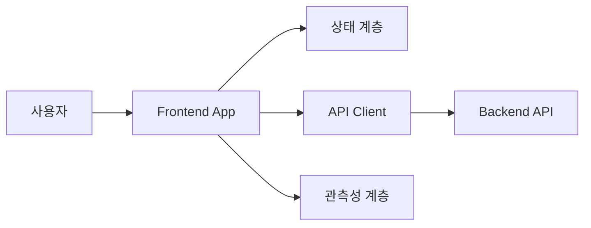
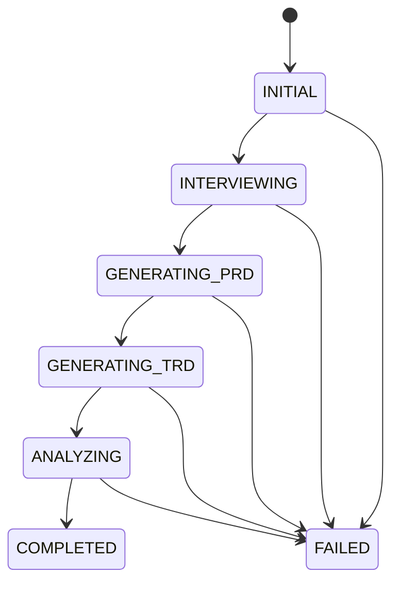

# Frontend Technical Requirements Document (TRD) — mat-copilot

> 이 문서는 `PRD/front.md`의 제품 요구사항을 구현 가능한 기술 설계로 구체화하기 위한 **작성 양식**이다.  
> 대괄호(`[ ]`)와 `<작성 필요>`로 표시된 항목을 검토·확정한 뒤 작성한다.

| 항목 | 내용 |
| --- | --- |
| 문서 버전 | `<예: v0.1 (Draft)>` |
| 문서 상태 | `<Draft / Review / Approved>` |
| 작성자 | `<이름 또는 계정>` |
| 검토자 | `<프론트엔드 / 백엔드 / AI / QA / 보안 담당자>` |
| 작성일 | `<YYYY-MM-DD>` |
| 최종 수정일 | `<YYYY-MM-DD>` |
| 대상 릴리스 | `<M1 / M2 / M3 / M4 또는 버전>` |
| 관련 PRD | `[PRD/front.md](../PRD/front.md)` |
| 관련 백엔드 TRD | `[TRD/back.md](./back.md)` |
| 디자인 문서 | `<Figma 등 링크>` |
| API 명세 | `<OpenAPI 등 링크>` |

---

## 1. 문서 목적 및 범위

### 1.1 목적

<이 TRD가 해결할 기술적 의사결정과 개발팀에 제공할 기준을 작성한다.>

### 1.2 구현 범위

| 구분 | 포함 범위 | 관련 PRD ID | 비고 |
| --- | --- | --- | --- |
| In Scope | `<구현 대상>` | `<FR-N, US-N>` | `<비고>` |
| Out of Scope | `<제외 대상>` | `<NG-N>` | `<제외 사유 또는 후속 일정>` |

### 1.3 전제 조건 및 제약

| ID | 구분 | 내용 | 기술적 영향 | 확인 상태 |
| --- | --- | --- | --- | --- |
| CON-01 | PRD 제약 | `<내용>` | `<설계에 미치는 영향>` | `<확정 / 확인 필요>` |
| ASM-01 | 가정 | `<내용>` | `<가정이 틀릴 때의 영향>` | `<확정 / 확인 필요>` |

### 1.4 용어 정의

| 용어 | 정의 | 데이터/코드상의 명칭 |
| --- | --- | --- |
| `<용어>` | `<정의>` | `<예: SessionStatus>` |

---

## 2. 요구사항 추적표

> 모든 P0 기능 요구사항과 비기능 요구사항이 하나 이상의 설계 항목 및 테스트에 연결되어야 한다.

| PRD ID | 요구사항 요약 | 설계 섹션 | 구현 모듈 | 테스트 ID | 상태 |
| --- | --- | --- | --- | --- | --- |
| `<FR-N / NFR 항목>` | `<요약>` | `<섹션 번호>` | `<모듈명>` | `<TC-N>` | `<미설계 / 설계 / 구현 / 검증>` |

---

## 3. 기술 스택

### 3.1 기술 선정 원칙

- `<제품 요구사항과의 적합성>`
- `<팀의 숙련도 및 유지보수성>`
- `<성능 및 접근성>`
- `<라이선스와 공급망 보안>`
- `<생태계 안정성 및 장기 지원 여부>`
- `<번들 크기와 브라우저 호환성>`

### 3.2 기술 스택 요약

| 영역 | 후보/선정 기술 | 버전 | 선정 상태 | 선정 근거 | 대안 및 제외 사유 |
| --- | --- | --- | --- | --- | --- |
| 런타임 | `<작성 필요>` | `<버전>` | `<후보 / 확정>` | `<근거>` | `<대안>` |
| UI 프레임워크 | `<작성 필요>` | `<버전>` | `<후보 / 확정>` | `<근거>` | `<대안>` |
| 언어 | `<작성 필요>` | `<버전>` | `<후보 / 확정>` | `<근거>` | `<대안>` |
| 빌드 도구 | `<작성 필요>` | `<버전>` | `<후보 / 확정>` | `<근거>` | `<대안>` |
| 라우팅 | `<작성 필요>` | `<버전>` | `<후보 / 확정>` | `<근거>` | `<대안>` |
| 서버 상태 관리 | `<작성 필요>` | `<버전>` | `<후보 / 확정>` | `<근거>` | `<대안>` |
| 클라이언트 상태 관리 | `<작성 필요>` | `<버전>` | `<후보 / 확정>` | `<근거>` | `<대안>` |
| 폼/검증 | `<작성 필요>` | `<버전>` | `<후보 / 확정>` | `<근거>` | `<대안>` |
| 그래프/캔버스 | `<작성 필요>` | `<버전>` | `<후보 / 확정>` | `<근거>` | `<대안>` |
| 차트 | `<작성 필요>` | `<버전>` | `<후보 / 확정>` | `<근거>` | `<대안>` |
| Markdown 렌더링 | `<작성 필요>` | `<버전>` | `<후보 / 확정>` | `<근거>` | `<대안>` |
| 스타일링/UI 시스템 | `<작성 필요>` | `<버전>` | `<후보 / 확정>` | `<근거>` | `<대안>` |
| 국제화 | `<작성 필요>` | `<버전>` | `<후보 / 확정>` | `<근거>` | `<대안>` |
| 단위/통합 테스트 | `<작성 필요>` | `<버전>` | `<후보 / 확정>` | `<근거>` | `<대안>` |
| E2E 테스트 | `<작성 필요>` | `<버전>` | `<후보 / 확정>` | `<근거>` | `<대안>` |
| 오류/성능 관측 | `<작성 필요>` | `<버전>` | `<후보 / 확정>` | `<근거>` | `<대안>` |
| 패키지 관리자 | `<작성 필요>` | `<버전>` | `<후보 / 확정>` | `<근거>` | `<대안>` |

### 3.3 의존성 도입 기준

| 점검 항목 | 기준 | 확인 결과 |
| --- | --- | --- |
| 라이선스 | `<허용/금지 라이선스>` | `<작성 필요>` |
| 유지보수 | `<최근 릴리스, 이슈 대응 등 기준>` | `<작성 필요>` |
| 보안 | `<취약점 허용 기준 및 점검 방법>` | `<작성 필요>` |
| 번들 크기 | `<허용 증가량>` | `<작성 필요>` |
| 접근성 | `<필수 지원 수준>` | `<작성 필요>` |
| 대체 가능성 | `<벤더 종속성 평가 기준>` | `<작성 필요>` |

---

## 4. 프론트엔드 아키텍처

### 4.1 아키텍처 개요

<렌더링 방식, 애플리케이션 경계, 백엔드 통신 방식, 주요 설계 원칙을 요약한다.>



> 위 다이어그램을 실제 설계에 맞게 수정한다.

### 4.2 계층 및 책임

| 계층 | 책임 | 포함 요소 | 금지 사항 |
| --- | --- | --- | --- |
| Presentation | `<작성 필요>` | `<작성 필요>` | `<작성 필요>` |
| Feature/Domain | `<작성 필요>` | `<작성 필요>` | `<작성 필요>` |
| Data Access | `<작성 필요>` | `<작성 필요>` | `<작성 필요>` |
| Shared | `<작성 필요>` | `<작성 필요>` | `<작성 필요>` |

### 4.3 디렉터리 구조

```text
<프로젝트 루트>/
├─ <디렉터리>/        # <책임>
├─ <디렉터리>/        # <책임>
└─ <디렉터리>/        # <책임>
```

### 4.4 모듈 의존성 규칙

- `<허용되는 의존 방향>`
- `<Feature 간 직접 참조 정책>`
- `<공통 모듈 추출 기준>`
- `<순환 의존성 방지 방식>`
- `<외부 라이브러리 래핑 기준>`

### 4.5 라우팅 및 화면 진입

| 경로 | 화면/상태 | 진입 조건 | 필요한 식별자 | 직접 접근/새로고침 처리 |
| --- | --- | --- | --- | --- |
| `<경로>` | `<화면>` | `<조건>` | `<sessionId/jobId 등>` | `<처리 방식>` |

---

## 5. 핵심 상태 및 데이터 흐름

### 5.1 애플리케이션 상태 머신



> 전이 조건, 실패 상태의 원래 단계 보존 방식, 재시도 전이를 구체화한다.

| 현재 상태 | 이벤트 | 전이 조건 | 다음 상태 | 부수 효과 | 실패 처리 |
| --- | --- | --- | --- | --- | --- |
| `<상태>` | `<이벤트>` | `<가드 조건>` | `<상태>` | `<API 호출/저장 등>` | `<처리>` |

### 5.2 상태 분류 및 저장 위치

| 상태 | 예시 | 소유 주체 | 저장 위치 | 영속화 여부 | 초기화 조건 |
| --- | --- | --- | --- | --- | --- |
| 서버 상태 | `<작성 필요>` | `<작성 필요>` | `<작성 필요>` | `<예/아니요>` | `<조건>` |
| 전역 UI 상태 | `<작성 필요>` | `<작성 필요>` | `<작성 필요>` | `<예/아니요>` | `<조건>` |
| 로컬 UI 상태 | `<작성 필요>` | `<작성 필요>` | `<작성 필요>` | `<예/아니요>` | `<조건>` |
| 폼 상태 | `<작성 필요>` | `<작성 필요>` | `<작성 필요>` | `<예/아니요>` | `<조건>` |

### 5.3 동시성 및 경쟁 상태 방지

| 시나리오 | 위험 | 방지 전략 | 사용자 경험 |
| --- | --- | --- | --- |
| 답변 중복 제출 | `<작성 필요>` | `<작성 필요>` | `<작성 필요>` |
| 오래된 다음 질문 응답 | `<작성 필요>` | `<작성 필요>` | `<작성 필요>` |
| 빠른 세션 전환 | `<작성 필요>` | `<작성 필요>` | `<작성 필요>` |
| 작업 재시도 중 중복 실행 | `<작성 필요>` | `<작성 필요>` | `<작성 필요>` |
| 새로고침/재접속 | `<작성 필요>` | `<작성 필요>` | `<작성 필요>` |

### 5.4 복구 및 영속화 전략

- 세션/작업 식별자 저장 위치: `<작성 필요>`
- 저장 데이터 최소화 기준: `<작성 필요>`
- 민감 정보 저장 금지 기준: `<작성 필요>`
- 재접속 시 복구 순서: `<작성 필요>`
- 만료/삭제 정책: `<작성 필요>`
- 스키마 버전 변경 시 처리: `<작성 필요>`

---

## 6. API 및 데이터 계약

### 6.1 통신 원칙

| 항목 | 결정 |
| --- | --- |
| API 형식 | `<REST / GraphQL / 기타>` |
| 기본 URL/환경 분리 | `<작성 필요>` |
| 인증 방식 | `<작성 필요>` |
| 상태 업데이트 | `<Polling / SSE / WebSocket / 미정>` |
| 타임아웃 | `<작성 필요>` |
| 재시도 | `<대상 오류, 횟수, 백오프, 멱등성 조건>` |
| 요청 취소 | `<작성 필요>` |
| API 버전 관리 | `<작성 필요>` |
| 날짜/시간 기준 | `<작성 필요>` |
| ID 형식 | `<작성 필요>` |

### 6.2 엔드포인트 목록

| ID | Method | Path | 목적 | 요청 타입 | 응답 타입 | 오류 | 멱등성 |
| --- | --- | --- | --- | --- | --- | --- | --- |
| API-01 | `<METHOD>` | `<path>` | `<목적>` | `<타입>` | `<타입>` | `<오류 코드>` | `<보장 방식>` |

### 6.3 핵심 데이터 모델

> 아래 모델별 실제 필드, 필수 여부, nullable 여부, enum, 제약 조건을 정의한다.

#### 인터뷰 세션

```ts
interface InterviewSession {
  // <작성 필요>
}
```

#### 질문 노드 및 답변

```ts
interface QuestionNode {
  // <작성 필요>
}

interface Answer {
  // <작성 필요>
}
```

#### 생성 작업

```ts
interface GenerationJob {
  // <작성 필요>
}
```

#### 생성 문서

```ts
interface GeneratedDocument {
  // <작성 필요>
}
```

#### 비교 구간 및 상세 분석

```ts
interface Comparison {
  // <작성 필요>
}
```

#### 분석 지표

```ts
interface AnalysisMetric {
  // <작성 필요>
}
```

### 6.4 문서 위치 식별 계약

| 결정 항목 | 선택/정의 | 근거 |
| --- | --- | --- |
| 위치 식별 방식 | `<Block ID / Sentence ID / Offset / 기타>` | `<작성 필요>` |
| ID 안정성 보장 | `<작성 필요>` | `<작성 필요>` |
| 한쪽 문서에만 존재하는 항목 | `<작성 필요>` | `<작성 필요>` |
| 범위가 겹치는 비교 항목 | `<작성 필요>` | `<작성 필요>` |
| Markdown 변환 후 매핑 | `<작성 필요>` | `<작성 필요>` |
| 매핑 실패 표시 | `<작성 필요>` | `<작성 필요>` |

### 6.5 오류 모델

```ts
interface ApiError {
  // <code, message, retryable, fieldErrors, traceId 등 작성 필요>
}
```

| 오류 코드/종류 | 발생 조건 | 사용자 메시지 | 재시도 가능 | 입력/상태 보존 | 로깅 수준 |
| --- | --- | --- | --- | --- | --- |
| `<오류>` | `<조건>` | `<메시지 원칙>` | `<예/아니요>` | `<정책>` | `<수준>` |

### 6.6 백엔드 합의 필요 항목

- [ ] 질문 입력 유형과 validation 스키마
- [ ] 질문의 분기·병합 표현 방식
- [ ] 질의 종료 신호
- [ ] 이전 답변 수정 및 이후 분기 무효화 계약
- [ ] 비동기 작업의 상태 전달 방식
- [ ] 실패 단계 재시도 API와 멱등성
- [ ] 문서의 안정적인 블록/구간 식별 방식
- [ ] 분석 지표의 단위, 임계값, 상태 및 설명
- [ ] 부분 결과와 `산정 불가` 표현 방식
- [ ] 인증, 세션 만료 및 결과 보존 기간

---

## 7. 화면 및 기능별 기술 설계

### 7.1 전역 애플리케이션 셸

| 설계 항목 | 내용 |
| --- | --- |
| 뷰포트 고정 방식 | `<작성 필요>` |
| 내부 스크롤 영역 | `<작성 필요>` |
| 홈 이동/이탈 방지 | `<작성 필요>` |
| 최소 해상도 미만 처리 | `<작성 필요>` |
| 전역 오류 경계 | `<작성 필요>` |
| 포커스 이동 원칙 | `<작성 필요>` |

### 7.2 인터뷰 및 첫 질문

| 설계 항목 | 내용 |
| --- | --- |
| 첫 질문 로딩 | `<작성 필요>` |
| 입력 타입 렌더링 | `<작성 필요>` |
| 클라이언트 검증 | `<작성 필요>` |
| 제출 단축키 | `<작성 필요>` |
| 중복 제출 차단 | `<작성 필요>` |
| 제출 실패 시 값 보존 | `<작성 필요>` |

### 7.3 질문 마인드맵/캔버스

| 설계 항목 | 내용 |
| --- | --- |
| 그래프 데이터 구조 | `<작성 필요>` |
| 자동 레이아웃 알고리즘 | `<작성 필요>` |
| 노드/엣지 렌더링 | `<작성 필요>` |
| 드래그 좌표계 및 경계 | `<작성 필요>` |
| 현재 질문 자동 이동 | `<작성 필요>` |
| 입력 조작과 드래그 충돌 방지 | `<작성 필요>` |
| 키보드 대체 탐색 | `<작성 필요>` |
| 대규모 그래프 최적화 | `<가상화/뷰포트 렌더링/캐시 기준>` |
| 축소·확대/미니맵 범위 | `<MVP 포함 여부>` |

#### 성능 한계 및 검증 데이터

| 항목 | 목표/상한 | 측정 방법 | 초과 시 대응 |
| --- | --- | --- | --- |
| 노드 수 | `<작성 필요>` | `<작성 필요>` | `<작성 필요>` |
| 엣지 수 | `<작성 필요>` | `<작성 필요>` | `<작성 필요>` |
| 드래그 FPS/응답 시간 | `<작성 필요>` | `<작성 필요>` | `<작성 필요>` |
| 레이아웃 계산 시간 | `<작성 필요>` | `<작성 필요>` | `<작성 필요>` |

### 7.4 문서 생성 및 분석 대기

| 설계 항목 | 내용 |
| --- | --- |
| 단계 상태 모델 | `<작성 필요>` |
| 상태 수신 방식 | `<작성 필요>` |
| 폴링/재연결 정책 | `<해당 시 작성>` |
| 실제 진행률 유무 처리 | `<작성 필요>` |
| 장시간 대기 안내 | `<작성 필요>` |
| 완료 단계 보존 | `<작성 필요>` |
| 실패 단계 재시도 | `<작성 필요>` |
| 새로고침 복구 | `<작성 필요>` |

### 7.5 분석 결과 레이아웃

| 영역 | 크기/동작 | 데이터 | 로딩/빈 상태 | 오류 상태 |
| --- | --- | --- | --- | --- |
| PRD 패널 | `<작성 필요>` | `<작성 필요>` | `<작성 필요>` | `<작성 필요>` |
| TRD 패널 | `<작성 필요>` | `<작성 필요>` | `<작성 필요>` | `<작성 필요>` |
| 분석 시각화 | `<작성 필요>` | `<작성 필요>` | `<작성 필요>` | `<작성 필요>` |
| 상세 리포트 | `<작성 필요>` | `<작성 필요>` | `<작성 필요>` | `<작성 필요>` |

### 7.6 Markdown 렌더링 및 교차 강조

| 설계 항목 | 내용 |
| --- | --- |
| Markdown 파서/렌더러 | `<작성 필요>` |
| 허용 HTML 정책 | `<작성 필요>` |
| Sanitization | `<작성 필요>` |
| Block ID 주입 방식 | `<작성 필요>` |
| 각주 표시 방식 | `<작성 필요>` |
| 복수/중첩 강조 처리 | `<작성 필요>` |
| 양쪽 문서 스크롤 동기화 | `<작성 필요>` |
| 선택 상태의 단일 진실 공급원 | `<작성 필요>` |
| 긴 문서 최적화 | `<작성 필요>` |
| 다운로드 파일 생성/URL 처리 | `<작성 필요>` |

### 7.7 분석 시각화

| 지표 | 시각화 후보 | 값/단위 | 상태 기준 출처 | 접근 가능한 대체 표현 |
| --- | --- | --- | --- | --- |
| `<지표>` | `<차트 유형>` | `<범위/단위>` | `<API 메타데이터 등>` | `<텍스트/테이블>` |

### 7.8 선택 연동 규칙

| 사용자 액션 | PRD 패널 | TRD 패널 | 시각화 | 상세 리포트 | URL/복구 상태 |
| --- | --- | --- | --- | --- | --- |
| 각주 선택 | `<동작>` | `<동작>` | `<동작>` | `<동작>` | `<동작>` |
| 지표/항목 선택 | `<동작>` | `<동작>` | `<동작>` | `<동작>` | `<동작>` |
| 선택 해제 | `<동작>` | `<동작>` | `<동작>` | `<동작>` | `<동작>` |

---

## 8. 컴포넌트 설계

### 8.1 컴포넌트 목록

| 컴포넌트 | 책임 | 주요 Props | 상태 소유 | 접근성 역할 | 재사용 범위 |
| --- | --- | --- | --- | --- | --- |
| `<ComponentName>` | `<책임>` | `<타입>` | `<위치>` | `<role/label 등>` | `<범위>` |

### 8.2 컴포넌트 상태 규격

각 주요 컴포넌트에 다음 상태를 정의한다.

- [ ] Default
- [ ] Loading/Skeleton
- [ ] Empty
- [ ] Error
- [ ] Disabled
- [ ] Focus
- [ ] Selected/Active
- [ ] Partial data

### 8.3 디자인 토큰

| 토큰 영역 | 정의 위치 | 명명 규칙 | 주의 사항 |
| --- | --- | --- | --- |
| Color | `<작성 필요>` | `<작성 필요>` | `<색상에만 의미를 의존하지 않음>` |
| Typography | `<작성 필요>` | `<작성 필요>` | `<작성 필요>` |
| Spacing | `<작성 필요>` | `<작성 필요>` | `<작성 필요>` |
| Z-index | `<작성 필요>` | `<작성 필요>` | `<작성 필요>` |
| Motion | `<작성 필요>` | `<작성 필요>` | `<reduced motion 고려>` |

---

## 9. 접근성

### 9.1 목표 및 기준

- 준수 목표: `<WCAG 버전 및 수준>`
- 검증 도구: `<자동 검사 도구 및 수동 검사 방법>`
- 키보드만으로 완료해야 하는 핵심 흐름: `<작성 필요>`

### 9.2 기능별 접근성 설계

| 기능 | 키보드 조작 | 포커스 정책 | 스크린 리더 | 색상 외 표현 | 검증 방법 |
| --- | --- | --- | --- | --- | --- |
| 질문 입력/제출 | `<작성 필요>` | `<작성 필요>` | `<작성 필요>` | `<작성 필요>` | `<작성 필요>` |
| 마인드맵 탐색 | `<작성 필요>` | `<작성 필요>` | `<작성 필요>` | `<작성 필요>` | `<작성 필요>` |
| 생성 단계 | `<작성 필요>` | `<작성 필요>` | `<live region 등>` | `<작성 필요>` | `<작성 필요>` |
| 각주/교차 강조 | `<작성 필요>` | `<작성 필요>` | `<작성 필요>` | `<작성 필요>` | `<작성 필요>` |
| 차트 | `<작성 필요>` | `<작성 필요>` | `<대체 표/요약>` | `<작성 필요>` | `<작성 필요>` |
| 오류/모달 | `<작성 필요>` | `<작성 필요>` | `<작성 필요>` | `<작성 필요>` | `<작성 필요>` |

---

## 10. 성능 설계

### 10.1 성능 예산

| 지표 | 목표 | 측정 환경 | 측정 도구 | 실패 기준 |
| --- | --- | --- | --- | --- |
| LCP | `<목표>` | `<환경>` | `<도구>` | `<기준>` |
| INP | `<목표>` | `<환경>` | `<도구>` | `<기준>` |
| CLS | `<목표>` | `<환경>` | `<도구>` | `<기준>` |
| 초기 JS 번들 | `<목표>` | `<환경>` | `<도구>` | `<기준>` |
| 드래그 응답성 | `<목표>` | `<환경>` | `<도구>` | `<기준>` |
| 긴 문서 렌더링 | `<목표>` | `<문서 크기>` | `<도구>` | `<기준>` |

### 10.2 최적화 전략

- 코드 분할 기준: `<작성 필요>`
- 그래프 가상화/뷰포트 렌더링: `<작성 필요>`
- 문서 블록 지연 렌더링: `<작성 필요>`
- 레이아웃 계산 캐시: `<작성 필요>`
- 메모이제이션 적용/금지 기준: `<작성 필요>`
- 대용량 응답 처리: `<작성 필요>`
- 성능 회귀 탐지: `<작성 필요>`

---

## 11. 보안 및 개인정보 보호

### 11.1 위협 및 대응

| 위협 | 공격/오류 경로 | 영향 | 대응 | 검증 |
| --- | --- | --- | --- | --- |
| XSS | `<사용자 입력/Markdown 등>` | `<영향>` | `<대응>` | `<테스트>` |
| 민감 정보 노출 | `<저장소/로그/URL 등>` | `<영향>` | `<대응>` | `<테스트>` |
| 세션 탈취 | `<경로>` | `<영향>` | `<대응>` | `<테스트>` |
| CSRF | `<해당 여부>` | `<영향>` | `<대응>` | `<테스트>` |
| 악성 다운로드 | `<경로>` | `<영향>` | `<대응>` | `<테스트>` |
| 공급망 취약점 | `<의존성>` | `<영향>` | `<대응>` | `<점검>` |

### 11.2 데이터 취급 기준

| 데이터 | 민감도 | 브라우저 저장 | 전송 보호 | 로그 허용 | 보존/삭제 |
| --- | --- | --- | --- | --- | --- |
| `<데이터>` | `<등급>` | `<위치/금지>` | `<방식>` | `<마스킹 규칙>` | `<정책>` |

### 11.3 보안 헤더 및 브라우저 정책

- CSP: `<작성 필요>`
- HTTPS/HSTS: `<작성 필요>`
- 쿠키 속성: `<작성 필요>`
- iframe 정책: `<작성 필요>`
- Referrer/Permissions 정책: `<작성 필요>`
- 소스맵 공개 정책: `<작성 필요>`

---

## 12. 오류 처리 및 사용자 피드백

### 12.1 오류 처리 원칙

- `<기술 오류를 사용자 언어로 변환하는 기준>`
- `<재시도 가능한 오류와 불가능한 오류의 구분>`
- `<사용자 입력 및 완료 상태 보존 원칙>`
- `<부분 성공 표시 원칙>`
- `<오류 추적 ID 노출 원칙>`

### 12.2 화면별 오류 처리표

| 화면/기능 | 오류 | 보존할 상태 | 사용자 안내 | 액션 | 복구 성공 조건 |
| --- | --- | --- | --- | --- | --- |
| `<화면>` | `<오류>` | `<상태>` | `<메시지>` | `<재시도/초기화 등>` | `<조건>` |

---

## 13. 관측성 및 분석 이벤트

### 13.1 로깅 및 오류 수집

| 구분 | 수집 대상 | 필수 속성 | 제외/마스킹 | 보존 정책 |
| --- | --- | --- | --- | --- |
| Error | `<작성 필요>` | `<traceId 등>` | `<PII 등>` | `<작성 필요>` |
| Warning | `<작성 필요>` | `<작성 필요>` | `<작성 필요>` | `<작성 필요>` |
| Performance | `<작성 필요>` | `<작성 필요>` | `<작성 필요>` | `<작성 필요>` |

### 13.2 제품 분석 이벤트

| 이벤트명 | 발생 시점 | 속성 | 연결 성공 지표 | 개인정보 주의 |
| --- | --- | --- | --- | --- |
| `<event_name>` | `<조건>` | `<속성>` | `<PRD 지표>` | `<주의 사항>` |

### 13.3 모니터링 및 알림

| 지표 | 정상 기준 | 경고/장애 임계값 | 대시보드 | 알림 대상 |
| --- | --- | --- | --- | --- |
| `<지표>` | `<기준>` | `<임계값>` | `<링크>` | `<담당자>` |

---

## 14. 테스트 전략

### 14.1 테스트 계층

| 테스트 종류 | 대상 | 도구 | 실행 시점 | 통과 기준 |
| --- | --- | --- | --- | --- |
| 정적 검사 | `<타입/린트 등>` | `<작성 필요>` | `<작성 필요>` | `<작성 필요>` |
| 단위 테스트 | `<대상>` | `<작성 필요>` | `<작성 필요>` | `<작성 필요>` |
| 컴포넌트 테스트 | `<대상>` | `<작성 필요>` | `<작성 필요>` | `<작성 필요>` |
| API 계약 테스트 | `<대상>` | `<작성 필요>` | `<작성 필요>` | `<작성 필요>` |
| 통합 테스트 | `<대상>` | `<작성 필요>` | `<작성 필요>` | `<작성 필요>` |
| E2E 테스트 | `<핵심 흐름>` | `<작성 필요>` | `<작성 필요>` | `<작성 필요>` |
| 접근성 테스트 | `<대상>` | `<작성 필요>` | `<작성 필요>` | `<작성 필요>` |
| 성능 테스트 | `<대상>` | `<작성 필요>` | `<작성 필요>` | `<작성 필요>` |
| 브라우저 테스트 | `<브라우저/버전>` | `<작성 필요>` | `<작성 필요>` | `<작성 필요>` |

### 14.2 필수 테스트 시나리오

| TC ID | 우선순위 | 시나리오 | 사전 조건 | 기대 결과 | 관련 요구사항 |
| --- | --- | --- | --- | --- | --- |
| TC-01 | `<P0/P1>` | `<시나리오>` | `<조건>` | `<결과>` | `<FR-N/AC-N>` |

검토 시 최소한 다음 범주를 포함한다.

- [ ] 첫 질문 조회, 입력 검증 및 답변 제출
- [ ] 중복 제출 방지와 오래된 응답 무시
- [ ] 가변 길이 및 분기 질문 그래프
- [ ] 캔버스 드래그와 입력 필드 이벤트 충돌
- [ ] 현재 질문으로 이동 및 키보드 대체 탐색
- [ ] 생성 단계 진행, 실패 단계 재시도 및 완료 단계 보존
- [ ] 새로고침/재접속 후 상태 복구
- [ ] 긴 PRD·TRD 렌더링
- [ ] 각주, 문서, 차트 및 상세 리포트 교차 강조
- [ ] 누락, 부분 결과 및 산정 불가 상태
- [ ] 안전하지 않은 Markdown 및 사용자 입력
- [ ] 최소 지원 해상도와 지원 브라우저
- [ ] 키보드 및 스크린 리더 핵심 흐름
- [ ] 네트워크 지연, 오프라인 및 연결 복구

### 14.3 테스트 데이터

| 데이터 세트 | 목적 | 규모/특징 | 생성/보관 방식 |
| --- | --- | --- | --- |
| `<데이터>` | `<목적>` | `<노드 수, 문서 길이 등>` | `<방식>` |

---

## 15. 개발 및 배포

### 15.1 환경 구성

| 환경 | 목적 | API 대상 | 설정 주입 방식 | 접근 통제 |
| --- | --- | --- | --- | --- |
| Local | `<작성 필요>` | `<작성 필요>` | `<작성 필요>` | `<작성 필요>` |
| Development | `<작성 필요>` | `<작성 필요>` | `<작성 필요>` | `<작성 필요>` |
| Staging | `<작성 필요>` | `<작성 필요>` | `<작성 필요>` | `<작성 필요>` |
| Production | `<작성 필요>` | `<작성 필요>` | `<작성 필요>` | `<작성 필요>` |

### 15.2 환경 변수

| 변수명 | 목적 | 필수 | 공개 가능 | 기본값 | 관리 위치 |
| --- | --- | --- | --- | --- | --- |
| `<VARIABLE_NAME>` | `<목적>` | `<예/아니요>` | `<예/아니요>` | `<값/없음>` | `<위치>` |

> 비밀값은 프론트엔드 번들 또는 저장소에 포함하지 않는다.

### 15.3 CI/CD 파이프라인


| 단계 | 명령/도구 | 실패 조건 | 산출물 |
| --- | --- | --- | --- |
| Install | `<작성 필요>` | `<작성 필요>` | `<작성 필요>` |
| Static Check | `<작성 필요>` | `<작성 필요>` | `<작성 필요>` |
| Test | `<작성 필요>` | `<작성 필요>` | `<작성 필요>` |
| Build | `<작성 필요>` | `<작성 필요>` | `<작성 필요>` |
| Deploy | `<작성 필요>` | `<작성 필요>` | `<작성 필요>` |
| Smoke Test | `<작성 필요>` | `<작성 필요>` | `<작성 필요>` |

### 15.4 배포 및 롤백

- 배포 전략: `<작성 필요>`
- 캐시 무효화: `<작성 필요>`
- API 호환성 확인: `<작성 필요>`
- Feature Flag 사용 기준: `<작성 필요>`
- 롤백 조건: `<작성 필요>`
- 롤백 절차: `<작성 필요>`
- 배포 후 검증: `<작성 필요>`

---

## 16. 코딩 규칙 및 협업 기준

| 항목 | 기준 |
| --- | --- |
| 명명 규칙 | `<작성 필요>` |
| 타입 사용 | `<작성 필요>` |
| 컴포넌트 분리 | `<작성 필요>` |
| 상태 관리 | `<작성 필요>` |
| API 호출 | `<작성 필요>` |
| 오류 처리 | `<작성 필요>` |
| 스타일 작성 | `<작성 필요>` |
| UI 문자열/i18n | `<작성 필요>` |
| 테스트 작성 | `<작성 필요>` |
| 코드 리뷰 | `<작성 필요>` |

### 16.1 Definition of Done

- [ ] 관련 PRD 요구사항 및 수용 기준을 충족했다.
- [ ] 타입 검사, 린트, 테스트 및 빌드가 통과했다.
- [ ] 로딩, 빈 상태, 오류 및 재시도 상태를 구현했다.
- [ ] 키보드 및 접근성 요구사항을 검증했다.
- [ ] 지원 브라우저와 최소 해상도에서 확인했다.
- [ ] 성능 예산을 초과하지 않는다.
- [ ] 로그에 민감 정보가 포함되지 않는다.
- [ ] 분석 이벤트와 오류 관측이 연결되었다.
- [ ] API 계약 및 관련 문서가 최신 상태다.

---

## 17. 릴리스 단계별 기술 범위

| 단계 | 기술 구현 범위 | 선행 조건 | 완료 조건 | 제외/후속 항목 |
| --- | --- | --- | --- | --- |
| M1 | `<작성 필요>` | `<작성 필요>` | `<측정 가능한 조건>` | `<작성 필요>` |
| M2 | `<작성 필요>` | `<작성 필요>` | `<측정 가능한 조건>` | `<작성 필요>` |
| M3 | `<작성 필요>` | `<작성 필요>` | `<측정 가능한 조건>` | `<작성 필요>` |
| M4 | `<작성 필요>` | `<작성 필요>` | `<측정 가능한 조건>` | `<작성 필요>` |

---

## 18. 기술 리스크 및 대응

| ID | 리스크 | 가능성 | 영향도 | 조기 징후 | 완화 방안 | 비상 계획 | 담당자 |
| --- | --- | --- | --- | --- | --- | --- | --- |
| RISK-01 | `<리스크>` | `<상/중/하>` | `<상/중/하>` | `<징후>` | `<방안>` | `<계획>` | `<담당자>` |

검토 대상 예시:

- [ ] 질문 그래프 증가에 따른 렌더링/레이아웃 성능
- [ ] 긴 Markdown 문서의 렌더링 및 강조 성능
- [ ] 문서 위치 매핑 불일치
- [ ] 비동기 작업 장기화와 중복 실행
- [ ] API 응답 순서 역전 및 상태 불일치
- [ ] 분석 점수에 대한 사용자 오해
- [ ] 적록 색상 중심 표현의 접근성 문제
- [ ] 백엔드 API 및 분석 스키마 변경

---

## 19. 기술 의사결정 기록 (ADR)

| ADR ID | 의사결정 | 상태 | 선택안 | 주요 근거 | 대안 | 결정일 | 담당자 |
| --- | --- | --- | --- | --- | --- | --- | --- |
| ADR-001 | `<예: 상태 업데이트 방식>` | `<제안/승인/폐기>` | `<선택>` | `<근거>` | `<대안>` | `<날짜>` | `<담당자>` |

각 주요 의사결정은 다음 형식으로 상세 기록한다.

### ADR-XXX — `<의사결정 제목>`

- **상태:** `<제안 / 승인 / 폐기 / 대체>`
- **맥락:** `<결정이 필요한 배경과 제약>`
- **검토한 선택지:** `<선택지별 장단점>`
- **결정:** `<선택한 방안>`
- **근거:** `<정량·정성 근거>`
- **결과 및 트레이드오프:** `<얻는 점과 감수할 점>`
- **재검토 조건:** `<언제 결정을 다시 검토할지>`

---

## 20. 미결 사항

| ID | 질문/결정 사항 | 선택지 | 영향 범위 | 결정권자 | 기한 | 상태 |
| --- | --- | --- | --- | --- | --- | --- |
| OQ-01 | `<질문>` | `<선택지>` | `<설계/일정 영향>` | `<담당자>` | `<날짜>` | `<Open/Resolved>` |

---

## 21. 검토 및 승인

### 21.1 검토 체크리스트

- [ ] 모든 P0 요구사항이 설계와 테스트에 매핑되었다.
- [ ] 프론트엔드와 백엔드 데이터 계약이 합의되었다.
- [ ] 상태 전이, 실패 및 복구 경로가 정의되었다.
- [ ] 기술 스택의 버전, 근거 및 대안이 기록되었다.
- [ ] 성능 목표가 측정 가능한 수치로 정의되었다.
- [ ] 접근성, 보안 및 개인정보 요구사항이 포함되었다.
- [ ] 배포, 관측성 및 롤백 방법이 정의되었다.
- [ ] 미결 사항마다 결정권자와 기한이 지정되었다.

### 21.2 승인 이력

| 역할 | 이름 | 승인 여부 | 일자 | 의견 |
| --- | --- | --- | --- | --- |
| Product/PM | `<작성 필요>` | `<대기/승인/반려>` | `<날짜>` | `<의견>` |
| Frontend | `<작성 필요>` | `<대기/승인/반려>` | `<날짜>` | `<의견>` |
| Backend/AI | `<작성 필요>` | `<대기/승인/반려>` | `<날짜>` | `<의견>` |
| QA | `<작성 필요>` | `<대기/승인/반려>` | `<날짜>` | `<의견>` |
| Security/Operations | `<작성 필요>` | `<대기/승인/반려>` | `<날짜>` | `<의견>` |

---

## 부록 A. PRD 수용 기준 매핑

| PRD 수용 기준 번호 | 구현 설계 | 검증 방법 | 결과 |
| --- | --- | --- | --- |
| `<AC-N>` | `<설계 섹션/모듈>` | `<테스트 ID 또는 수동 검증>` | `<미검증/통과/실패>` |

## 부록 B. 변경 이력

| 버전 | 일자 | 작성자 | 변경 내용 | 검토자 |
| --- | --- | --- | --- | --- |
| `<버전>` | `<날짜>` | `<작성자>` | `<변경 요약>` | `<검토자>` |